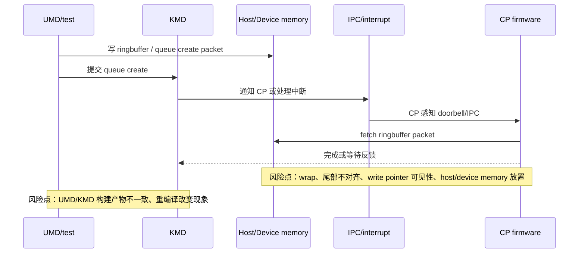

---
type: learning-card
created: 2026-05-09
source: "[[wiki/fw/debug/CP ringbuffer IPC 与 queue create 调试|CP ringbuffer IPC 与 queue create 调试]]"
category: "topics"
---

# CP ringbuffer IPC 与 queue create 调试

## 原文

- 原文链接：[[wiki/fw/debug/CP ringbuffer IPC 与 queue create 调试|CP ringbuffer IPC 与 queue create 调试]]
- 原始路径：wiki\topics\CP ringbuffer IPC 与 queue create 调试.md
- 分类：`topics`

## 这个主题可以怎么讲

这个主题适合讲“queue create 不动时，我怎么按数据链路排查”。不要把它讲成 ringbuffer 一个小 bug，而要讲 host 写入、KMD 通知、IPC、中断、CP fetch、memory visibility 这一整条链路。面试里可以强调：这类问题最容易被构建产物、测试二进制和平台时序干扰，所以必须保留多层证据。

## 问题链路图

## 技术抓手

- ringbuffer wrap：最后一次写不一定对齐 ringbuffer size，必须单独测尾部跨界。
- memory visibility：ringbuffer 放 host memory、write pointer 放 device memory，或者相反组合，都会影响观察和同步。
- IPC 时序：PZ1 上可能出现中断已经通知 KMD，但 ringbuffer 还没写好的情况。
- 构建一致性：queue create 后不动、第一次 create stream 挂，重编译 UMD test 后现象改变，说明测试产物也要纳入排查。
- 证据组合：UMD log、kern.log、dmesg、波形要一起看。

## 证据材料

- [[wiki/fw/debug/CP ringbuffer IPC 与 queue create 调试|原文]] 给出 2026-03 的 ringbuffer wrap、IPC、queue create 观察。
- [[语雀工作笔记索引]] 中 2026-03 和 2026-01 是主要来源：3 月有 wrap/IPC/queue create，1 月有 host/device ringbuffer 放置实验。
- 可引用现象：queue create 后不动、第一次 create stream 挂、重编译 UMD test 后能运行。
- 可引用排查原则：如果一次构建改变现象，不能只看 CP 代码，要确认 UMD/KMD 测试二进制一致性。

## 面试追问

- ringbuffer wrap 为什么不能只测整齐对齐的 case？
- 中断已经来了，但 ringbuffer 还没写好，可能说明什么？
- queue create 不动时，你会先看 UMD packet 还是 CP 波形？为什么？
- host memory 和 device memory 放置对同步有什么影响？
- 为什么重编译 UMD test 会改变问题判断？

## 关联页面

- [[CP command processing flow]]
- [[CP 多队列多上下文与 HCQD MCQD]]
- [[CP 平台 bring-up 与 PCIe 调试]]
- [[语雀工作笔记索引]]