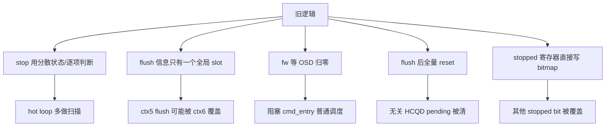
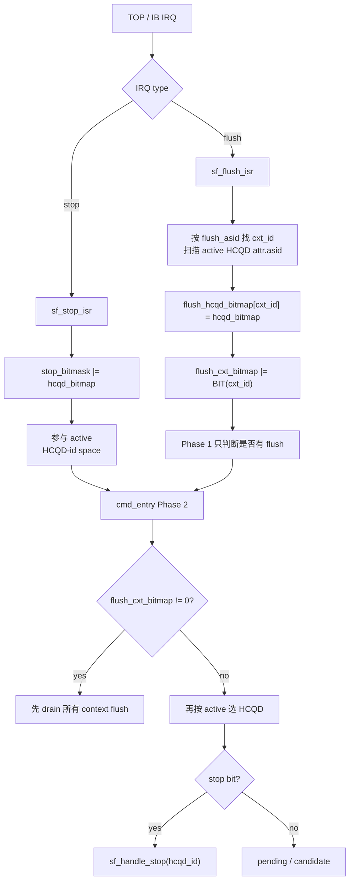
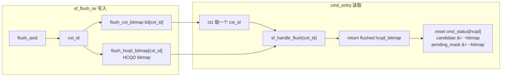

---
type: learning-card
created: 2026-05-09
source: "[[wiki/fw/cp-user/CP stop flush 与 queue 切换|CP stop flush 与 queue 切换]]"
category: "topics"
---

# CP stop flush 与 queue 切换

## 原文

- 原文链接：[[wiki/fw/cp-user/CP stop flush 与 queue 切换|CP stop flush 与 queue 切换]]
- 原始路径：wiki\topics\CP stop flush 与 queue 切换.md
- 分类：`topics`
- 文件大小：5477 bytes

## 结论先背

stop/flush 都是控制面事件，但它们不在同一个维度上：

- stop 是 HCQD 级：`stop_bitmask` 进入 `active = candidate | pending_mask | stop_bitmask`。
- flush 是 context 级：`flush_cxt_bitmap` 只告诉 `cmd_entry()` 哪些 context 要 drain。
- 每个 context 对应的 HCQD 集合放在 `flush_hcqd_bitmap[cxt_id]`，由 `sf_handle_flush(cxt_id)` 返回给 `cmd_entry()` 清理。

## 为什么要改

旧 stop/flush 逻辑的问题是：控制面事件和普通 packet dispatch 混在一起，既影响 hot loop，也容易在并发场景下误处理。

这次改动的目标不是“代码写得更漂亮”，而是让 stop/flush 同时满足三件事：

- 正确：不会漏 stop，不会丢多 context flush。
- 快：普通调度路径只做 bitmap 判断，不做复杂扫描。
- 隔离：只清理被 stop/flush 影响的 HCQD，不伤害其他 queue。

## stop/flush 到 cmd_entry 的路径

## sf flush context bitmap 关系

## 关键语义

- flush 优先级最高。进入锁内后，`cmd_entry()` 重新读 `flush_cxt_bitmap`，有 flush 就先处理所有 pending context。
- flush 完成后只 reset 被 flush 的 HCQD，不是全量清所有 `cmd_status`。
- stop 被放进 HCQD active mask，因此没有新 candidate 时也不会漏 stop。
- stop/flush 完成后写 `CPE_FW_HCQD_STOPPED` 要 read-modify-write，不能直接 `writel(bitmap)` 覆盖旧 bit。

## 改动收益怎么讲

面试或 review 时可以这样讲：

1. 背景：`cmd_entry()` 是 CP user hot loop，stop/flush 是控制面事件，会打断普通 candidate dispatch。
2. 原问题：旧 flush 如果用单体信息保存，多个 context 连续 flush 会互相覆盖；旧 stop/flush 还容易带来扫描、阻塞和全量 reset。
3. 修改：stop 改为 HCQD bitmask；flush 拆成 context bitmap + per-context HCQD bitmap；flush 在 Phase 2 优先 drain；返回 processed bitmap 做精确清理。
4. 收益：修复并发覆盖风险，降低 hot loop 开销，避免误清无关 HCQD，trace 上也更容易验证。

| 设计点 | 收益 |
|---|---|
| `stop_bitmask` | stop 可直接进入 HCQD active mask，O(1) 调度 |
| `flush_cxt_bitmap` | O(1) 判断是否有 pending context flush |
| `flush_hcqd_bitmap[cxt_id]` | 多 context flush 不覆盖 |
| `sf_handle_flush(cxt_id)` 返回 bitmap | 精确清理本次 flush 涉及的 HCQD |
| read-modify-write stopped | 不覆盖其他 stopped bit |

## 容易误解点

- `flush_cxt_bitmap` 的 bit index 是 `cxt_id`；`active` 的 bit index 是 `hcqd_id`。两个 bitmap 不能 OR 在一起。
- `flush_hcqd_bitmap[cxt_id]` 不是“另一个 active”，它是 flush context 到 HCQD 集合的映射。
- stop 和 flush 同时出现时，flush valid 期间 stop ISR 可能只清 IRQ，真正 drain/drop 由 flush 路径覆盖。
- 当前需要继续关注 `stop_bitmask` set/clear 的 RMW 竞争，尤其是 ISR set 和 handle clear 重叠窗口。

## 关联页面

- [[CP candidate peek 热路径优化|CP candidate peek 热路径优化]]
- [[CP cmd_entry Candidate V7 调度设计|CP cmd_entry Candidate V7 调度设计]]
- [[CP queue scheduling stop flush|CP queue scheduling stop flush]]
- [[HCQD|HCQD]]
- [[Interaction-Buffer|Interaction-Buffer]]
- [[wiki/sources/local-md/C-home-shuaishuai.zhu/fw/docs/cp_user_sf_cmd_changes|CP User：Stop/Flush 与 cmd_entry 优化]]
- [[本地 Markdown 文件索引|本地 Markdown 文件索引]]
- [[语雀工作笔记索引|语雀工作笔记索引]]
