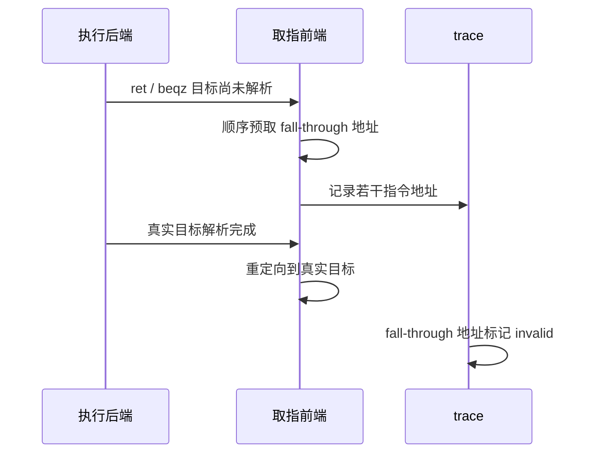
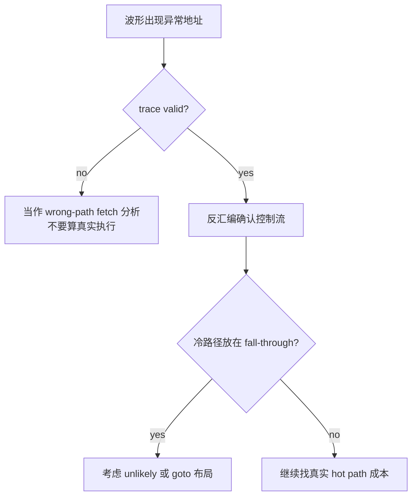

---
type: learning-card
created: 2026-05-09
source: "[[wiki/fw/performance/CP 分支预取与 cmd_entry 布局优化|CP 分支预取与 cmd_entry 布局优化]]"
category: "topics"
---

# CP 分支预取与 cmd_entry 布局优化

## 原文

- 原文链接：[[wiki/fw/performance/CP 分支预取与 cmd_entry 布局优化|CP 分支预取与 cmd_entry 布局优化]]
- 原始路径：wiki\topics\CP 分支预取与 cmd_entry 布局优化.md
- 分类：`topics`
- 文件大小：1536 bytes

## 结论

波形里看到某段 `.text` 地址，不等于这段代码真实执行。`ret` 或 `beqz` 目标还没解析时，CPU 前端可能顺序预取 fall-through 指令；如果 trace 标记 invalid，这只是 wrong-path fetch。优化 `cmd_entry()` 布局时，要分清“真实执行成本”和“前端误取痕迹”。

## wrong-path fetch 解释图

## 布局优化怎么判断

## 对 cmd_entry 的启发

- 多数情况下不执行的分支，不适合放在默认 fall-through 路径上。
- `unlikely()` 在 release `-O2` 更可能改变布局；debug `-O0` 下效果有限。
- 手写 goto 布局可以在 `-O0` 下固定热路径顺序，但只应该用于被波形证明的 hot path。
- 先看 valid bit，再谈布局优化；否则容易把前端预取误判成实际执行。

## 和 candidate peek 的关系

candidate 优化关注“拿到 candidate 后多久到 `ib_peek_packet()`”。如果中间 trace 出现 `ib_wait_idma_idle` 或其他函数开头地址，先判断它是不是 invalid fetch；只有 valid 执行路径上的读、分支、函数调用才是需要优化的 hot path 成本。

## 关联页面

- [[cmd_entry|cmd_entry]]
- [[CP candidate peek 热路径优化|CP candidate peek 热路径优化]]
- [[CP command processing flow|CP command processing flow]]
- [[语雀工作笔记索引|语雀工作笔记索引]]
