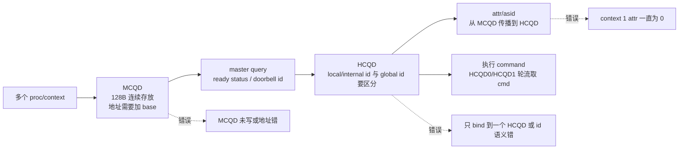

---
type: learning-card
created: 2026-05-09
source: "[[wiki/fw/flows/CP 多队列多上下文与 HCQD MCQD|CP 多队列多上下文与 HCQD MCQD]]"
category: "topics"
---

# CP 多队列多上下文与 HCQD MCQD

## 原文

- 原文链接：[[wiki/fw/flows/CP 多队列多上下文与 HCQD MCQD|CP 多队列多上下文与 HCQD MCQD]]
- 原始路径：wiki\topics\CP 多队列多上下文与 HCQD MCQD.md
- 分类：`topics`

## 这个主题可以怎么讲

这个主题适合讲“我怎么把硬件规格里的队列模型落到 firmware 调度”。核心不是会背 MCQD/HCQD 名词，而是能说明 query/bind/doorbell 这条链路里，地址布局、global/local id、context/asid 属性任何一个错了，都会表现成多队列不轮转、bind 到错误队列或 context 属性丢失。

## 模块关系图

## 技术抓手

- MCQD 地址：多个 MCQD 并行时，MCQD addr 忘记加 base 会导致 query 地址异常。
- 硬件约束：根据 CP MAS，MCQD 需要 128 字节连续存放才能被 query。
- 最小复现：两个 proc + 两个 MCQD，观察 HCQD0/HCQD1 是否轮流取 cmd。
- 多 context：context 1 的 HCQD attr 一直为 0，最后定位为 MCQD 未写。
- ID 语义：HCQD id 使用内部 id 而不是 global HCQD id 会出错，改成 global 后解决。
- query/bind：`qdma_get_mcqd_ready_status()`、`top_reg_get_mcqd_doorbell_id()` 一类路径要按系统链路看。

## 证据材料

- [[wiki/fw/flows/CP 多队列多上下文与 HCQD MCQD|原文]] 记录了 2025-09 到 2025-12 的关键事件。
- [[语雀工作笔记索引]] 中 2025-09 是多 MCQD 并行和 128B 连续存放，2025-12 是多 context、HCQD global id、kernel perf。
- 可引用结果：两个 proc + 两个 MCQD 后，看到 HCQD0/HCQD1 轮流取 cmd 执行。
- 可引用失败：多个 MCQD 只能 bind 到一个、context 1 HCQD attr 为 0、CP master 卡在 doorbell/query 路径。

## 面试追问

- MCQD 和 HCQD 分别解决什么问题？
- 为什么 MCQD 要 128B 连续存放？如果不连续会怎样？
- global HCQD id 和 local/internal id 的边界在哪里？
- 多 context 下 attr/asid 应该从哪里传到哪里？
- 你怎么设计最小 case 证明 HCQD0/HCQD1 真的轮转？

## 关联页面

- [[HCQD]]
- [[MCQD]]
- [[GraceC-CP]]
- [[CP command processing flow]]
- [[语雀工作笔记索引]]