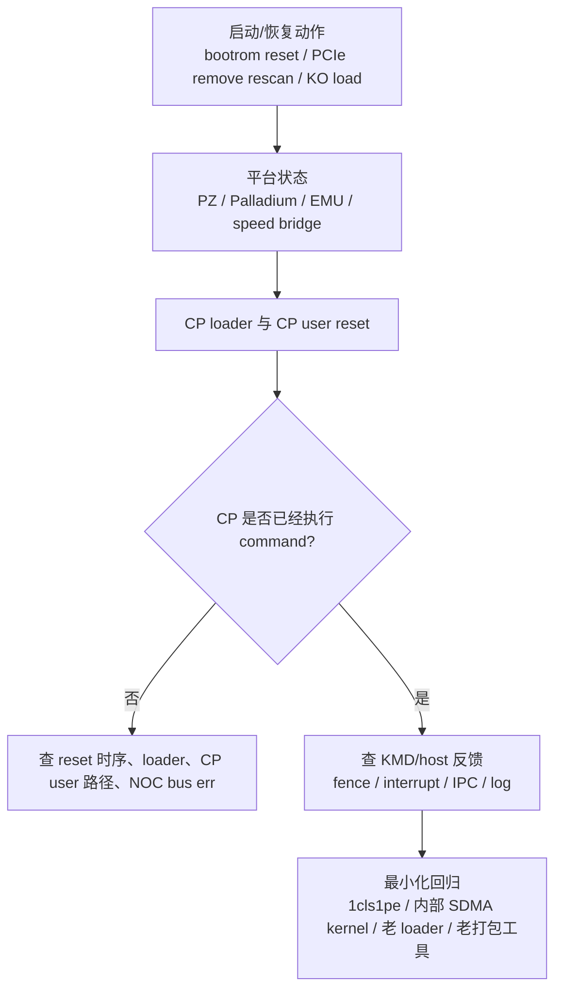

---
type: learning-card
created: 2026-05-09
source: "[[wiki/fw/debug/CP 平台 bring-up 与 PCIe 调试|CP 平台 bring-up 与 PCIe 调试]]"
category: "topics"
---

# CP 平台 bring-up 与 PCIe 调试

## 原文

- 原文链接：[[wiki/fw/debug/CP 平台 bring-up 与 PCIe 调试|CP 平台 bring-up 与 PCIe 调试]]
- 原始路径：wiki\topics\CP 平台 bring-up 与 PCIe 调试.md
- 分类：`topics`

## 这个主题可以怎么讲

这个主题适合讲“我怎么处理跨层 bring-up 问题”。不要只说 PCIe 或 firmware 某个点，而是把 CP loader、bootrom、CP user reset、PZ/Palladium/EMU、KMD KO、fence 返回串起来。面试里重点强调：平台问题的第一步是隔离变量，先判断 CP 有没有真正执行到，再看 host/KMD 有没有收到完成信号。

可以这样讲：

1. 早期问题发生在平台启动和 CP user reset 阶段，现象包括 NOC bus err、master 起不来、fence 不返回。
2. 我没有直接改 firmware，而是先用最小配置和版本对比判断是哪一层导致。
3. 证据来自 delay 实验、PCIe speed bridge 占用、bootrom/reset 顺序、kern.log、dmesg、UMD log 和波形。
4. 最终沉淀出 bring-up 排查顺序：平台/boot 顺序 -> driver/KMD -> firmware 执行 -> host 反馈。

## 问题链路图

## 技术抓手

- reset 时序：多 CP user 启动时，第二个 user 可能在第一个 reset 未完成前访问 NOC。
- PCIe/平台：speed bridge 上 t4/t5/t6 占用影响启动，t28 不受影响；Palladium reset PCIe 不一定能恢复。
- fence：DM1.4 下 kernel test fence 不返回，但 DM1.1 可以返回，要先确认 CP 是否执行完。
- KO/driver：PZ1 KO 加载和 mutex、PCIe remove/rescan 流程相关。
- 最小化回归：1cls1pe、内部 SDMA/kernel、老 loader、老打包工具。

## 证据材料

- [[wiki/fw/debug/CP 平台 bring-up 与 PCIe 调试|原文]] 的关键事件覆盖 2025-08 到 2026-02。
- [[语雀工作笔记索引]] 中 2025-08、2025-10、2025-11、2026-01、2026-02 是主要月份证据。
- 可引用现象：NOC bus err、DM1.4 fence 不返回、CP master 起不来、cls bitmap 只有 cls0 写入、PZ1 KO 加载受 mutex 影响。
- 需要回看原始材料的证据：`kern.log`、`dmesg`、UMD log、波形截图、PCIe remove/rescan 操作记录。

## 面试追问

- 你怎么判断 fence 不返回是 CP 没执行，还是 host/KMD 没收到？
- 为什么 reset PCIe 不一定能恢复 Palladium 上的问题？
- 你做最小化回归时会先固定哪些变量？
- CP user reset 时序为什么会导致 NOC bus err？
- 如果同一套代码 DM1.1 可以、DM1.4 不行，你会怎么做版本对比？

## 关联页面

- [[CP ringbuffer IPC 与 queue create 调试]]
- [[CP SDMA copy 与 kernel command 调试]]
- [[CP 多队列多上下文与 HCQD MCQD]]
- [[硬件基础 RAM ROM Flash]]
- [[语雀工作笔记索引]]