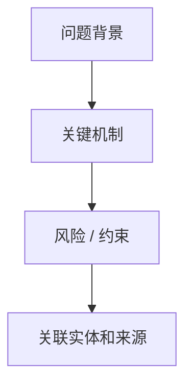
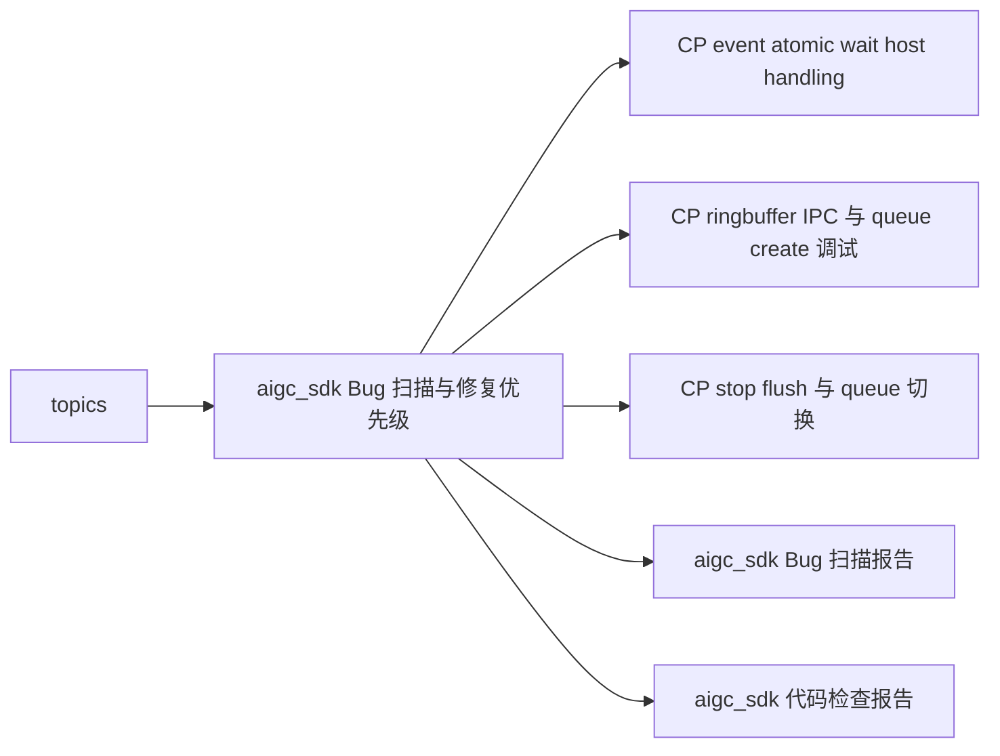

---
type: learning-card
created: 2026-05-09
source: "[[wiki/fw/debug/aigc_sdk Bug 扫描与修复优先级|aigc_sdk Bug 扫描与修复优先级]]"
category: "topics"
---

# aigc_sdk Bug 扫描与修复优先级

## 原文

- 原文链接：[[wiki/fw/debug/aigc_sdk Bug 扫描与修复优先级|aigc_sdk Bug 扫描与修复优先级]]
- 原始路径：wiki\topics\aigc_sdk Bug 扫描与修复优先级.md
- 分类：`topics`
- 文件大小：1442 bytes

## 怎么读

主题页：围绕一个问题或技术点展开。

## 本页关系图

## 小节索引

- 高优先级模式
- 与现有图谱关系
- 来源

## 关联页面

- [[CP event atomic wait host handling|CP event atomic wait host handling]]
- [[CP ringbuffer IPC 与 queue create 调试|CP ringbuffer IPC 与 queue create 调试]]
- [[CP stop flush 与 queue 切换|CP stop flush 与 queue 切换]]
- [[wiki/sources/local-md/C-home-shuaishuai.zhu/fw/aigc_sdk_bug_report|aigc_sdk Bug 扫描报告]]
- [[wiki/sources/local-md/C-home-shuaishuai.zhu/fw/aigc_sdk_check_report|aigc_sdk 代码检查报告]]

## 阅读提示

- 如果这页是 sources，优先把它当证据材料，不要从这里开始建立全局理解。
- 如果这页是 synthesis 或 topics，优先看 Mermaid 图和小节标题，再跳到关联页面。
- 如果这页没有显式链接，读完后回到 [[_learning_guides/00 阅读总入口|阅读总入口]] 或 [[wiki/index|Wiki Index]]。