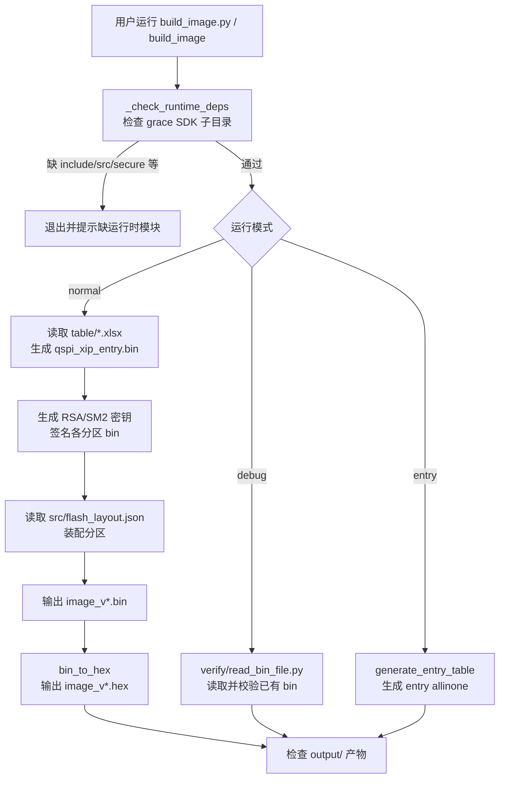

---
type: learning-card
created: 2026-05-09
source: "[[wiki/tools/image_tool 固件镜像打包工具|image_tool 固件镜像打包工具]]"
category: "topics"
---

# image_tool 固件镜像打包工具

## 原文

- 原文链接：[[wiki/tools/image_tool 固件镜像打包工具|image_tool 固件镜像打包工具]]
- 原始路径：wiki\topics\image_tool 固件镜像打包工具.md
- 分类：`topics`

## 什么时候用

- 维护 `/home/shuaishuai.zhu/image_tool` 的固件镜像打包脚本、README、架构说明或发布流程。
- 需要运行 `normal/debug/entry` 模式，验证 `.bin/.hex` 产物、签名、CRC、PyInstaller 打包。
- 需要判断当前开发工作流：以服务器上的 `grace/build_image.py` 为权威源文件；提交 commit 需要用户明确批准。

## image_tool 架构流程

## 操作步骤

1. 进入服务器事实源：`/home/shuaishuai.zhu/image_tool`。
2. 读当前 `README.md` 和 `architecture.md`，确认是否存在历史同步流和当前直接编辑流的冲突。
3. 改代码时以 `grace/build_image.py` 为当前权威源；不要恢复旧的 `build_image_new.py/_apply_changes.py/write_files.py` 同步模型，除非用户明确要求。
4. 验证 CLI 参数路径时，必须覆盖“传入所有参数不再交互”和“回车使用默认值”两类行为。
5. 文档同步更新 README 和 architecture；但只在用户授权时提交 commit。

## 常见失败

- README 旧段落仍说 `build_image_new.py` 是权威源，而当前架构页和协作约定已经改为直接服务器编辑 `grace/build_image.py`。
- 只从代码推断 CLI 已修复，没有运行复现；历史上 `e90a75f` 仍会在提供 CLI 参数后继续提示并触发 `EOFError`。
- PyInstaller 直接打包 `.py`，遗漏 `gmssl.sm2/sm3/func` hiddenimports。
- 缺少 `include/ src/ emu/ secure/ verify/ table/` 部署子目录，工具启动失败。

## 验证标准

- `python3 build_image.py -m normal -k rsa -c crc16 --fw-version 10102` 不应进入已提供参数的交互提示。
- 交互默认值路径可用，例如按多次回车能得到默认配置。
- `normal` 模式在部署包完整时生成 `output/image_v*.bin`，未跳过 HEX 时生成 `.hex`。
- PyInstaller 构建使用 `build_image.spec`，并保留 `gmssl` hiddenimports。
- 本轮若只被要求改文档，不能改服务器代码或自动 commit。

## 关联页面

- [[AI 协作远程编辑经验|AI 协作远程编辑经验]]
- [[wiki/sources/local-md/C-home-shuaishuai.zhu/image_tool/architecture|image_tool 架构文档]]
- [[wiki/sources/local-md/C-home-shuaishuai.zhu/image_tool/README|image_tool — Grace SoC 固件镜像打包工具]]