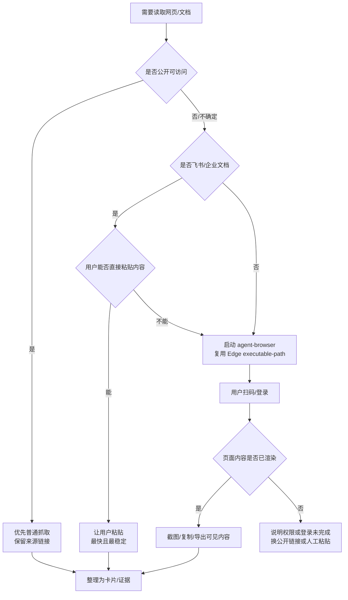

---
type: learning-card
created: 2026-05-09
source: "[[wiki/synthesis/工具与登录环境经验|工具与登录环境经验]]"
category: "topics"
---

# 工具与登录环境经验

## 原文

- 原文链接：[[wiki/synthesis/工具与登录环境经验|工具与登录环境经验]]
- 原始路径：wiki\topics\工具与登录环境经验.md
- 分类：`topics`

## 什么时候用

- 需要访问飞书、企业内网页、登录后可见资料，或 `WebFetch`/普通 HTTP 抓取拿不到内容。
- Windows 上使用 `agent-browser` 时，默认 Chrome for Testing 不存在，需要指定系统 Edge。
- 用户要求“抓资料”“看网页”“打开本地浏览器上下文”，但页面可能依赖登录态、二维码或企业权限。

## 浏览器登录态/资料抓取流程

## 操作步骤

1. 先判断是否真的需要浏览器登录态；飞书文档默认按需要鉴权处理。
2. 能让用户直接粘贴文档内容时优先粘贴，不把时间花在绕登录。
3. 必须浏览器打开时，在 Windows 使用 Edge：`/c/Program Files (x86)/Microsoft/Edge/Application/msedge.exe`。
4. 若 `agent-browser` 命令缺 PATH，补上 Node 和 npm global bin，再指定 `--executable-path`。
5. 抓取后保留原始 URL、页面标题、截图或用户粘贴来源，避免把登录页误当正文。

## 常见失败

- `agent-browser open` 报 Chrome not found，因为本机未安装 Chrome for Testing。
- 飞书链接跳转登录页，WebFetch 只能看到登录壳，不能代表文档正文。
- SSH one-liner 里拼 Windows PATH，空格和冒号导致命令解析失败。
- 登录态属于浏览器会话，不等于命令行 HTTP 客户端也有权限。

## 验证标准

- 明确说明资料来自公开抓取、用户粘贴、还是登录浏览器可见内容。
- 对飞书/企业文档，正文不是登录页、权限页或空白壳。
- Windows 浏览器命令指定了 Edge executable path，且 Node/npm PATH 问题已处理。
- 资料整理后保留相关 wikilink 和原文链接。

## 关联页面

- [[wiki/sources/local-md/C-home-shuaishuai.zhu/ajthunk/.claude/learnings/agent-browser-no-sudo-install|agent-browser Installation Without sudo]]
- [[wiki/sources/local-md/C-home-shuaishuai.zhu/ajthunk/.claude/learnings/agent-browser-windows-edge-workaround|agent-browser on Windows: Use Edge Instead of Chrome]]
- [[wiki/sources/local-md/C-home-shuaishuai.zhu/ajthunk/.claude/learnings/feishu-requires-auth|Feishu Documents Require Authentication]]
- [[wiki/sources/local-md/C-home-shuaishuai.zhu/ajthunk/.claude/learnings/ssh-windows-path-export-issue|SSH One-liner PATH Export Fails with Windows Paths]]
- [[wiki/sources/local-md/C-home-shuaishuai.zhu/ajthunk/.claude/retros/2026-03-30-1935|Session Retrospective — 2026-03-30 19:35]]