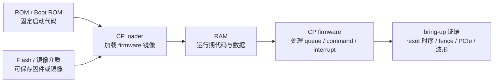

---
type: learning-card
created: 2026-05-09
source: "[[wiki/fw/concepts/硬件基础 RAM ROM Flash|硬件基础 RAM ROM Flash]]"
category: "topics"
---

# 硬件基础 RAM ROM Flash

## 原文

- 原文链接：[[wiki/fw/concepts/硬件基础 RAM ROM Flash|硬件基础 RAM ROM Flash]]
- 原始路径：wiki\topics\硬件基础 RAM ROM Flash.md
- 分类：`topics`

## 这个主题可以怎么讲

这张卡不是为了背概念，而是为了在面试官问 boot、firmware、存储介质时，把基础知识接回 [[CP 平台 bring-up 与 PCIe 调试]]。建议讲法是：RAM/ROM/Flash 的差异会影响启动阶段哪些内容是固定的、哪些能被重新打包或更新、哪些问题只能通过平台 reset 或镜像调整验证。

## 启动关系图

## 技术抓手

- RAM：随机访问、断电丢失、速度快；运行期状态和调试现象常在这里体现。
- DRAM：容量大、成本低，需要刷新；适合解释系统内存和 host/device memory 观察。
- SRAM：速度快、成本高，常用于 cache；可以接到 cache/同步或前端取指问题。
- ROM/Boot ROM：启动早期固定程序，适合解释为什么 boot 顺序和 reset 顺序影响 bring-up。
- Flash：区分 NAND/NOR，强调它常和固件镜像、可修改性、启动介质有关。

## 证据材料

- [[wiki/fw/concepts/硬件基础 RAM ROM Flash|原文]] 提供基础概念。
- [[CP 平台 bring-up 与 PCIe 调试]] 提供应用场景：CP loader、bootrom、reset、PCIe bring-up。
- [[语雀工作笔记索引]] 中 2025 的“工作笔记”是 RAM/ROM/NAND/NOR 基础来源。

## 面试追问

- Boot ROM 和 firmware loader 的职责怎么分？
- RAM、ROM、Flash 的可修改性差异会怎样影响 bring-up 排查？
- 为什么有些问题重打镜像能验证，有些必须重启平台或调整 reset 顺序？
- SRAM/DRAM 的差异和 cache、同步问题有什么关系？
- NAND Flash 和 NOR Flash 在启动场景里通常关注什么差异？

## 关联页面

- [[CP 平台 bring-up 与 PCIe 调试]]
- [[面试用工作笔记总结]]
- [[语雀工作笔记索引]]