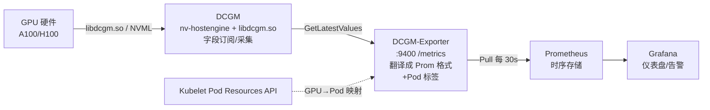
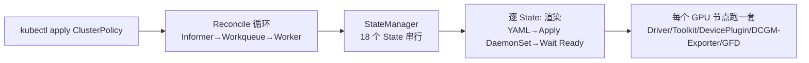

# GPU 监控与运维

> **一句话**：监控运维侧回答"GPU 怎么被管起来、看得见、报得准"——GPU-Operator 做 Day-0 自动部署，DCGM-Exporter 把指标喂给 Prometheus，cluster-health 做集群健康分诊，DeepOps 一键装裸机。落在 [[NVIDIA-AI-Cloud栈]] 的 L5 控制平面 + 可观测性/发现侧链。

## 监控链路：DCGM → Exporter → Prometheus → Grafana

- **DCGM**（Data Center GPU Manager）= 采集层。`nv-hostengine` 守护进程 + `libdcgm.so` 库，持续监控温度/功率/利用率/显存/ECC/XID，支持 `WatchFields` 按频率订阅。
- **DCGM-Exporter** = 翻译+出口层。调 `GetLatestValuesForFields` 取值，按 CSV 配置映射成 `DCGM_FI_DEV_*` 指标，经 PodMapper（查 Kubelet Pod Resources API 把 GPU UUID 映射到 Pod/namespace）注入标签，在 :9400 `/metrics` 以 Prometheus 文本暴露。两种连 DCGM 模式：Embedded（进程内链 libdcgm.so）/ Remote（TCP:5555 连独立 nv-hostengine）。
- **Prometheus** = 拉取+存储层。Pull 模式每 30s 抓 `/metrics`，时序存储。
- **Grafana** = 可视化层。查 Prometheus 渲染仪表盘（官方 Dashboard ID 12239）+ 告警。

**给应届生**：DCGM 是 GPU 的"体检中心"（量体温测心率，但说内部黑话）；DCGM-Exporter 是"翻译官+柜台"（翻成 Prometheus 能读的标准格式摆出来等取货，还顺手贴上"这是哪个 Pod 在用"的标签）；Prometheus 是定时取货的"外卖小哥"，Grafana 是把仓库数据画成仪表盘的"驾驶舱"。

## GPU-Operator：Day-0 自动化

Operator 模式 = CRD（声明期望状态）+ Controller（Reconcile 循环把实际状态协调到期望）。GPU-Operator 用 `ClusterPolicy` CR 让用户声明"我要这套 GPU 软件栈"，Controller 盯集群事件自动干活。

串行 18 个 State 像装修打卡单：先打地基（Driver）→ 接管线（Toolkit）→ 装插座（Device Plugin）→ 装监控（DCGM/Exporter）→ 贴标签（GFD），一项 Ready 才进下一项。管理范围覆盖 Driver、Container Toolkit、Device Plugin、DCGM、DCGM-Exporter、GFD、MIG Manager、VFIO/vGPU Manager、Kata Manager、机密计算（CC Manager）、Validator 等。驱动自动升级走 Cordon→Drain→滚动换版→Uncordon；依赖 NFD 的节点标签触发新节点自动补齐。

**给应届生**：Operator ≈ K8s 里的"自动管家"——你给它一张任务清单（ClusterPolicy），它就盯着集群状态自动干活，新机器来了自动装全套软件、驱动旧了自动滚动升级，永不打盹（Reconcile 循环）。为什么需要它？手动在每台节点装驱动/插件太繁琐易错，节点扩缩容要自动化。

## 节点发现：gpu-feature-discovery

通过 NVML 探测 GPU 硬件，转成标准化 `nvidia.com/*` 标签（`gpu.product`/`gpu.memory`/`gpu.family`/`gpu.count`/`cuda.driver.major`/`mig.capable`）。两种部署：DaemonSet 持续刷新（默认 60s）、Job 一次性。每次循环 Init/Shutdown NVML 避免长期占句柄、支持驱动热升级。输出写文件 `/etc/kubernetes/node-feature-discovery/features.d/gfd`（原子写+rename，NFD Worker inotify 感知）或 NodeFeature CRD。Manager 回退链：NVML→CUDA（Tegra）→Null。本组件在调度侧的角色见 [[K8s-GPU调度与运行时]]。

## 共享库：go-nvlib

go-nvlib 是在 [[K8s-GPU调度与运行时|go-nvml]] 之上的语义化厚封装库，给 GFD / device-plugin / Container Toolkit 当共同底座。核心模块：`nvlib/device`（GPU 设备抽象 + MIG 管理，`MigProfile` 表达 `1g.5gb`/`3g.20gb`）、`nvlib/info`（平台检测 nvml/tegra/wsl）、`nvpci`（扫 `/sys/bus/pci/devices` 按 vendor 0x10de 过滤，区分 GPU/NVSwitch/SR-IOV）、`nvmdev`（vGPU Mediated Device）、`pciids`（PCI 名称解析）。库而非进程，链接进调用方、按需懒加载。

**给应届生**：go-nvlib ≈ GPU 管理的"乐高积木箱"——把底层 NVML/PCI/sysfs/mmap 的脏活封装成好用的 Go 接口，多个组件拿它当底座，不各自重造轮子。go-nvml 是逐条翻译 NVML C 函数（薄），go-nvlib 把"MIG 创建/枚举/销毁"等打包成一站式语义（厚）。

## cluster-health：集群健康度设计

参考 Imbue 的大模型训练集群健康保障，形成"体检→分诊→自愈"闭环。多维度检查覆盖：

| 维度 | 检查内容 |
|---|---|
| GPU/ECC | nvidia-smi 查 ECC 错误计数 |
| Fabric Manager | nvidia-fabricmanager 是否 active |
| Docker-NVIDIA 通信 | 容器内 nvidia-smi 能否通信 |
| dmesg | XID/SXID 硬件错误、PCIe 带宽受限 |
| 通信 | NVLink NCCL all_reduce、IB 分组/P2P（≥720Gbps、延迟 P99≤4.2us） |
| UFM 端口 | 符号错误率/链路 down/端口抖动 |

`ComputeHostHealth` 四态：**OK**（入池调度）→ **UNHEALTHY**（降级池+修复脚本+回归）→ **CRITICAL**（下线隔离+工单）→ **UNKNOWN**（检查自身故障）。优先级合并：Incomplete>Error>Warning>SilencedWarning>OK，外层超时兜底。dmesg 白名单 + 无害 SXID 列表避免噪声误报。UFM 抖动坏端口可自动禁用/复测。

## DeepOps：裸金属部署

NVIDIA 开源的集群部署运维参考实现，以 Ansible playbook/role 为主，把裸机一键装成 GPU 集群。三段式：Playbook 定"做什么" / Role（50+）定"怎么做" / Inventory 定"在哪做"。覆盖 Infrastructure（DNS/NTP/存储）→ Cluster Core（Kubespray 装 K8s / Slurm）→ NVIDIA Stack（驱动/Toolkit/GPU-Operator/MOFED）→ Observability（DCGM-Exporter+Prometheus+Grafana）。与 GPU-Operator 互补：DeepOps 管物理机裸装，GPU-Operator 管 K8s 上的 GPU 生命周期。

**给应届生**：DeepOps ≈ 一套"装修包工队的 Ansible 脚本"——一键把裸机毛坯房装修成 GPU 集群精装房，装 OS、装驱动、装 K8s/Slurm、装监控一条龙。

## 延伸

- [[NVIDIA-AI-Cloud栈]] — 本页在七层栈中的位置
- [[K8s-GPU调度与运行时]] — gpu-feature-discovery / go-nvlib 的调度视角
- [[wiki/ai-infra/gpu-ras/GPU-RAS体系|GPU RAS]] — 故障检测处置闭环（与 cluster-health 互补）
- [[wiki/ai-infra/gpu-ras/DCGM与监控|DCGM 与监控]] — DCGM 4+1 + XID 错误码
- [[千卡训练性能优化]] — 健康集群是千卡训练的前提
- 专栏原文：[知乎 · 第55篇 DCGM-Exporter](https://zhuanlan.zhihu.com/p/1975168483886118603)｜[第56篇 GPU-Operator](https://zhuanlan.zhihu.com/p/1975272729939817293)｜[第58篇 gpu-feature-discovery](https://zhuanlan.zhihu.com/p/1975293845932615579)｜[第59篇 go-nvlib](https://zhuanlan.zhihu.com/p/1975310286631229164)｜[第60篇 cluster-health](https://zhuanlan.zhihu.com/p/1976048931537458464)｜[第126篇 DeepOps](https://zhuanlan.zhihu.com/p/2001075007229544068)
