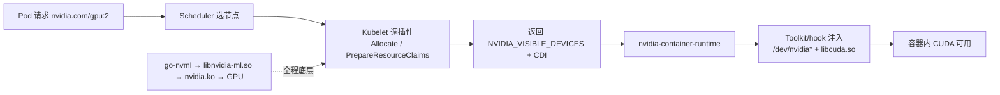

# K8s GPU 调度与运行时

> **一句话**：GPU 要从硬件变成容器里能用的资源，得过三关——**设备发现（节点上有几张什么卡）→ 设备分配（分给哪个 Pod）→ 运行时（把设备搬进容器）**。本页按这三层串起 7 个 NVIDIA 组件，落在 [[NVIDIA-AI-Cloud栈]] 的 L3+L4 层。

## 主线：一个 Pod 怎么用上 GPU

**给应届生**：先记住三个缩写——**CRI** = 容器运行时接口，K8s 不直接管 docker/containerd，通过 CRI 这层标准接口调度；**Device Plugin** ≈ K8s 给 GPU 发门禁卡的窗口，pod 要用 GPU 得先刷卡；**CDI** = 容器设备接口，把"该挂哪些设备文件"标准化成 spec，逐步替代老的 runtime hook。

## 一、设备发现与分配

### k8s-device-plugin（旧 Device Plugin 机制）
以 DaemonSet 跑在每个 GPU 节点，通过 gRPC + Unix Socket 向 Kubelet 暴露 `nvidia.com/gpu` 资源。三个核心接口：`ListAndWatch`（持续推送设备列表与健康状态流）、`Allocate`（分配 GPU 并返回环境变量/挂载点/CDI 注解）、`GetPreferredAllocation`（考虑 NVLink 拓扑返回建议）。健康检查基于 NVML EventSet 监听 XID 事件（13/31/43/45/68/109 等），故障设备标 Unhealthy 推给 Kubelet。支持 Time-Slicing（副本共享）、MPS、MIG（none/single/mixed 策略）。

### k8s-dra-driver-gpu（新 DRA 机制，替代 Device Plugin）
基于 K8s 1.32+ 的 Dynamic Resource Allocation。Pod 用 `ResourceClaim`/`ResourceClaimTemplate` 声明要什么 GPU（可指定 profile、共享、MIG），调度器看插件发布的 `ResourceSlice` 全局设备表决策，kubelet 调插件 `PrepareResourceClaims` 准备设备并生成 CDI。还能编排多节点 NVLink（MNNVL，经 ComputeDomain 分配 IMEX Domain ID 0–31）。

### gpushare（GPU 共享/细粒度切分）
阿里方案，把单张 GPU 切成多个虚拟分片（默认 6 片）。`gpushare-device-plugin` 把切片暴露为 `nvidia.com/gpushare` 资源；`gpushare-scheduler-plugin` 集成进 kube-scheduler，用 Bin Packing 决定哪片给哪个 Pod。注意它直接调 `nvidia-smi` 二进制，不走 go-nvml。

### gpu-feature-discovery（节点打标签）
通过 NVML 探测 GPU，打 `nvidia.com/gpu.product`/`gpu.memory`/`gpu.family`/`gpu.count`/`mig.capable` 等标签，让调度器按型号派活。运维视角的详解见 [[GPU监控与运维]]。

## 二、运行时

### nvidia-container-toolkit（让容器能访问 GPU）
拦截容器运行时 OCI spec，在容器创建时注入 GPU。Legacy 模式注入 prestart hook → `nvidia-container-cli` → `libnvidia-container.so`，干三件事：`mknod /dev/nvidia0`、bind mount `libcuda.so`、配 cgroup 设备白名单（`c 195:0 rwm`）。CDI 模式则直接读 `/etc/cdi/nvidia.yaml` 注入，无需 hook。

**给应届生**：nvidia-container-runtime hook ≈ 容器启动前把 GPU 设备文件塞进容器口袋——容器出厂是空壳（OCI spec），hook 伸手进去造设备节点、挂驱动库、开 cgroup 权限，装修完 runc 才真正入住。CDI 则是把"装修清单"标准化成文件，运行时直接读，比 hook 更干净。

### go-nvml（底层查询库）
NVML（NVIDIA Management Library）C API 的 Go 绑定，经 CGO + dlopen 加载 `libnvidia-ml.so.1`。分三层：上层手动封装 → c-for-go 自动生成绑定 → `pkg/dl` 动态库加载。延迟初始化 + 引用计数 + 版本化符号管理（运行时 dlsym 检测 `nvmlInit_v2` 等是否存在，优先用最新符号，保证向后兼容）。是 device-plugin、DRA driver、nomad 插件的共同底座。

### k8s-kata-manager（kata 容器 + GPU 安全隔离）
管理 Kata Containers（VM 级强隔离）运行时类。Kata 把容器跑在轻量 VM 里，GPU 不能走普通挂载，得用 VFIO 直通：扫描绑定 `vfio-pci` 的 GPU 生成 `nvidia.com/pgpu` CDI，自动下载 Kata 制品（vmlinuz/image/config）、配 containerd/CRI-O 运行时类。Pod 指定 `runtimeClassName: kata-qemu-nvidia-gpu` 即用直通 GPU。

## 三、Device Plugin vs DRA（核心对比）

| 维度 | Device Plugin | DRA |
|---|---|---|
| 范式 | 命令式 | 声明式 |
| 资源声明 | `limits.nvidia.com/gpu: 2`（整数） | `resources.claims` 引用 ResourceClaim，可指定 profile/sharing/MIG |
| 分配粒度 | 整卡为主（共享靠 Time-Slicing 软副本） | 原生支持共享、动态 MIG、细粒度 |
| 设备发现上报 | 插件主动 `ListAndWatch` 推流给 Kubelet | 插件发布 `ResourceSlice` 到 API Server，调度器看 |
| 设备注入 | envvar/volume-mount/CDI 注解 | CDI（标准化注入） |
| 局限 | 只能整卡、不懂拓扑/细粒度、扩展性差 | 需 K8s 1.32+，GPU 分配仍实验性 |

**给应届生**：Device Plugin 像"只能整租"的旧系统——kubelet 问"要几张"，插件回"这几张"，黑盒；DRA 像"可整租、可合租、可按需动态隔断"的新系统——Pod 写申请单"我要一张 MIG 3g.40gb，最好同 NVLink 域"，调度器看着全局设备表（ResourceSlice）审批，批完让插件备好设备。Device Plugin 在走下坡路，DRA 是未来。

## go-nvml vs go-nvlib

go-nvml 是**下层**（NVML C API 的直接 Go 绑定，薄封装，函数一一对应）；go-nvlib 是**上层**（在 go-nvml 之上的语义化厚封装，把 MIG 实例的创建/枚举/销毁打包成一站式接口，还集成 PCI 发现、平台检测）。依赖链：上层应用 → go-nvlib → go-nvml → `libnvidia-ml.so` → `nvidia.ko` → GPU。go-nvlib 组件详解见 [[GPU监控与运维]]。

## 非 K8s 对照：nomad-device-nvidia

HashiCorp Nomad 的 GPU 设备插件，和 k8s-device-plugin 干一模一样的活（发现/分配/监控 GPU），只是对接 Nomad 插件协议而非 K8s Device Plugin API。三个方法：`Fingerprint`（按 1m 轮询 go-nvml 枚举 GPU+MIG，流式上报属性）、`Reserve`（生成 `NVIDIA_VISIBLE_DEVICES` 隔离）、`Stats`（流式输出利用率/温度/ECC）。结构与 k8s-device-plugin 高度对称但更精简——可用作理解 K8s 方案的"简化镜像"。

## 延伸

- [[NVIDIA-AI-Cloud栈]] — 本页在七层栈中的位置
- [[GPU监控与运维]] — gpu-feature-discovery / go-nvlib 的运维视角
- [[wiki/ai-infra/gpu-ras/DCGM与监控|DCGM 与监控]] — XID 错误码与监控指标
- [[什么是分布式训练]] — 这些组件服务的大模型训练
- 专栏原文：[知乎 · 第53篇 Device Plugin](https://zhuanlan.zhihu.com/p/1975157926697116253)｜[第54篇 Container Toolkit](https://zhuanlan.zhihu.com/p/1975164902109898045)｜[第57篇 DRA Driver](https://zhuanlan.zhihu.com/p/1975276619737346492)｜[第122篇 go-nvml](https://zhuanlan.zhihu.com/p/1999970743514064797)｜[第123篇 kata-manager](https://zhuanlan.zhihu.com/p/1999971225993228397)｜[第124篇 gpushare](https://zhuanlan.zhihu.com/p/1999974474003539442)｜[第125篇 nomad-device-nvidia](https://zhuanlan.zhihu.com/p/2000323118321927866)
