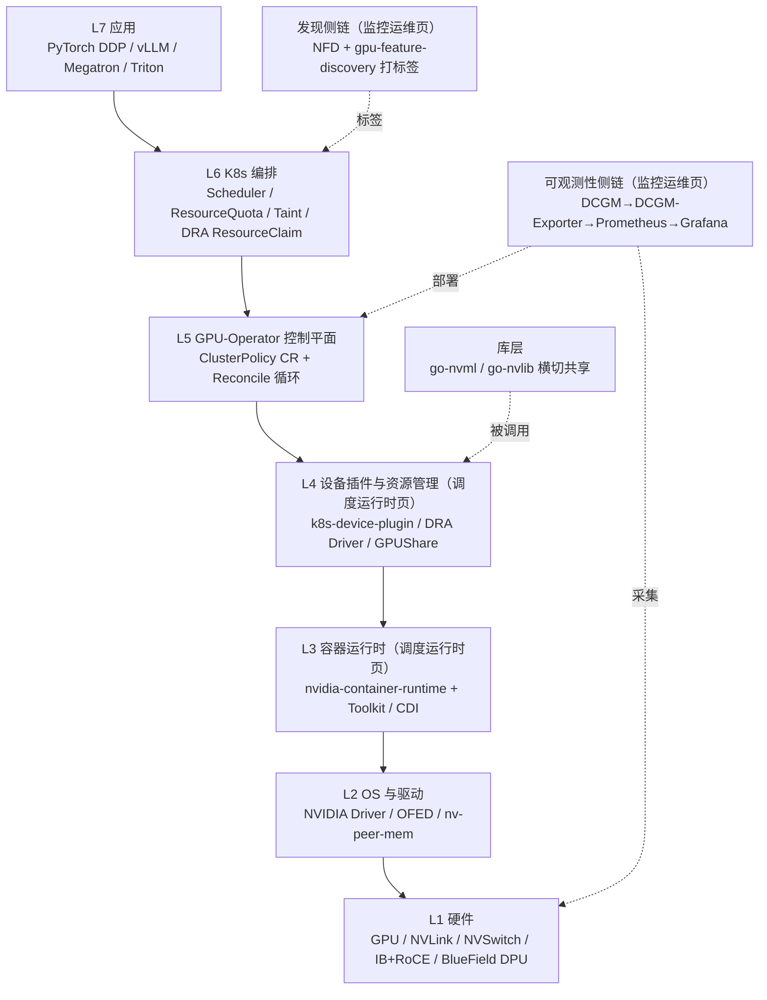

# NVIDIA AI Cloud 栈

> **一句话**：NVIDIA AI Cloud 栈 = 把 GPU 算力像云一样交付的全套云原生组件——底层 GPU/NVLink/DPU → 驱动 → 容器运行时 → 设备插件/DRA → GPU-Operator → K8s → 应用，让用户像申请 CPU/RAM 那样用 `kubectl` 申请、调度、共享、监控 GPU。

## 这是什么

注意：标题虽叫"AI Cloud"，但正文落地为 **NVIDIA Cloud Native Stack（开源云原生组件生态）**，不含 DGX Cloud / Base Command 等商业整机。它解决一个核心矛盾——**GPU 不是 K8s 的原生资源**：K8s 默认只认 CPU/RAM，要让它管 GPU，得解决设备发现、分配、共享、隔离、监控、故障一整套特有问题。

**给应届生**：一句话心智模型——**AI Cloud ≈ 把一堆 GPU 装进 K8s，像管 CPU 一样管 GPU**。K8s 原本只认 CPU/RAM 两种"货币"，GPU 是新货币；Device Plugin 是"兑换柜台"（把 GPU 翻译成 `nvidia.com/gpu`），Driver/Toolkit 是"通道"（把设备搬进容器），DCGM 是"审计"（监控每张卡花了多少），GPU-Operator 是"管家"（自动把这套东西装到每个节点）。

## 七层栈（L1–L7）+ 两条侧链

## 各层职责

| 层 | 干什么 | 关键组件 |
|---|---|---|
| L1 硬件 | 物理算力 + 互联 | GPU（A100/H100）、NVLink/NVSwitch、IB/RoCE NIC、BlueField DPU |
| L2 OS/驱动 | 让 OS 识别 GPU、暴露 `/dev/nvidia*` 与 libcuda | NVIDIA Driver、OFED、nv-peer-mem（GPUDirect RDMA） |
| L3 容器运行时 | 把 GPU 安全注入容器 | nvidia-container-runtime 拦截 OCI spec、Toolkit 改 spec、CDI 标准化注入 |
| L4 设备插件/资源管理 | 把 GPU 暴露给 K8s 并管理分配 | Device Plugin 注册 `nvidia.com/gpu`、DRA Driver 声明式分配、GPUShare 共享 |
| L5 GPU-Operator | 自动化控制平面 | ClusterPolicy CR + Reconcile 循环，自愈、滚动升级 |
| L6 K8s 编排 | 调度与隔离 | Scheduler、ResourceQuota、Taint/Toleration、DRA ResourceClaim |
| L7 应用 | 跑 AI/ML | PyTorch DDP、vLLM、Megatron、TensorRT、Triton |

**侧链**：可观测性链负责"看得见"；发现链（NFD+GFD）负责"贴标签"让调度器认识节点；库层（go-nvml/go-nvlib）横切共享，避免每个组件重复造轮子。

## 本集群三页的定位

- 本文（总览）= 全栈七层鸟瞰。
- [[K8s-GPU调度与运行时]] = 栈的 **L3 + L4 + 库层**，回答"GPU 怎么从硬件变成 K8s 可调度资源"。
- [[GPU监控与运维]] = 栈的 **L5 控制平面 + 可观测性侧链 + 发现侧链**，回答"GPU 怎么被管起来、看得见、报得准"。

## 演进三阶段

**给应届生**：理解这条时间线比记组件更重要——Device Plugin 在走下坡路，DRA 是未来。

1. **当前**：Device Plugin 为主，整卡分配，共享靠 Time-Slicing/MPS 这种"软副本"。
2. **过渡**：v25.x+ DRA Driver 加入、CDI 标准化设备注入，两者并存。
3. **未来**：NVIDIA Cloud Native Platform，DRA 为主、Device Plugin 废弃，叠加 NIM Operator（管 LLM 推理微服务）与机密计算（GPU TEE）。

## 典型集群配置

| 负载 | 配置 | GPU 共享策略 |
|---|---|---|
| 训练 | 32 节点 ×8 A100 80GB | 独占，全卡跑大模型 |
| 推理 | 16 节点 ×4 A30 + MIG → 256 实例 | MIG 硬件级隔离，多租户 |
| 混合 | 64 节点混 A100/A30/V100 | PriorityClass + 标签区分训练/推理 |

多租户隔离四层手段：Namespace+ResourceQuota 限配额、NetworkPolicy 网络隔离、Taint/Toleration 节点专用、MIG 提供硬件级错误隔离。详见 [[GPU监控与运维]] 与 [[wiki/ai-infra/gpu-ras/GPU-RAS体系|GPU RAS]]。

## 延伸

- [[K8s-GPU调度与运行时]] — 设备发现→分配→运行时分层详解
- [[GPU监控与运维]] — GPU-Operator + DCGM 监控链 + cluster-health
- [[wiki/ai-infra/gpu-ras/GPU-RAS体系|GPU RAS]] — 故障下的可靠性闭环
- [[wiki/ai-infra/distributed-training/index|分布式训练基础]] — 训练侧的并行与通信
- 专栏原文：[知乎 · 第52篇 NVIDIA AI Cloud 整体架构](https://zhuanlan.zhihu.com/p/1974950965577803164)
