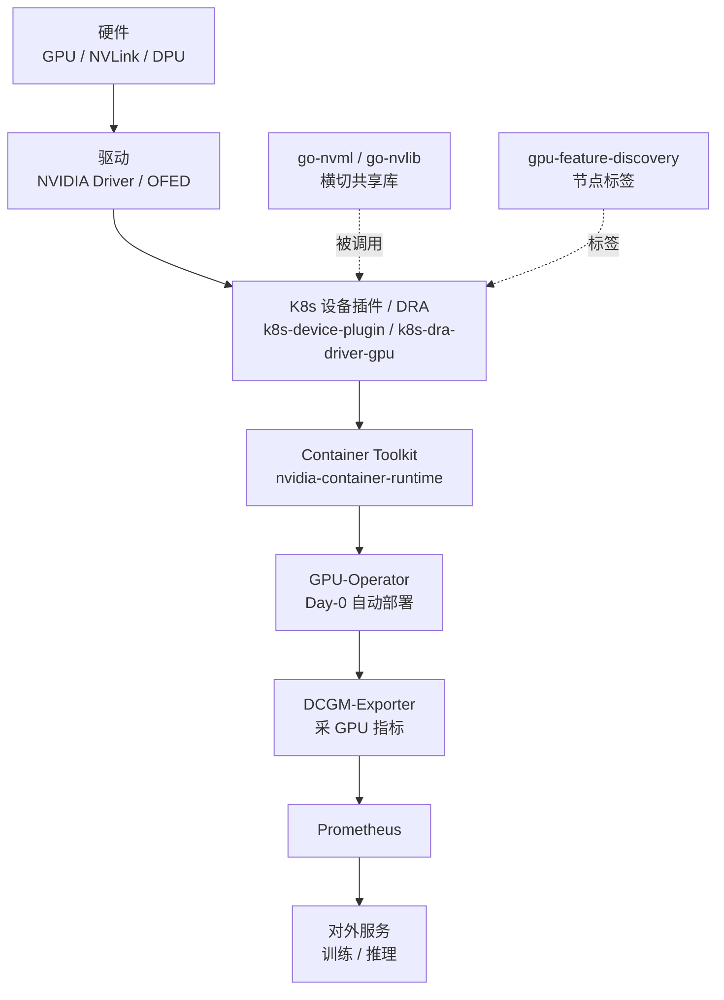

# AI 云 / K8s GPU 运维

> 知乎专栏第52–60、122–126篇重写。把 GPU 算力像云一样交付——从裸机部署到 K8s 调度运行时再到监控运维的云原生全栈。

## 推荐阅读顺序

1. [[NVIDIA-AI-Cloud栈]] — 七层栈总览 + 演进三阶段（Device Plugin→DRA→未来）
2. [[K8s-GPU调度与运行时]] — 设备发现→分配→运行时，7 个组件 + Device Plugin vs DRA 对比
3. [[GPU监控与运维]] — GPU-Operator 自动化 + DCGM 监控链 + cluster-health + DeepOps

## 云原生 GPU 栈

**给应届生**：从下往上看这条链——硬件出算力，驱动让 OS 认识 GPU，设备插件把 GPU 翻译成 K8s 资源，Toolkit 把设备搬进容器，GPU-Operator 自动把这一套装到每个节点，DCGM-Exporter 采指标喂给 Prometheus，最后服务训练/推理。三页分别覆盖"总览 / 调度运行时 / 监控运维"。

## 延伸

- [[wiki/ai-infra/index|ai-infra 专区首页]]
- [[wiki/ai-infra/gpu-ras/GPU-RAS体系|GPU RAS]] — 故障下的可靠性闭环
- [[wiki/ai-infra/distributed-training/index|分布式训练基础]] — 这些云组件服务的大模型训练
