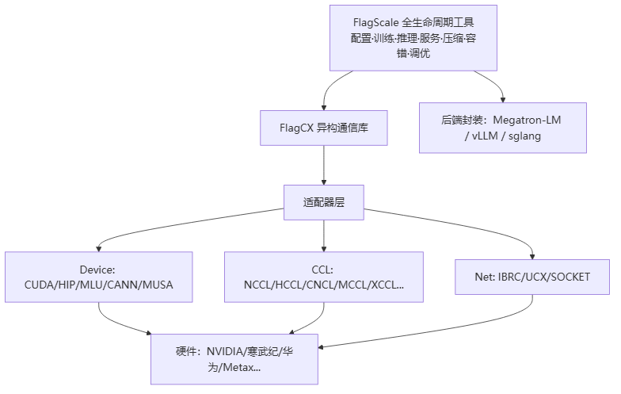
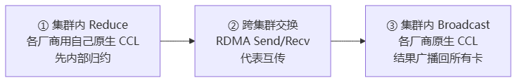

# FlagCX 与 FlagScale

> **一句话**：FlagCX 是智源（BAAI）开源的**异构跨芯片集合通信库**，用适配器架构把 NCCL/HCCL/CNCL 等 10+ 厂商 CCL 统一封装，让不同厂商的 GPU 能一起做 AllReduce；FlagScale 是其上层的大模型**全生命周期工具集**（训练/推理/服务/压缩/容错/调优）。

## 解决什么问题

各厂商芯片各有一套私有 CCL 且互不互通——NVIDIA 用 NCCL、华为用 HCCL、寒武纪用 CNCL……单家算力不够时无法跨厂商混训。FlagCX 用"适配器"统一接口，异构集群也能跑集合通信。

- **与 NCCL**：NCCL 只支持同构 NVIDIA 集群；FlagCX 是其异构扩展。**同构场景**直接调原生 NCCL（仅 1.02-1.10× 开销），**异构场景**走 C2C 跨集群算法（比纯主机通信提升 10×+）。

**给应届生**：NCCL 像「只准同品牌手机互传」的快传；FlagCX 像「万能转接头」，NVIDIA 卡、寒武纪卡、华为卡插一起也能传梯度。这是国产芯片生态的关键基建。

## 两层关系

> 图解源文件：[`01-两层关系-flowchart.mmd`](../../../_attachments/ai-infra/comm-libs/FlagCX与FlagScale/whiteboard-mermaid/01-两层关系-flowchart.mmd)。

- **FlagCX**（底层通信库）：应用层 → 统一 API（`flagcx.h`）→ Runner（HomoRunner 同构 / HybridRunner 异构 C2C / HostRunner / UniRunner）→ 核心组件（Topology/Proxy/Bootstrap/Transport/Tuner）→ 适配器层（Device+CCL+Net+Host）→ 硬件。
- **FlagScale**（上层工具）：Hydra 配置驱动，CLI 入口 → Runner（train/inference/serve/elastic/auto_tuner）→ 任务逻辑（Megatron-LM 训练 / vLLM 推理）→ 通用能力（compress/transformations）→ 后端适配。通过 `cpu:gloo,cuda:flagcx` 复合 backend 集成 FlagCX。

## C2C 三阶段算法（核心创新）

异构 AllReduce 的关键——各厂商 CCL 不能直接互通，就用三阶段绕开：

> 图解源文件：[`02-C2C-三阶段算法（核心创新）-flowchart.mmd`](../../../_attachments/ai-infra/comm-libs/FlagCX与FlagScale/whiteboard-mermaid/02-C2C-三阶段算法（核心创新）-flowchart.mmd)。

**给应届生**：类比「国际会议」——各国先内部开会汇总（说本国语言=CCL），再派代表用英语到国际会议交换（RDMA），回国再广播给国民。32 GPU 异构全局 AllReduce，1GB 数据约 2ms、聚合带宽约 500GB/s。

## 关键机制

- **适配器模式**：`flagcxCCLAdaptor` 定义统一接口，各厂商各实现一套；新芯片接入只写适配器、不改核心。
- **自动调优 Tuner**：成本模型预估+实测选最优算法/参数并缓存，首次 5-10s，后续无开销，提升 1.02-1.5×。
- **自适应分桶**：小消息(<1MB) Sequential，大消息(>64MB) Pipeline 分块重叠，隐藏延迟（[[通信隐藏]]）。
- **零拷贝 RDMA + RegPool**：GPUDirect RDMA 绕过 CPU，注册池缓存避免重复注册，延迟减 50%。

## 典型场景

- **异构混训**：NVIDIA + 寒武纪 + Metax + TsingMicro 同训一个模型（如 Llama3-8B）。
- **跨芯片 AllReduce**：32 GPU 异构全局 AllReduce。
- 三厂商混训（NCCL+MCCL+TCCL）经 Pipeline+多 NIC 优化后可达同构 0.88× 性能。
- Prefill-Decode 分离、跨云训练。

## 国产芯片启示

1. **接入门槛低、接口清晰**：`flagcxCCLAdaptor`/`flagcxDeviceAdaptor` 明确接口（基础函数/通信器管理/集合通信/点对点/组语义），国产芯片做数据类型映射+返回码映射+函数实现即可接入；NCCL 适配器是最完整参考。
2. **异构生态机会**：FlagCX 已支持寒武纪 CNCL、华为 HCCL、Metax MCCL、昆仑芯 XCCL 等，国产芯片可借此进入异构混训生态，不必自建孤岛式同构集群。
3. **能力分级适配**：`memAlloc`/`commFinalize` 可不支持（返回 `NotSupported`），`Gather/Scatter` 可用 `Send/Recv` 组合实现，降低首版接入难度。

## 延伸

- [[集合通信原语]] · [[AllReduce]] · [[Ring-AllReduce]]
- [[wiki/ai-infra/nccl/NCCL架构总览|NCCL]] — FlagCX 同构场景直调 NCCL
- [[什么是分布式训练]] · [[训练拓扑与服务框架]]
- 同集群：[[NVSHMEM]] · [[UCX]] · [[Gloo]] · [[TorchComms]]
- 专栏原文：[第73篇 FlagCX架构](https://zhuanlan.zhihu.com/p/1981498671762800969) · [第117篇 性能优化](https://zhuanlan.zhihu.com/p/1994166441600106803) · [第118篇 后端对接](https://zhuanlan.zhihu.com/p/1994167348022777584) · [第119篇 异构混训](https://zhuanlan.zhihu.com/p/1994168366269756651) · [第121篇 FlagScale架构](https://zhuanlan.zhihu.com/p/1997086128277324675)
