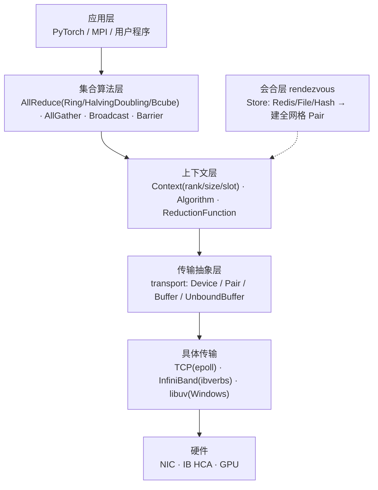

# Gloo

> **一句话**：Gloo 是 Meta（Facebook）开源的集合通信库，定位为 **CPU 侧集合通信主力**、PyTorch `torch.distributed` 的 `gloo` 后端，可在无 GPU 环境用纯 TCP/以太网做 AllReduce——与专注 GPU 的 NCCL 互补。

## 解决什么问题

- **无 GPU 环境也能分布式训练**：CPU 节点间梯度同步、模型广播。
- **bootstrap/初始化通信**：进程发现与连接建立（rendezvous），先用 Store 交换地址再建全网格 TCP。
- **传输无关**：同一套集合算法可跑在 TCP / InfiniBand / libuv 上。

- **与 NCCL**：NCCL 强绑 GPU+NVLink/RDMA；Gloo 算法层与传输层解耦，纯 CPU/以太网也能工作，也可集成 GPUDirect 与 NCCL。

**给应届生**：NCCL 是"必须有 GPU 才能用的对讲机"；Gloo 是"只要有网线就能用的对讲机"。所以 PyTorch 调试、CPU 训练、初始化阶段常用 gloo 后端，GPU 大规模训练再切 nccl。

## 分层架构

关键设计：算法层只依赖 `getPair(rank)` + `buffer->send/waitRecv`，**完全不感知底层传输**。

## 关键机制

- **Ring/Tree 集合算法**：Ring 把张量分块沿环形流水传递，N 步聚合（[[Ring-AllReduce]] 思路）；Halving-Doubling 按距离折半加倍，log2(N) 步收敛（像锦标赛淘汰+决赛重排）。
- **transport 抽象**：Device 工厂造 Pair，Pair 管 send/recv；TCP 用 epoll 事件循环，IB 用 QP+MR 做 RDMA write。一套算法复用多种传输。

**给应届生**：Ring AllReduce ≈「传花接力」——每人加自己那一份再传给下一个，绕一圈后每个人都拿到总和。transport 抽象 ≈「统一快递接口，底下可换顺丰/京东/自建车队」，算法不关心谁送，只管送。

- **异步 + completion queue**：send 后阻塞 `waitRecv()`，epoll 后台线程读写完成后用条件变量唤醒——CPU 开销低、可高并发。
- **pair-based 全网格**：N 个 rank 之间建 N×(N-1)/2 条双向 Pair，集合算法在其上编排。
- **Slot 并发隔离**：多个并发集合操作用递增 slot 区分（多车道），同一条 Pair 上互不干扰。

## 典型场景

- PyTorch `dist.init_process_group("gloo")`：CPU 训练梯度 AllReduce、初始化阶段参数广播、`dist.barrier()` 同步。
- 无 GPU 环境调试与开发、跨机箱 CPU 训练。
- 多节点经 Redis/File Store rendezvous 后全网格 TCP 通信。

## 国产芯片启示

1. **CPU 侧 fallback 价值**：国产 GPU/加速卡若 NCCL 等价物不成熟，Gloo 可作 CPU 训练与初始化阶段的稳定 fallback，门槛低。
2. **transport 适配机会**：Gloo 传输插件化设计天然支持新增国产高速互联的 transport 实现，只需实现 Device/Pair/Buffer 接口即可让所有集合算法复用。
3. **rendezvous 可复用**：Store 抽象不绑硬件，国产集群可直接用 TCPStore/FileStore 起步。

## 延伸

- [[集合通信原语]] · [[AllReduce]] · [[Ring-AllReduce]]
- [[wiki/ai-infra/nccl/NCCL架构总览|NCCL]] — 专注 GPU，与 Gloo 互补
- [[什么是分布式训练]] · [[训练拓扑与服务框架]]
- 同集群：[[NVSHMEM]] · [[UCX]] · [[TorchComms]] · [[FlagCX与FlagScale]]
- 专栏原文：[第131篇 Gloo 集合通信库 4+1架构视图](https://zhuanlan.zhihu.com/p/2021538926179955472)
