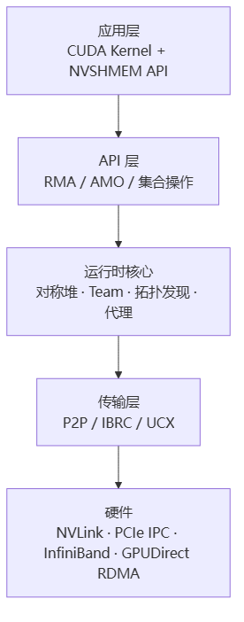
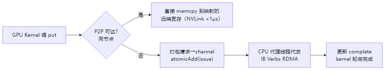

# NVSHMEM

> **一句话**：NVSHMEM 是 NVIDIA 的 PGAS 共享内存通信库——让多张 GPU 的显存拼成一个逻辑"全局地址空间"，CUDA kernel 线程能直接 `put`/`get` 别卡的显存、做硬件原子，全程不用 CPU 介入。NCCL 管"集合通信"，NVSHMEM 管"细粒度点对点 + kernel 内发起通信"。

## 是什么 / 解决什么问题

NVSHMEM 扩展 OpenSHMEM 标准，给 GPU 提供 **PGAS**（Partitioned Global Address Space，分区全局地址空间）编程模型。每个 GPU = 一个 PE（Processing Element），所有 PE 分配等大的"对称堆"（symmetric heap），相同偏移地址对应同一逻辑位置 → 形成"全局地址空间"，任一 PE 的 kernel 线程可直接读写别的 PE 的对称堆。

- **NCCL**：进程（CPU 侧）发起集合通信，粒度大、同步在 host。
- **NVSHMEM**：CUDA kernel 线程发起 put/get/atomic，粒度细、可在 GPU 内做流水线与[[通信隐藏]]。

**给应届生**：PGAS ≈「每张卡的显存互相透明可见」。你写 `nvshmem_float_put(dst, val, peer)`，就像往隔壁卡的显存写一个数，硬件直接搬，CPU 不掺和。NCCL 是"班长喊口令全班一起交作业"，NVSHMEM 是"同学之间随时传纸条"。

## 核心架构（4+1 视图精简）

> 图解源文件：[`01-核心架构（4+1-视图精简）-flowchart.mmd`](../../../_attachments/ai-infra/comm-libs/NVSHMEM/whiteboard-mermaid/01-核心架构（4+1-视图精简）-flowchart.mmd)。

- **对称堆**：所有 PE 分配等大 heap，相同偏移 → 全局地址空间；通过 Bootstrap（PMI/MPI/SHMEM）交换内存句柄建立映射。
- **传输层三选一**：P2P（同节点 NVLink/PCIe，`cudaIpcGetMemHandle`，<1μs）、IBRC（跨节点 InfiniBand RDMA，~1-2μs）、UCX（异构 fallback，自动选路）。
- **Team 机制**：把 PE 分组（WORLD/NODE/同 GPU），支持层次化集合通信。
- **代理机制**：kernel 发不出去的操作（如跨节点 RDMA）打包写进 channel buffer + `atomicAdd(issue)`，CPU 代理线程轮询代发，完成后更新 `complete` 计数器。

## 三类 API

| 类别 | 代表 API | 作用 |
|---|---|---|
| RMA | `nvshmem_put/get`、`*_nbi`(非阻塞) | 远程显存读写 |
| AMO | `atomic_add/cas/swap/fetch` | 硬件原子同步 |
| 集合 | `barrier_all/broadcast/reduce/alltoall` | 集合通信 |
| 同步 | `fence/quiet/signal_wait_until` | 内存序与完成等待 |

**给应届生**：`put` 是异步的——发出去就返回。`quiet()` = "等所有 put 真正落地再继续"；`fence()` = "保证本 PE 发出的操作先后顺序"。类似文件 IO 的 flush——不 quiet，数据可能还在路上。`signal_op + wait_until` 把"数据传完"和"通知到位"解耦，是流水线并行的关键套路。

## 两种执行路径

> 图解源文件：[`02-两种执行路径-flowchart.mmd`](../../../_attachments/ai-infra/comm-libs/NVSHMEM/whiteboard-mermaid/02-两种执行路径-flowchart.mmd)。

## 典型场景

- **流水线并行**：stage1 kernel 算完 `put` 中间结果 + `signal`，stage2 `wait_until` 收到再继续，通信藏在计算里（见 [[通信隐藏]]）。
- **手搓 Ring AllReduce**：用 `put + fence + wait_until` 实现 ReduceScatter + AllGather（[[Ring-AllReduce]] 的另一种落地）。
- 多 GPU 协作的分布式矩阵乘、科学计算 HPC。

## 与 NCCL 的差异

| | NCCL | NVSHMEM |
|---|---|---|
| 发起方 | CPU 进程 | GPU kernel 线程 |
| 粒度 | 大块集合通信 | 单元素 put/get + 原子 |
| 同步 | host 侧 barrier | kernel 内 signal/wait |
| 适合 | 数据并行梯度归约 [[AllReduce]] | 细粒度点对点、流水线、PGAS 计算 |

二者非互斥：NVSHMEM 的 UCX 传输可对接 NCCL/UCX 生态，大模型训练常两者混用。

## 国产芯片启示

1. **P2P 内存访问是地基**：无 `cuDeviceCanAccessPeer` 等效能力，NVSHMEM 直接跑不起来（致命级）。GPU 要能 Load/Store 跨芯片显存。
2. **硬件原子是核心**：barrier/signal 全靠硬件 AMO，软件模拟性能掉 90%+；至少实现 add/cas/swap/fetch/and/or/xor/set 等 8 种、32/64 位、跨芯片 <500ns。
3. **高速互联 + GPUDirect RDMA**：对标 NVLink ≥400GB/s、<2μs；跨节点要网卡能直接 DMA 进 GPU 显存（GPU 内存物理地址可暴露给 NIC）。CUDA VMM 统一地址空间能极大简化编程。

## 延伸

- [[集合通信原语]] · [[AllReduce]] · [[Ring-AllReduce]] · [[通信隐藏]]
- [[wiki/ai-infra/nccl/NCCL架构总览|NCCL]] — 同为 NVIDIA 通信库，定位互补
- [[什么是分布式训练]] · [[训练拓扑与服务框架]]
- 同集群：[[UCX]]（NVSHMEM 的传输后端之一）· [[Gloo]] · [[TorchComms]] · [[FlagCX与FlagScale]]
- 专栏原文：[第23篇 NVSHMEM 4+1架构](https://zhuanlan.zhihu.com/p/1972653673030108683) · [第24篇 国产芯片兼容性](https://zhuanlan.zhihu.com/p/1972683922480575348) · [第25篇 应用示例](https://zhuanlan.zhihu.com/p/1972694423113590355)
