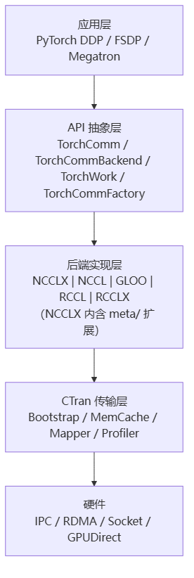

# TorchComms

> **一句话**：TorchComms 是 Meta 为 PyTorch 开发的新一代通信 API 集合，用统一的 `new_comm(backend, device)` 管理 NCCL/NCCLX/Gloo/RCCL 等多种后端，目标是重构替代 `torch.distributed`；其中 **NCCLX** 是基于 NCCL 扩展的高性能后端，叠加零拷贝 RDMA、内存注册缓存、全链路追踪等增强。

## 解决什么问题

`torch.distributed` 历史包袱重、后端硬编码、初始化慢。TorchComms 用策略模式 + ABI 版本化 + entry_points 动态加载，统一管理多后端，支持 CUDA Graph、async_op、communicator split。

- **NCCLX vs NCCL**：NCCLX 基于 NCCL v2.27，叠加 `meta/` 专有增强（CTran 通信框架、CollTrace 追踪、AlgoConf 动态算法、Hints）。实测 8×A100 AllReduce 100MB：延迟降 14%、带宽升 16%，千卡场景优势 68-89%。

**给应届生**：NCCL 是"集合通信的标准实现"，NCCLX 是 Meta 在它上面打的"性能补丁包"——保留同样 API（`ncclAllReduce`），底层换上零拷贝 RDMA + 追踪 + 动态选算法。上层 `dist.init_process_group("nccl")` 改成 `new_comm("ncclx")` 就能迁移。

## 四层架构

> 图解源文件：[`01-四层架构-flowchart.mmd`](../../../_attachments/ai-infra/comm-libs/TorchComms/whiteboard-mermaid/01-四层架构-flowchart.mmd)。

NCCLX 的 `meta/` 增强：`ctran`（CTran 通信框架集成）、`colltrace`（全链路追踪）、`algoconf`（运行时算法配置）、`hints`（GlobalHints）、`transport`（传输扩展）。

## 关键机制

- **内存注册缓存 memCacheAllocator**：RDMA 每次通信都要 `ibv_reg_mr` 注册内存（内核态切换）。NCCLX 首次注册后用 AVL 树缓存复用，命中直接走，省 70-90% 注册开销。
- **懒初始化 `NCCL_LAZY_SETUP_CHANNELS`**：通道用到才建，初始化时间减 50%。
- **CTran 零拷贝 + 异步流水线**：标准 NCCL 走 GPU→CPU→网络→CPU→GPU；NCCLX 走 GPU→网络→GPU 直连 RDMA，准备/传输/完成三级流水线并行，稳态延迟取三者最大值。

**给应届生**：内存注册缓存 ≈「门禁卡复用」——第一次进大楼办卡（注册，慢），之后刷卡进（命中缓存，快）。懒初始化 ≈「按需开灯」——没人的房间不开空调，省启动时间。CTran 零拷贝 ≈「点对点快递不经过中转站」。

- **CollTrace**：记录每次集合操作的提交/排队/执行/完成时间戳（行车记录仪），自动检测慢操作告警，cudaEvent 对象池复用降 80% 开销。
- **API 兼容**：保留 NCCL 的 `ncclAllReduce/AllGather` 签名，上层迁移成本低。

## 典型场景

- DDP 梯度 `all_reduce`(SUM)、FSDP 的 `all_gather`/`reduce_scatter`、Megatron TP 的 `all_reduce`、PP 的 `send/recv`。
- `comm.split(ranks)` 分子通信器用于 3D 并行（TP/PP/DP group）和 MoE 专家并行。
- CUDA Graph 捕获通信操作 replay，消除每 iter CPU 开销（100 次迭代 CPU 时间 20ms→1ms）。

## 国产芯片启示

1. **TorchCommBackend 抽象是机会**：国产芯片无需硬刚 NCCL，只需实现 `TorchCommBackend` 接口（all_reduce/all_gather/send/recv 等纯虚函数）+ entry_points 注册，即可作为新后端插入，降低 CUDA 依赖。
2. **CTran 依赖 CUDA Driver API**（`cuMemCreate/Map/SetAccess`、IPC 句柄）：国产适配须实现这约 50 个核心 API 的语义等价层 + UVA 虚拟内存 + GPUDirect RDMA。
3. **硬件门槛**：SIMT 32 线程 warp、≥25GB/s 专用互联、48-57 位 UVA、BF16、跨设备 64 位原子。分 4 阶段（功能→性能→全功能→差异化），首版目标 60% A100 性能。

## 延伸

- [[集合通信原语]] · [[AllReduce]] · [[通信隐藏]]
- [[wiki/ai-infra/nccl/NCCL架构总览|NCCL]] — NCCLX 基于 NCCL 扩展
- [[什么是分布式训练]] · [[训练拓扑与服务框架]]
- 同集群：[[NVSHMEM]] · [[UCX]] · [[Gloo]] · [[FlagCX与FlagScale]]
- 专栏原文：[第49篇 TorchComms架构](https://zhuanlan.zhihu.com/p/1974773458928947562) · [第50篇 NCCLX对比NCCL](https://zhuanlan.zhihu.com/p/1974774499535779525) · [第51篇 国产芯片兼容性](https://zhuanlan.zhihu.com/p/1974785536578297912)
