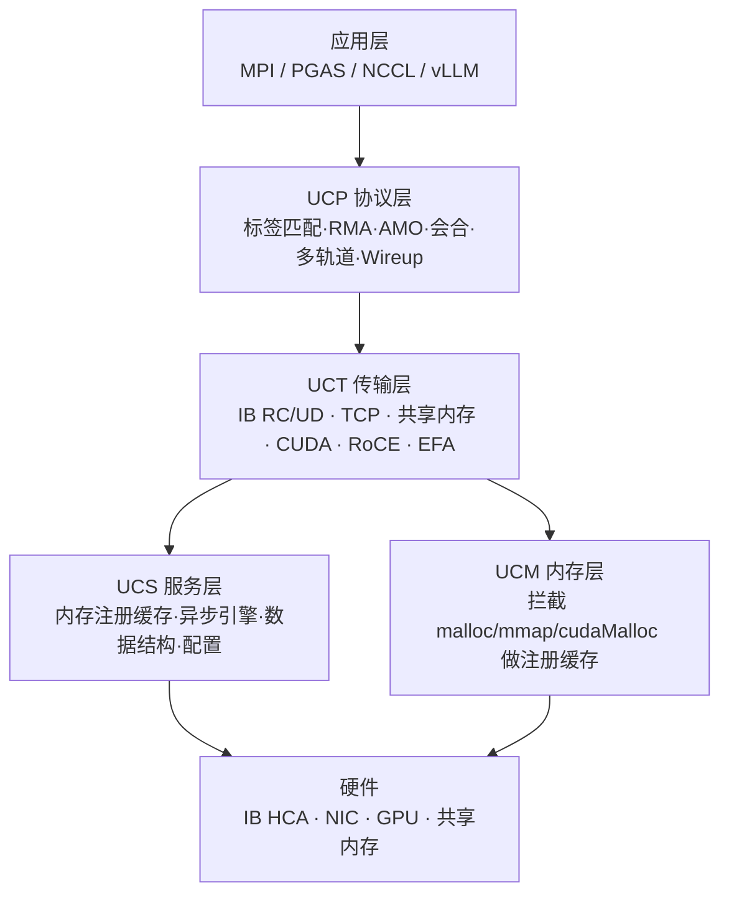
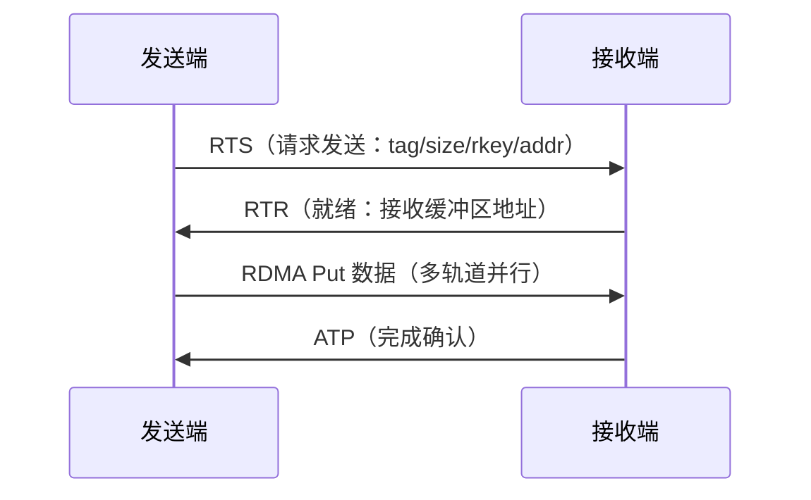

# UCX

> **一句话**：UCX（Unified Communication X）是一套"通信框架的框架"——把 InfiniBand/RoCE/TCP/共享内存/GPU 等底层传输抽象成统一 API，让上层 MPI/NCCL/NVSHMEM/vLLM 不用关心具体网卡。NCCL 是"集合通信库"，UCX 是更底层的"通信底座"。

## 是什么 / 解决什么问题

UCX 面向高带宽低延迟网络，提供抽象通信原语，自动选用最优硬件卸载（RDMA、GPUDirect、原子操作）。痛点：上层框架每对接一种网卡都要重写一遍通信代码；UCX 用分层抽象屏蔽硬件差异，运行时自动选最优传输。

- **与 NCCL**：NCCL 专注 GPU 集合通信，可用 UCX 作传输后端（`NVSHMEM_UCX_SUPPORT` / NCCL+UCX）；UCX 更底层、更通用，也能做点对点 RMA/AMO。
- **定位**：UCX ≈ 通信界的"硬件抽象层"，把一堆厂商的传输统一成一套 API。

**给应届生**：把 UCX 想成「通信界的 HAL」。你写 `ucp_tag_send_nbx()`，它自己挑：同节点走共享内存/NVLink，跨节点走 InfiniBand RDMA，没 IB 就退到 TCP。上层 NCCL/MPI 不用为每张网卡写特判。

## 四层架构

- **UCP**（协议层）：高级抽象——标签匹配消息、RMA put/get、AMO 原子、流式通信、Wireup 连接协商、多轨道（Multi-Rail）。
- **UCT**（传输层）：底层原语，每种硬件一个实现（IB RC/UD/MLX5、TCP、POSIX/CMA/KNEM 共享内存、CUDA IPC/GDR、RoCE、EFA…），动态库插件化。
- **UCS**（服务层）：内存注册缓存、异步事件引擎、数据结构、统计/调试。
- **UCM**（内存层）：拦截 `malloc/mmap/cudaMalloc`，给注册缓存喂地址变更事件。

## 关键机制

**协议自适应**：按消息大小选协议——Short（<256B 直接塞 AM 头）、Eager（<8KB 主动发）、Rendezvous（>8KB 会合握手）。

**给应届生**：会合协议（Rendezvous）≈「大件快递先电话约时间」。小消息直接扔过去（Eager，像发短信），大消息要先问对方"有没有地方放"再寄（Rendezvous），否则接收端缓冲爆掉。

- **多轨道 Multi-Rail**：把一块大数据切成 N 份，同时走 N 张网卡（如 4×IB 聚合 400Gbps），聚合带宽。
- **内存注册缓存**：RDMA 要求内存先 `ibv_reg_mr` 注册（1GB 约 1ms）。UCX 拦截 malloc 把注册结果缓存，命中后 <1μs，命中率 >95%。这是 GPUDirect RDMA 能"零拷贝"的前提。

## 典型场景

- **vLLM 分布式推理**：张量并行 AllReduce（100MB-10GB 大张量，调多轨道）、KV Cache 跨节点拉取（RDMA Get 零拷贝）、流水线并行。
- **MPI/PGAS 底座**：OpenMPI、NVSHMEM 都可挂 UCX 当传输。
- 异构网络（IB+TCP 混部）、云上 EFA 网卡。

**给应届生**：vLLM 跑多卡推理时，环境变量 `UCX_TLS=rc,cuda_copy,cuda_ipc,sm` 决定走哪些传输，`UCX_MAX_RNDV_LANES=2` 开多轨道。这些是 vLLM 性能调优的常见旋钮——出了通信瓶颈先查 `ucx_info -d` 看实际选了什么传输。

## 国产芯片启示

1. **内存类型检测是第一道关**：UCX 靠 `cuPointerGetAttribute` 判断指针是 host/GPU/统一内存，再选传输。国产芯片必须提供等效 API 且查询 <50ns，否则传输选错、性能崩。
2. **IPC + P2P + GPUDirect RDMA**：同节点 GPU 间走 P2P（≥300GB/s），跨节点要网卡直接 DMA 进 GPU 显存（全尺寸 PCIe BAR + IOMMU pass-through）。
3. **插件化接入门槛低**：实现一个 `uct_md_ops`（内存注册/分配/查询）+ UCT 传输插件，就能让国产芯片进入 UCX 生态，所有上层框架（MPI/NCCL/vLLM）自动受益。

## 延伸

- [[集合通信原语]] · [[AllReduce]] · [[通信隐藏]]
- [[wiki/ai-infra/nccl/NCCL架构总览|NCCL]] — 可用 UCX 作传输
- [[什么是分布式训练]] · [[训练拓扑与服务框架]]
- 同集群：[[NVSHMEM]]（UCX 是其传输后端之一）· [[Gloo]] · [[TorchComms]] · [[FlagCX与FlagScale]]
- 专栏原文：[第70篇 UCX 4+1架构](https://zhuanlan.zhihu.com/p/1976761240597599492) · [第71篇 vLLM性能优化](https://zhuanlan.zhihu.com/p/1976761861409087988) · [第72篇 国产芯片兼容性](https://zhuanlan.zhihu.com/p/1976762199209951715)
