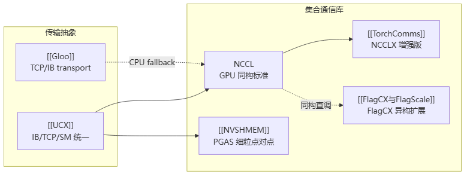

# 其他集合通信库 索引

> **本专区**：除了 [[wiki/ai-infra/nccl/NCCL架构总览|NCCL]] 这个"GPU 集合通信事实标准"之外，业界还有一批通信库各管一段——底层传输框架、异构跨厂商、PyTorch 原生、CPU 侧、PGAS 细粒度。本页是它们的阅读入口。

## 阅读顺序

1. 先读 [[集合通信原语]] + [[什么是分布式训练]] 打底，再进本专区。
2. [[Gloo]] — 最简单，Meta 出品，CPU 侧集合通信，PyTorch gloo 后端，帮你理解"传输无关算法"。
3. [[UCX]] — 通信框架的框架，把 IB/TCP/共享内存抽象成统一 API，是 NCCL/NVSHMEM/vLLM 的传输底座。
4. [[TorchComms]] — Meta 给 PyTorch 的新一代通信 API + NCCLX（NCCL 的性能增强版）。
5. [[NVSHMEM]] — NVIDIA 的 PGAS 共享内存库，kernel 内细粒点对点通信。
6. [[FlagCX与FlagScale]] — 国产之光，异构跨芯片通信库 + 全生命周期工具。

## 概念锚点：每个库一句话

| 库 | 一句话 | 定位 | 对标/补充 |
|---|---|---|---|
| [[Gloo]] | Meta 集合通信库 | CPU 侧、传输无关 | NCCL 的 CPU 互补 |
| [[UCX]] | 统一通信框架 | 传输抽象底座 | NCCL/NVSHMEM 的底层 |
| [[TorchComms]] | PyTorch 新通信 API + NCCLX | 后端统一管理 | NCCL 的性能增强 |
| [[NVSHMEM]] | NVIDIA PGAS 共享内存库 | kernel 内细粒点对点 | NCCL 的细粒度互补 |
| [[FlagCX与FlagScale]] | 智源异构跨芯片库 + 全生命周期工具 | 异构混训 | NCCL 的异构扩展 |

## 共同主线

> 图解源文件：[`01-共同主线-flowchart.mmd`](../../../_attachments/ai-infra/comm-libs/index/whiteboard-mermaid/01-共同主线-flowchart.mmd)。

所有库最终服务于 [[AllReduce]]、[[Ring-AllReduce]] 等集合原语，支撑 [[什么是分布式训练|分布式训练]] 第⑤步梯度归约。

## 国产芯片启示汇总

| 库 | 对自研芯片最关键的一条 |
|---|---|
| [[NVSHMEM]] | P2P 内存访问 + 硬件原子是地基，缺一不可 |
| [[UCX]] | 内存类型检测 API 必须提供（<50ns） |
| [[FlagCX与FlagScale]] | 适配器接口清晰，国产芯片接入门槛最低 |
| [[TorchComms]] | 实现 TorchCommBackend 接口即可插入 PyTorch |
| [[Gloo]] | transport 插件化，可作国产芯片 CPU fallback |

## 延伸

- [[wiki/ai-infra/nccl/index|NCCL 专区]] — GPU 集合通信事实标准
- [[wiki/ai-infra/distributed-training/index|分布式训练基础]] — 通信原语与拓扑算法
- [[集合通信原语]] · [[AllReduce]] · [[Ring-AllReduce]] · [[通信隐藏]] · [[训练拓扑与服务框架]]
