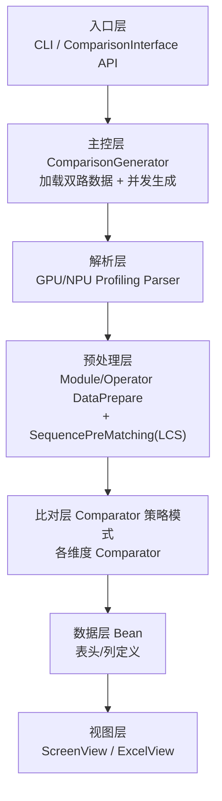
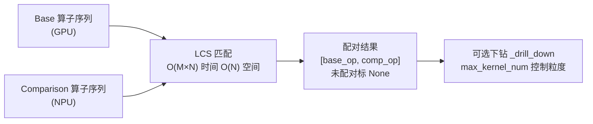
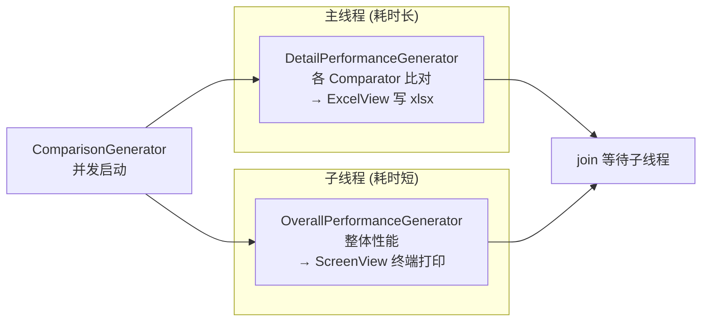
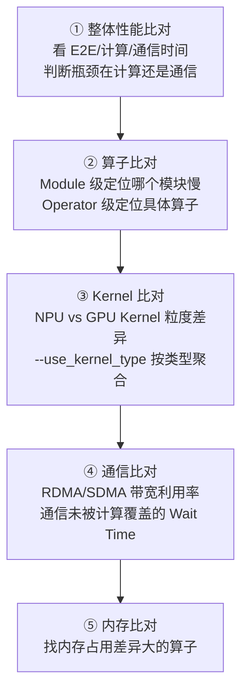

# compare_tools 性能比对

> **一句话**：compare_tools 是昇腾 `msprof_analyze` 框架下的**性能数据比对工具**，专门做 GPU（CUDA/PyTorch Profiler）与 ASCEND NPU 之间的 Profiling 数据横向对比——"NPU 比 GPU 慢在哪：是计算、通信还是内存？哪个算子拖后腿？"。和 [[msprobe精度调试]] 互补：msprobe 比对的是**数值精度**，compare_tools 比对的是**执行性能**。

## 解决什么问题

把模型从 GPU 迁到 NPU，性能往往打折扣。要知道慢在哪：
- 整体慢多少（E2E 时间）？
- 慢在**计算**还是**通信**还是**内存**？
- 哪个**算子**耗时比 GPU 多？
- 哪个 **Kernel** 粒度有差异？

compare_tools 把两份 Profiling 数据对齐比对，输出终端一览表 + Excel 报告。

## 6 大比对维度

| 维度 | 比什么 |
|---|---|
| **整体性能** | E2E 时间、计算时间、通信时间、内存占用 |
| **算子性能** | Module 级 / Operator 级逐算子耗时 |
| **内存** | 算子内存使用情况 |
| **通信性能** | AllReduce/AllGather 等集合通信时延 |
| **Host API** | PyTorch API 层面调用耗时 |
| **Kernel** | Device 侧 Kernel 粒度耗时，支持 kernel_type 聚合 |

输出：屏幕 PrettyTable 一览表 + 多 Sheet 的 `performance_comparison_result_*.xlsx`（绿表头=Base 基准，黄表头=Comparison，红单元格=性能退化 Diff Ratio>1）。

## 架构：分层



**给应届生**：这是典型的**分层 + 策略模式**架构。每个比对维度是一个 Comparator（整体/算子/通信/内存/Kernel），继承同一个 BaseComparator，用同一套 Bean 定义表头、同一套 View 渲染。加新维度 = 加一个 Comparator+Bean，不动老代码。这是大型工具扩展性的标准做法。

## 核心难点：跨平台算子匹配（LCS）

GPU 和 NPU 的算子名、调用顺序可能不同，怎么"对齐"同一个算子？用**最长公共子序列（LCS）**算法：



优化手段：numpy int32 数组替代 Python list（省 4x 内存、快 3-5x）、BitMap 替代 bool 矩阵（省 8x 内存）、名称 hash 化（字符串比较转整数比较）。M×N>5×10⁹ 时预警提示加 `--disable_details`。

**给应届生**：为什么用 LCS 而不是按名字一一对应？因为两侧算子数量、顺序可能不一样（NPU 把某几个 GPU 算子融合成一个，或顺序因实现不同而错位）。LCS 找"最长公共子序列"= 找两侧都按顺序出现的那段算子序列来对齐，容错性强。这是处理"序列对齐"问题的经典算法（和 DNA 序列比对、git diff 同源）。

## 匹配流程（Module vs Operator）

- **Module 匹配**：构建 Module 树，BFS 广度遍历，每层用 LCS 匹配同层子模块。
- **Operator 匹配**：先按前向/反向 TID 分段，再逐段 LCS。`--use_input_shape` 可加输入形状做精确匹配；`--op_name_map` 提供算子名映射（如 `{'MatMul':'matmul_v2'}`）。

## 并发执行



整体性能（屏幕输出，快）和详细比对（Excel，慢）并发跑，缩短总时长。

## 性能分析推荐顺序



**给应届生**：调性能的套路——**先看整体定方向（计算 or 通信瓶颈），再逐层下钻**。不要一上来就钻到某个算子，容易瞎子摸象。整体→模块→算子→Kernel，每层缩小范围。

## 常用命令

```bash
# 全量比对 GPU vs NPU
python performance_compare.py ./gpu_profile.json ./npu_profile_dir/ -o ./result/

# 只比算子和通信
python performance_compare.py gpu.json npu/ --enable_operator_compare --enable_communication_compare -o result/

# 指定步骤 + 算子名映射 + 精确匹配
python performance_compare.py npu_run1/ npu_run2/ \
  --enable_operator_compare --base_step 5 --comparison_step 5 \
  --op_name_map "{'MatMul':'matmul_v2'}" --use_input_shape -o result/

# Kernel 比对 + 类型聚合
python performance_compare.py gpu.json npu/ --enable_kernel_compare --use_kernel_type -o result/

# 仅汇总不生成逐条详情（大数据量加速）
python performance_compare.py gpu.json npu/ --disable_details -o result/
```

## 常见问题

| 问题 | 原因 | 解决 |
|---|---|---|
| Invalid profiling path | 路径格式不支持 | 确认 .json/.db/正确目录结构 |
| 比对超 30 分钟 | 算子多 LCS 矩阵大 | 加 `--disable_details` |
| Module 比对空（降级 Operator） | 数据无 Python 函数栈 | `--disable_module` 跳过 |
| Diff Ratio 显示 INF | Base 侧该指标为 0 | 正常，表示 Base 无此类算子 |
| Kernel 比对结果少 | `--max_kernel_num` 过小 | 调大或去掉 |

## 延伸

- [[msprobe精度调试]] — 精度（非性能）维度的 NPU vs GPU 比对，姊妹工具
- [[千卡训练性能优化]] — 性能调优的实战经验
- [[分布式训练评价指标]] — 加速比等性能指标定义
- [[什么是分布式训练]] — 性能优化的系统背景
- 专栏原文：[知乎 · 第133篇 compare_tools](https://zhuanlan.zhihu.com/p/2024238176244375638)
