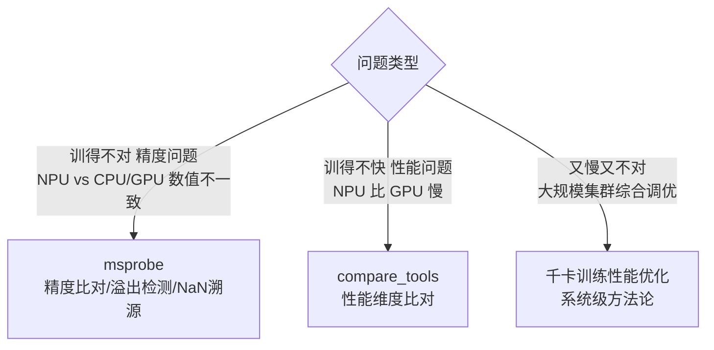

# 调试与性能工具

> 知乎专栏第132–134篇重写。Ascend 生态的精度/性能调试工具箱——解决"训得不对"和"训得不快"两类问题。

## 推荐阅读顺序

1. [[msprobe精度调试]] — 一站式精度调试：算子级/NaN溯源/梯度探针/图可视化
2. [[compare_tools性能比对]] — NPU vs GPU 性能横向比对（计算/通信/内存/Kernel）
3. [[千卡训练性能优化]] — 系统工程经验：加速比冲 0.95+、FPS 稳如直线

## 精度 vs 性能：两个工具怎么选

**给应届生**：msprobe 和 compare_tools 是姊妹工具，一个查"对不对"（数值精度），一个查"快不快"（执行性能）。千卡优化是更高层的系统方法论，告诉你该调哪里。三者配合：先 msprobe 保证精度对，再 compare_tools 找性能瓶颈，最后用千卡方法论系统调优。

## 概念锚点

精度/性能核心指标见 [[分布式训练评价指标]]（加速比、MFU、曲线拟合）。

## 延伸

- [[wiki/ai-infra/index|ai-infra 专区首页]]
- [[wiki/ai-infra/distributed-training/index|分布式训练基础]]
- [[wiki/ai-infra/nccl/index|NCCL 集合通信库]] — 性能优化的通信底座
