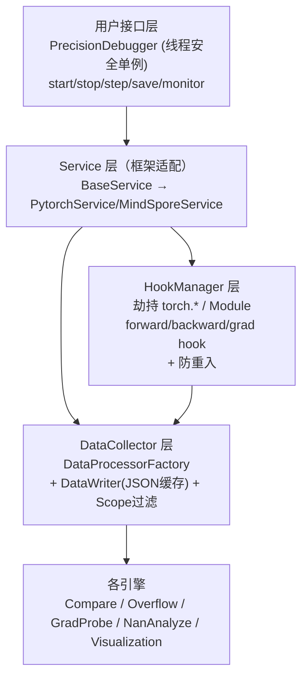
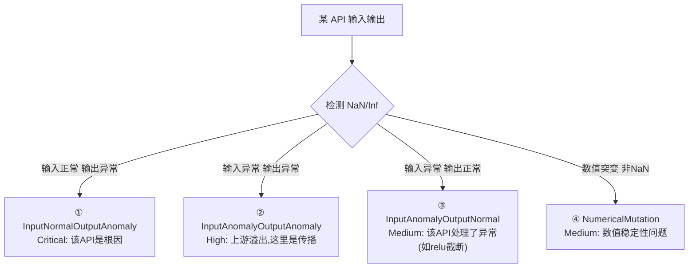
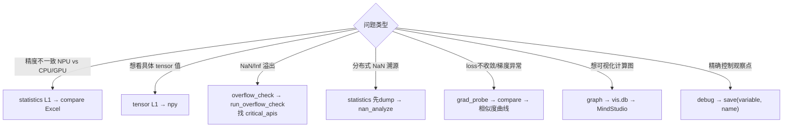

# msprobe 精度调试

> **一句话**：msprobe 是昇腾 NPU 上的**一站式精度调试工具包**，专门解决分布式训练精度问题——"训出来精度不对，到底是哪个算子、哪一步、哪个 rank 出了问题"。它通过 hook 拦截每个 API 的输入输出，做数据采集、溢出检测、梯度探针、精度比对、NaN 溯源和图可视化。

## 解决什么问题

分布式训练精度问题的定位是噩梦：
- 哪个**算子**算错了？（NPU vs CPU/GPU 结果不一致）
- 溢出从哪来？（NaN/Inf 首发在哪个 API）
- **梯度**健康吗？（梯度爆炸/消失）
- 分布式训练 NaN 是哪个 **rank** 先产生的？

msprobe 把这些"大海捞针"变成"Excel 报告 + 可视化图"。

## 7 大核心能力

| 能力 | 干什么 | 输出 |
|---|---|---|
| **数据采集** | 采集每个 API/Module 前向反向的输入输出张量或统计量 | dump.json |
| **溢出检测** | 实时检测 NaN/Inf，按 4 类场景分级定位根因算子 | critical_apis |
| **梯度探针** | 多步梯度相似度曲线，看梯度传播健康度 | similarities.csv + PNG |
| **精度比对** | NPU vs CPU/GPU 双路数据自动匹配 + 统计差异 | compare_result.xlsx |
| **NaN 溯源** | 跨 rank 分布式训练 NaN 首发节点追踪 | anomaly_analyze.json |
| **图可视化** | dump.json 构建计算图，支持比对/溢出标注/微步分页 | *.vis.db（MindStudio） |
| **内核级 Dump** | C++/ACL 层绕过 Python，dump kernel 原始数据（L2 级） | dump_tensor_data/ |

支持框架：PyTorch（主体）、MindSpore、MindTorch（兼容层）。

## 架构：4 层

**给应届生**：核心思路是 **hook 劫持**——在 PyTorch 每个 `torch.*` 函数和 `nn.Module` 上挂钩子，每次调用前后偷偷记录输入输出。这样不改训练代码就能"看到"每一步的数据。Hook 是精度/性能调试类工具的通用手法（PyTorch 自己的 `register_forward_hook` 就是）。

## 采集级别：L0/L1/L2/mix/debug

| level | module_hook | api_hook | C++/ACL | 用途 |
|---|---|---|---|---|
| L0 | ✓ | ✗ | ✗ | Module 级别，粒度粗 |
| L1 | ✗ | ✓ | ✗ | API 级别，最常用 |
| L2 | ✗ | ✓(配置) | ✓(AclDumper) | 内核级原始数据 |
| mix | ✓ | ✓ | ✗ | Module+API 混合 |
| debug | ✗ | ✗ | ✗ | 手动 save() 指定点 |

**给应届生**：级别 = 采集粒度。先想清楚要看多细——只想知道哪层算错用 L0；要定位到具体算子用 L1；要 kernel 原始数据用 L2；想手动看某几个变量用 debug。新手默认 **L1 statistics** 起步。

## 精度比对流程（最常用）

- **余弦相似度**阈值 0.9999，**最大绝对误差**阈值 0.001，低于阈值标红/黄。
- **模糊匹配**（`--fuzzy_match`）：NPU 和 GPU 算子名可能不同，用双指针队列按名称前缀配对。
- **跨框架**（PT vs MS）需 `-am api_mapping.json` 提供层映射。

## 溢出检测：4 类场景（就高原则）

**给应届生**：溢出定位口诀——**"输入正常输出坏"的 API 才是真凶**（场景①Critical）。输入已经坏了说明问题在更上游，这个 API 只是"受害者"。按优先级就高保留，命中第一个即停。

## NaN 溯源：三段式（分布式专属）

跨 rank 训练出现 NaN，要找**哪个 rank 哪一层最先产生**：
1. **pre_analyze**：第一个通信算子之前搜索，训练开始就有 NaN 则直接定位。
2. **analyze**：通信节点间分析，dropwhile 跳过正常段，BFS 找所有组中 (layer, sub_layer) 最小的异常节点。
3. **post_analyze**：最后一个通信节点之后的异常。

输出 `anomaly_analyze_{timestamp}.json`，含 op_name / layer / stack_info。

**给应届生**：分布式 NaN 最难查因为会"传染"——一个 rank 算出 NaN，经 AllReduce 传给所有 rank，看到的"坏"不一定是"源头"。nan_analyze 沿通信节点回溯，找首个产生点。需多 rank 数据，单卡用 overflow_check 即可。

## 任务选择决策树

## 关键工程机制

- **双重检查锁单例**：PrecisionDebugger 全局唯一，线程安全创建。
- **Hook 防重入**：`inner_switch[tid]` + `inner_api_count[tid]`——hook 采集时若内部又调 torch op 不会递归爆炸。只有最外层（count==1）才采集。
- **atexit 崩溃保障**：注册 `write_json_at_exit()`，训练崩了也能写出已采集数据。
- **异步 dump**：大 tensor 时内存积累、stop 时统一写（注意可能 OOM）。
- **C++ 插件（pybind11）**：L2 内核级 dump 通过 `_msprobe_ccsrc.so` 调 ACL 运行时，绕过 Python 拦截。

## 给应届生的上手路径

1. `pip install msprobe`，写个最小训练循环，`PrecisionDebugger(task="statistics", level="L1")` 包住 forward/backward。
2. 跑完得 `dump.json`，再 CPU 上跑同样代码得另一份。
3. `msprobe -f pytorch compare -npu <npu>.json -bench <cpu>.json -o out/` 得 Excel。
4. 看红行（余弦相似度低）→ 首差算子 → 那就是精度问题源头。

## 延伸

- [[compare_tools性能比对]] — 性能（非精度）维度的 NPU vs GPU 比对
- [[千卡训练性能优化]] — 精度与性能的综合调优
- [[分布式训练评价指标]] — 曲线拟合的工程化落地
- [[什么是分布式训练]] — 第⑤步 AllReduce 是 NaN 传染的通道
- 专栏原文：[知乎 · 第134篇 msprobe](https://zhuanlan.zhihu.com/p/2024245192052539864)
