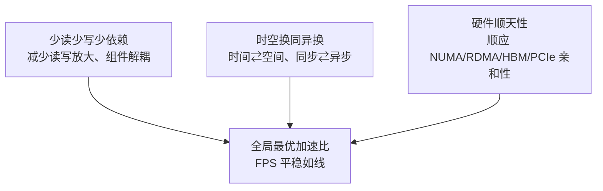
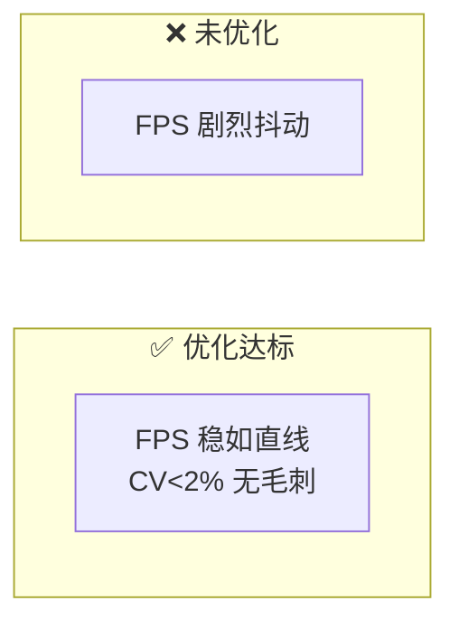
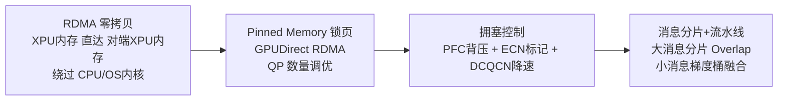
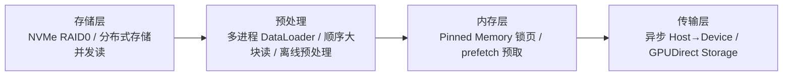
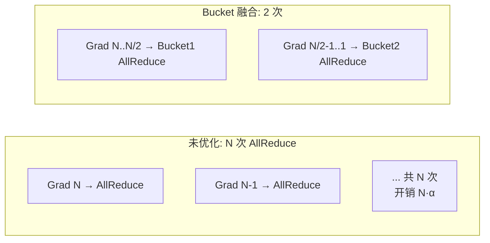
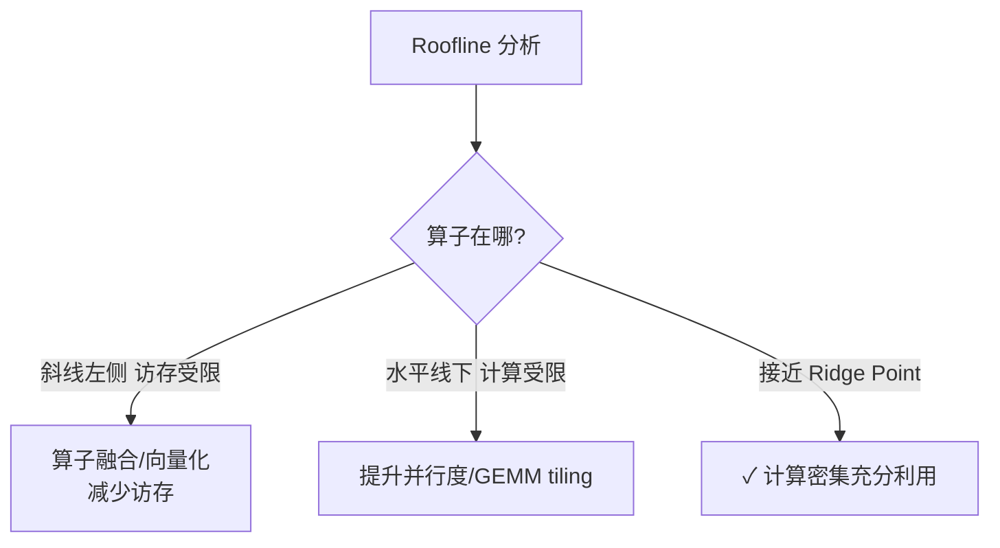
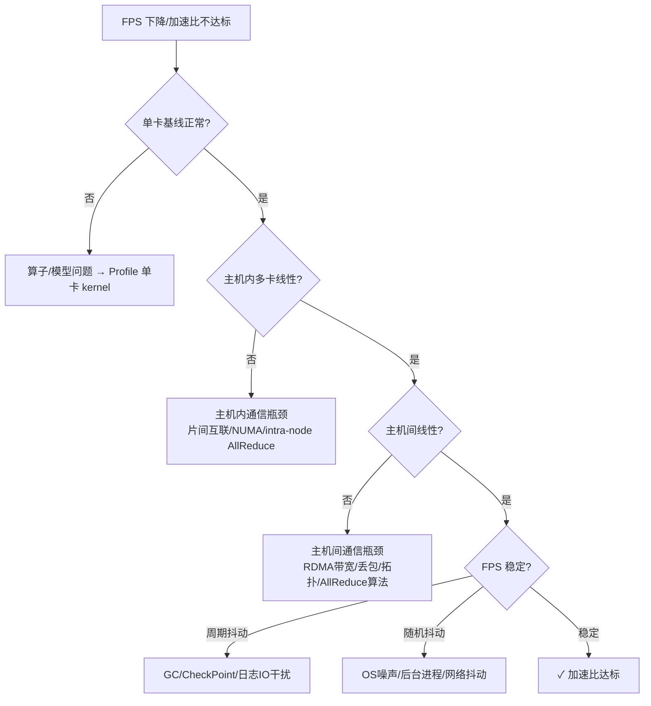

# 千卡训练性能优化

> **一句话**：把千卡集群加速比调到 0.95+，是一场"理论-实践-再理论"的系统工程。核心是减少/隐藏非计算时间（加速比 = 计算时间 / (计算时间 + 非计算时间)）。优化的终点不是某个数字，而是 **FPS 稳如直线**——一个优化到位的系统，FPS 曲线平稳无波动，这就是"系统平衡之美"。

## 基本约束

- **前提是模型收敛、精度达标、曲线拟合**——脱离这个前提的性能优化都无效（先对后快）。
- 加速比 = 分布式单卡性能 / 单卡独立性能（分母是独立单卡，非单机多卡的单卡）。
- 本质：加速比 = 计算时间 / (计算时间 + 非计算时间) → **调优核心 = 减少或隐藏非计算时间**。
- 国产 AI 加速卡软硬件功能与生态较 GPU 有差距，短板更突出，调试更难。

## 性能优化总诀：三方向

| 方向 | 手段 |
|---|---|
| **少读少写少依赖** | 提升缓存命中率、数据压缩、读写合并、依赖解耦、IO 隔离 |
| **时空换同异换** | 空间换时间（缓存）、时间换空间、同步转异步、批处理、流水线重叠 |
| **硬件顺天性** | NUMA 亲和、RDMA 零拷贝、HBM 带宽利用、PCIe 对齐、磁盘分块对齐 |

**给应届生**：所有性能优化手段都能归入这三类。遇到性能问题先归类——是"读太多写太多"（少读写）、是"在傻等"（时空换/异步）、还是"没顺着硬件脾气"（硬件亲和）。归对类，手段就出来了。

## 系统平衡之美：FPS 稳如直线

优化达标的系统，FPS 曲线**平稳无波动**（CV<2%，无周期毛刺，无趋势下降，P99/P50<1.2）；不达标的系统 FPS **剧烈抖动**。

FPS 抖动根因分布（典型）：网络抖动/拥塞 35%、Straggler 落后节点 25%、OS 噪声 20%、GC/IO 暂停 12%、温控降频 8%。

**给应届生**：性能好不好，看 FPS 曲线"平不平"比看单个数值更准。直线 = 系统平衡（任何扰动都被吸收）；抖动 = 系统脆弱（一个慢节点拖垮全局）。这就像杂技"一根羽毛"的平衡——风一吹就倒说明没调好。

## 工程方法论

| 原则 | 含义 |
|---|---|
| 组织到位 | 充足人力 + 合适攻坚人才，避免半途而废/数据造假 |
| 架构先行 | 全局视角发现+拆解问题，先出架构设计文档 |
| 分而治之 | "千卡0.95+"不确定大目标 → 拆成确定性小任务逐步迭代 |
| 小即是大 | 先单卡→主机内多卡→2机→千卡，局部夯实再全局扩展 |
| 众策众智 | 软硬件联合、跨团队协作 |
| 躬身入局 | 实操逐个攻克，小目标递进 |

**给应届生**："小即是大"是分布式扩展的金律——**不要一上来就千卡调**。先单卡 MFU 打到 40%+，再主机内 8 卡线性，再 2 机，每扩展一层先保证不退化，最后才到千卡。局部不夯实就上规模，问题会指数级放大。

## 具体问题具体分析（核心）

GPU 有适配其硬件生态的最优方案，国产 XPU 有自己的专属路径。主流分布式方案多基于 GPU/CUDA 设计，未必适配国产卡。每个卡既有共性（矛盾普遍性）也有自身特性（矛盾特殊性），调优关键是挖掘差异化特性。

常见错误：
- **照抄 GPU 调优参数**（如 AllReduce chunk_size 按 GPU 最优设，XPU 小消息延迟不同）→ 应小消息测延迟找最优 chunk。
- **认为加速比不达标是网络问题** → 可能是算子效率低或片间互联没用满 → 先 Profile 单卡确认 MFU 达标。
- **用 GPU Benchmark 评估 XPU 应达 FPS** → 应先建 XPU 自身性能基准。

## 网络通信优化

网络是核心连接载体，原生缺点：不可靠、易故障、有时延、会抖动、不安全、会丢包、有带宽限制、消息会乱序。

### 三大网络难题

1. **同步通信短板**：Ring 拓扑中系统速度受限于最慢的相邻连接 → 系统 = min(所有卡速度)。
2. **落后者 Straggler**：集群性能受限于最慢节点。确定性落后（硬件差异）→ 诊断隔离替换；随机性落后（OS/后台干扰）→ CPU 亲和绑定、isolcpus 隔离、关后台进程、NUMA 绑定。
3. **异质问题**：国产主机内非全连接、主机间分层交换机，Ring 同步模式被差节点拖累。

### 关键技术

通信时间 = α(启动延迟) + β·S(传输时间)。大消息 β·S 主导→流水线分片；小消息 α 主导→梯度桶融合。

## 数据 IO 优化

数据路径：磁盘→主机缓存→HBM，带宽 磁盘<<PCIe<<HBM。IO 速率跟不上计算消耗速率就成瓶颈。

目标：IO 时间完全藏在计算时间里（迭代 T 预取 T+1 的数据），IO 对 FPS 无影响。

## 训练框架优化：梯度融合

神经网络分层，每层一个梯度。不融合则 100 层 = 100 次 AllReduce（小消息 α 开销累积爆炸）。

N=100 时未优化 ~105ms，融合后 ~50ms，通信时间节约约 52%。配合 DDP 流水线：梯度算完立即触发通信，下层计算与上层通信并行（[[通信隐藏]]）。

框架优化清单：梯度 Bucket 10~30%、计算通信 Overlap 10~25%、混合精度 1.5~2x、梯度压缩 10~100x（需验精度）、梯度累积、静态图编译 5~20%、算子融合 5~15%。

## 模型优化：Roofline 与 MFU

- **MFU**（Model FLOP Utilization）= 模型每步实际 FLOP / (硬件峰值 FLOP/s × 迭代时间)。目标：单卡 55~65%、主机内 50~60%、千卡 40~55%。
- **BatchSize 调优**：BS 小→并行度不足浪费带宽；BS 大→OOM。找 MFU>40% 的最小 BS，最优 BS 通常是 GEMM tile 整数倍。
- **混合精度**：BF16 首选（范围同 FP32、精度损失小、速度 2x）；权重主副本保 FP32；FP16 需 Loss Scaling 防下溢。国产卡须验证 BF16 收敛精度与 GPU 一致。

## 系统优化：NUMA

AI 服务器带宽层次：**片间互联 >> PCIe >> UPI**（CPU 间）。所以：
- XPU 0-3 进程绑 Socket 0 的 CPU 核（`numactl --cpubind=0`），XPU 4-7 绑 Socket 1。
- 避免数据从 Socket 1 内存经 UPI 传给 Socket 0 的 XPU（UPI 只有 ~80GB/s，是瓶颈）。

OS 调优：`isolcpus`/`nohz_full` 隔离训练核、`vm.swappiness=0` 禁 swap、大页提升 TLB、`performance` governor 禁降频。

## 性能诊断决策树

**给应届生**：这是面试和实战都该背的诊断套路——**自底向上分层定位**：先确认单卡没问题（算法/算子层），再主机内（片间互联层），再主机间（网络层），最后看稳定性（抖动层）。每层排除一层，避免在错的层面瞎调。

## 关键指标体系

| 类别 | 指标 | 正常 | 告警 |
|---|---|---|---|
| 计算效率 | XPU MFU（大模型） | >40% | <30% |
| 计算效率 | XPU 利用率 | >85% | <70% |
| 计算效率 | HBM 带宽利用率 | >70% | <50% |
| 通信效率 | AllReduce 时间占比 | <15% | >25% |
| 通信效率 | RDMA 带宽利用率 | >80% | <60% |
| 通信效率 | 通信-计算 Overlap 率 | >60% | <30% |
| 稳定性 | FPS 变异系数 CV | <2% | >5% |
| 稳定性 | 迭代时间 P99/P50 | <1.2 | >1.5 |
| 加速比 | N 卡加速比（千卡） | >0.90 | <0.85 |

## 延伸

- [[msprobe精度调试]] / [[compare_tools性能比对]] — 精度与性能的工程化定位工具
- [[分布式训练评价指标]] — 加速比/MFU/收敛的定义
- [[训练拓扑与服务框架]] — 2D-Ring 等拓扑算法
- [[通信隐藏]] / [[Ring-AllReduce]] — 框架优化的底层
- [[GPU-RAS体系]] — 系统优化的可靠性侧（故障隔离/弹性容错）
- 专栏原文：[知乎 · 第132篇 千卡性能优化](https://zhuanlan.zhihu.com/p/2021551055880603396)
