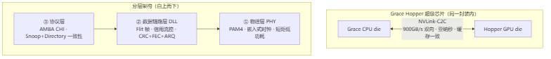
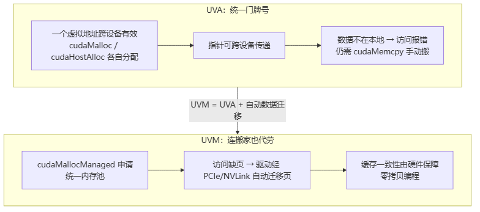

# NVLink-C2C 与 GPU 统一内存

> **一句话**：这是"让多块芯片用起来像一块内存"的硬件底层——上半页讲 NVLink-C2C，把 NVLink 从板级下沉到芯片 die 之间（Grace CPU + Hopper GPU 同封装直连），高带宽、低延迟、缓存一致；下半页讲 UVA/UVM，把 CPU 和 GPU 的地址与数据统一管起来。它们是 [[集合通信原语]]、[[AllReduce]] 跑得快的硬件地基，也是 GPUDirect/RDMA 的前提。

## 为什么放一起讲

分布式训练里"多卡协同"靠两件事：**卡之间连得快**（互联）和**卡之间共享内存视图**（统一寻址/迁移）。NVLink-C2C 管前者，UVA/UVM 管后者，合起来回答"怎么让跨设备编程像访问一块内存一样简单"。

## NVLink-C2C：芯片 die 间的高速直通电梯

### 是什么、解决什么

NVLink-C2C（Chip-to-Chip）是 NVIDIA 把 NVLink 从**系统级板间互联下沉到芯片/裸片级**的方案，给 Chiplet 架构提供**低延迟、高带宽、缓存一致**的芯片间通信。典型落地是 Grace Hopper 超级芯片：Grace CPU die 和 Hopper GPU die 封装在一起，用 NVLink-C2C 直连。

- **带宽**：单链路最高 900GB/s 双向（NVLink 4.0 C2C）。
- **延迟**：亚纳秒级，比板级 NVLink 低 1–2 个数量级，接近片内总线。
- **一致性**：全缓存一致，兼容 AMBA CHI 协议，跨芯片数据零拷贝访问。
- **能效/面积**：比 PCIe Gen5 高 25 倍能效、90 倍面积效率（短距毫米级互联，省了长距驱动电路）。

**给应届生**：NVLink-C2C ≈ 两个芯片 die 之间的「高速直通电梯」——不仅快（900GB/s、亚纳秒），关键是两块 die **共享同一份缓存视图（一致性）**，谁改了数据另一方立刻可见，不用互相 `memcpy` 拷来拷去。对照着记三档：普通 NVLink 是「跨板卡的高速公路」，PCIe 是「通用国道」，NVLink-C2C 是「同一栋楼里的内部电梯」。

### 分层架构

沿用 NVLink 的「物理层 → 数据链路层 → 协议层」三级，但针对芯片级短距重做了优化：

> 图解源文件：[`01-分层架构-flowchart.mmd`](../../../_attachments/ai-infra/distributed-training/NVLink-C2C与GPU统一内存/whiteboard-mermaid/01-分层架构-flowchart.mmd)。

- **物理层 PHY**：嵌入式时钟省引脚，PAM4 调制 + 内置 FEC 提升带宽密度，链路训练自动做通道对齐/极性/均衡。放弃板级长距驱动，专攻短距"能效-面积"双优。
- **数据链路层 DLL**：以 Flit 为传输单元，基于**信用（Credit）的反压**防溢出，CRC + FEC + 自动重传（ARQ）保证可靠，链路异常时切冗余通道。
- **协议层**：原生 AMBA CHI 一致性协议，Snoop + Directory 混合模型，支撑跨芯片共享虚拟地址空间——数据改了自动同步，软件不必显式拷贝。

### 与板级 NVLink、PCIe 的区别

| 维度 | NVLink-C2C | 板级 NVLink | PCIe Gen5 |
|---|---|---|---|
| 互联距离 | 毫米级（封装内） | 厘米级（板级） | 厘米级（板级） |
| 典型带宽 | 单链路 900GB/s 双向 | 数百 GB/s | x16 ≈ 128GB/s |
| 链路延迟 | 亚纳秒级 | 数十纳秒级 | 15–30ns |
| 缓存一致 | 原生全一致（CHI） | 系统级一致 | 不支持，需上层扩展 |
| 用途 | 同封装 die 间（Grace Hopper） | 同机箱多 GPU | 通用板级 I/O |

> 注意带宽口径：NVLink-C2C 的 900GB/s 是单链路双向峰值；PCIe 表中为 x16 链路双向峰值。两者不在同一量级，且 NVLink-C2C 还多了一份"一致性"。

## UVA 与 UVM：统一地址 vs 统一内存管家

光有互联还不够，还得让 CPU/GPU 在地址和数据层面"看着是一块内存"。NVIDIA 走了两步：UVA 统一地址，UVM 在其上统一数据迁移。

### UVA：统一虚拟寻址（只统一门牌号）

UVA 让 CPU 系统内存和所有 GPU 显存共享**一个全局虚拟地址空间**，任意一个虚拟地址在所有设备上都有效，指针可直接跨设备传递。靠"地址分段划分"（系统段 / 设备段 / 共享段）和"CPU MMU + GPU MMU 协同"实现。

**给应届生**：UVA ≈ 给每张 GPU 显存编一个「全局门牌号」——CPU 拿着一个地址就能指认数据，指针可以随便传。但门牌号统一**不等于东西搬好了**：数据若不在本地设备，访问直接报错，程序员仍得自己 `cudaMemcpy` 搬。一句话「地址统一 ✓，数据迁移 ✗」。

### UVM：统一内存（连搬家也代劳）

UVM 在 UVA 之上加了一层"内存管家"，用 `cudaMallocManaged` 申请统一内存池，数据按需在 CPU/GPU 间自动迁移。三大机制：

1. **按需分页 + 缺页触发**：访问的地址本地没有 → 触发缺页故障（类似 OS 缺页）→ 驱动定位数据在哪 → 经 PCIe/NVLink 搬过来 → 更新 MMU 映射 → 重放访问。全过程对用户透明。
2. **透明页迁移优化**：4KB/64KB 页级迁移；支持预取、优先级、合并迁移，以及内存超额订阅（Over-Subscription）。
3. **缓存一致性**：迁移时先写回脏数据、失效旧缓存，并支持 CPU/GPU 原子操作，避免"脏数据"。

### UVA vs UVM 对比

> 图解源文件：[`02-UVA-vs-UVM-对比-flowchart.mmd`](../../../_attachments/ai-infra/distributed-training/NVLink-C2C与GPU统一内存/whiteboard-mermaid/02-UVA-vs-UVM-对比-flowchart.mmd)。

| 维度 | UVA（统一虚拟寻址） | UVM（统一内存） |
|---|---|---|
| 统一什么 | 地址空间 | 地址 + 数据迁移 |
| 数据搬运 | 手动 `cudaMemcpy` | 自动按需迁移页 |
| 硬件要求 | Fermi 及以上，独立 MMU | Kepler 及以上，页迁移引擎 |
| 适合场景 | 访问模式固定、要精确控拷 | 访问复杂、原型快验、延迟不敏感 |
| 代价 | 编程稍繁 | 缺页/迁移有延迟，延迟敏感场景慎用 |

**给应届生**：UVA = 「统一门牌号系统」（地址统一，但东西还得自己搬）；UVM = 「连搬家也代办的管家」（你按地址一访问，它发现东西不在本地就自动搬过来）。面试区分两者就抓一句：**UVA 统一地址，UVM 在 UVA 之上再加自动迁移**——所以 UVM 离不开 UVA，UVA 却能单独用（"UVA + 手动拷贝"是常见组合）。

## 和分布式训练的关系

这些内存/互联机制不是孤立知识点，是上层软件栈跑得快的**硬件地基**：

- NVLink / NVLink-C2C 是 [[wiki/ai-infra/nccl/index|NCCL]] 的传输底层——集合通信（[[集合通信原语]]、[[AllReduce]]、[[Ring-AllReduce]]）的带宽和延迟直接由它决定，[[通信隐藏]] 也建立在"通信本就够快"之上。
- UVA/UVM 让多卡/异构编程模型简化，是张量并行、流水并行里"跨设备共享参数"的地址基础。
- 高带宽 + 一致性互联是 GPUDirect/RDMA 的前提，也是 [[千卡训练性能优化]] 里压榨通信带宽的物理上限。
- 互联的可靠性侧见 [[wiki/ai-infra/gpu-ras/Fabric-Manager与NVLink|Fabric Manager 与 NVLink]]。

回到 [[什么是分布式训练]] 的"道/法/术/器"框架：本文属于**器**——是上层所有并行策略的硬件底座。

## 延伸

- [[什么是分布式训练]] — 系统 = 要素×连接+目的+边界，本文落在"连接"硬件层
- [[集合通信原语]] / [[AllReduce]] / [[Ring-AllReduce]] — 跑在这些互联之上的通信原语
- [[wiki/ai-infra/nccl/index|NCCL]] — NVLink 是其传输底层
- [[千卡训练性能优化]] — 互联带宽是千卡性能的物理上限
- [[wiki/ai-infra/gpu-ras/Fabric-Manager与NVLink|Fabric Manager 与 NVLink]] — NVLink 互联的 RAS 侧
- 专栏原文：[知乎 · 第106篇 NVLink-C2C 介绍](https://zhuanlan.zhihu.com/p/1987297824543627187) ｜ [知乎 · 第107篇 GPU UVA 与 UVM 解析](https://zhuanlan.zhihu.com/p/1987302295352939853)
