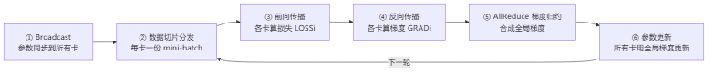

# 什么是分布式训练

> **一句话**：分布式训练 = 分布式系统 + 训练系统。单卡装不下、算不动、算太慢，就拆给多张卡并行算，再把各自的梯度聚合成全局梯度统一更新。难点不在"一起算"，而在"合得快、合得对、合得不停机"。

## 拆解：系统 = 要素 × 连接 + 目的 + 边界

作者用一个公式统摄全局，对任何"系统"都拆成这四件套：

| 系统 | 要素（谁在干活） | 连接（怎么协作） | 目的 | 边界 |
|---|---|---|---|---|
| 分布式系统 | 计算单元（GPU/NPU/TPU/DPU） | 网络（NVLink/PCIe/IB/RoCE/TCP） | 共同完成任务 | 不什么都往里塞 |
| 训练系统 | 模型参数 / 数据样本 | 前向 + 反向传播 | 拟合输入输出关系 | 一次迭代 |

合起来：**分布式训练 = 计算 × 网络 + 训练功能 + 系统边界**。

**给应届生**：面试被问"什么是分布式训练"，别背名词。答两层——硬件层是"一堆加速卡用网络连起来"，软件层是"把训练的一次迭代（前向算损失、反向算梯度、更新参数）拆成多卡并行 + 一次全局聚合"。关键动词是**拆**和**合**。

## 训练的一次迭代：6 步

> 图解源文件：[`01-训练的一次迭代-6-步-flowchart.mmd`](../../../_attachments/ai-infra/distributed-training/什么是分布式训练/whiteboard-mermaid/01-训练的一次迭代-6-步-flowchart.mmd)。

- **① Broadcast**：第一步把 rank 0 的初始参数广播到所有卡，保证起点一致。
- **② 数据切片**：把数据集切成多份，每卡吃一份（数据并行的核心）。
- **③④ 前向/反向**：每张卡独立算自己那份数据的损失和梯度，互不干扰。
- **⑤ AllReduce**：分布式训练的**灵魂**——把每张卡各自的梯度加成一个全局梯度，所有卡拿到同一份。详见 [[集合通信原语]]。
- **⑥ 参数更新**：所有卡用同一份全局梯度更新参数，保证模型始终一致。

**给应届生**：记住这个对称性——前向"每卡各算各的"，反向"每卡各算各的"，唯独第⑤步要"全体对齐"。第⑤步要是算错了或没对齐，多卡训出来的模型就发散/不收敛。所以分布式训练里 90% 的工程量都在"怎么把第⑤步做得又快又稳"。

## 为什么要分布式：三个"单卡扛不住"

1. **模型太大**装不进单卡显存 → 张量并行/流水并行把模型切开。
2. **数据太多**单卡算太慢 → 数据并行把数据切开。
3. **收敛太慢**，生产要求 24 小时内收敛 → 加卡换时间（详见 [[分布式训练评价指标]]）。

> 这三条对应分布式训练的三大并行策略：数据并行、模型并行（张量/流水）、流水并行。它们都依赖第⑤步的集合通信来聚合，所以**集合通信库（NCCL/Gloo 等）是整个分布式训练软件栈的底座**。

## 道 / 法 / 术 / 器

作者用这四个境界给整个专栏定调，建议以此定位每个知识点属于哪层：

| 层级 | 含义 | 本专区对应 |
|---|---|---|
| **道** | 本质理论（为什么这样做） | 本文的"系统=要素×连接+目的+边界" |
| **法** | 方法论（应该怎么做） | [[训练拓扑与服务框架]] 的拓扑选择原则 |
| **术** | 套路技巧（具体怎么调） | [[NCCL拓扑算法]]、Ring AllReduce 分桶 |
| **器** | 工具（用什么实现） | [[NCCL架构总览]]、Horovod、msprobe |

**给应届生**：遇到任何分布式训练问题，先问自己"这是道/法/术/器哪一层？"——是原理没懂（道）、是方案选错了（法）、是参数没调好（术）、还是工具用错了（器）。定位准了，找答案就快。

## 延伸

- [[分布式训练评价指标]] — 怎么判断训得"快不快、对不对、稳不稳"
- [[集合通信原语]] — 第⑤步 AllReduce 的底层原语全家桶
- [[训练拓扑与服务框架]] — Ring/2D-Torus 拓扑 + Horovod 服务框架
- [[AllReduce]] — 分布式训练最核心的通信原语
- 专栏原文：[知乎 · 第1章 什么是分布式训练](https://zhuanlan.zhihu.com/p/487945343)
