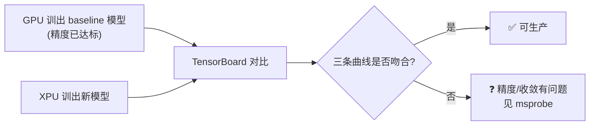

# 分布式训练评价指标

> **一句话**：分布式训练要同时盯两类指标——**训练指标**（训得对不对、快不快）和**系统指标**（跑得稳不稳、能不能扩）。教科书的准确率/召回率在生产里反而不常看，真正卡脖子的是加速比、收敛时间和可用性。

## 训练指标（模型层面）

| 指标 | 含义 | 生产关注点 |
|---|---|---|
| **加速比 speedup** | 多卡单卡吞吐 ÷ 单卡吞吐 | 越高资源利用率越高，但对全栈要求也越高 |
| **吞吐量** | sequence/sec 或 FPS | 每秒处理多少图片/样本 |
| **收敛时间 / epoch** | 训到收敛要多久 | 生产硬指标：**24 小时内收敛才算可用** |
| **平均准确率** | 训完的 eval accuracy | 到达目标值（如 ResNet50 达 76%）才算收敛 |
| **可收敛** | 最终能否达平均准确率 | 否则任务失败 |
| **学习率 / 损失率** | LR 大收敛快但易爆炸，小则慢易过拟合 | 调参核心 |
| **曲线拟合** | 新模型曲线 vs 已达标 baseline 曲线 | XPU 调试的金标准 |

### 加速比：分布式训练的头号 KPI

```
加速比 = 多卡训练单卡平均吞吐 / 单卡训练吞吐
例：1000 卡集群 ResNet50 单卡 FPS=600，单卡训练 FPS=800 → 加速比 0.75
```

**给应届生**：加速比不是"1000 卡就快 1000 倍"。它衡量的是"加卡到底赚没赚回来"。0.75 意味着 1000 张卡只发挥了 750 张卡的活——剩下的 250 张卡的钱白花了。千卡集群要冲 0.95+，对网络、拓扑算法、通信库、芯片架构的要求是**全栈级**的，不是单点能解决的（见 [[千卡训练性能优化]]）。

### 曲线拟合：怎么证明 XPU 训得"对"



三大核心曲线：**eval_accuracy / Loss / Learning_rate**。只要这三条新模型曲线与 baseline 最终吻合，大概率可判断 XPU 训出的模型生产可用。

**给应届生**：面试问"怎么验证国产卡训练结果正确"——答曲线拟合：拿 GPU 已验证的 baseline，在 TensorBoard 里 `--logdir=training_model:/xpu_log, baseline:/gpu_log` 叠加对比，三条主线吻合即达标。这比单看准确率可靠得多。

> 作者留的开放问题：2000 卡 XPU 集群，去哪找同等规模的 GPU 集群做 baseline？这需要其他技术方案（如分层校验、算子级比对），见 [[msprobe精度调试]]、[[compare_tools性能比对]]。

## 系统指标（集群层面）

分布式训练系统本身也是分布式系统，除了模型指标，还有一套系统质量指标：

| 指标 | 含义 | 量化 |
|---|---|---|
| **可用性 Availability** | 长期对外提供服务的能力 | "几个九"：5个9=0.99999；企业级默认6个9 |
| **可靠性 Reliability** | 一定时间内无故障执行功能 | 5个9 即企业级达标 |
| **可伸缩性 Scalability** | 加资源能扛更多负载且保质量 | 受可用性/可靠性制约 |
| **韧性 resilience** | 容错性，故障下还能正常工作 | 软/硬件/人为故障下的恢复力 |

**给应届生**：
- **可用性 vs 可靠性**容易混。可用性问"服务在不在线"（时间维度），可靠性问"会不会出错"（故障维度）。现在更看重**请求失败率**而非"几个九"——因为设计好的系统故障时也能不中断服务（如弹性训练、故障转移）。
- **韧性**是分布式训练的命门：1000 张卡跑几天，必有卡坏、网断、节点宕。能不能自动隔离故障卡、继续训练（弹性训练），决定集群能不能用。详见 [[GPU-RAS体系]]。

## 延伸

- [[什么是分布式训练]] — 为什么需要这些指标
- [[千卡训练性能优化]] — 加速比怎么冲到 0.95+
- [[msprobe精度调试]] / [[compare_tools性能比对]] — 曲线拟合的工程化工具
- [[GPU-RAS体系]] — 系统指标的落地：可用性/可靠性/韧性
- 专栏原文：[知乎 · 第2篇 分布式训练与系统评价指标](https://zhuanlan.zhihu.com/p/492667659)
