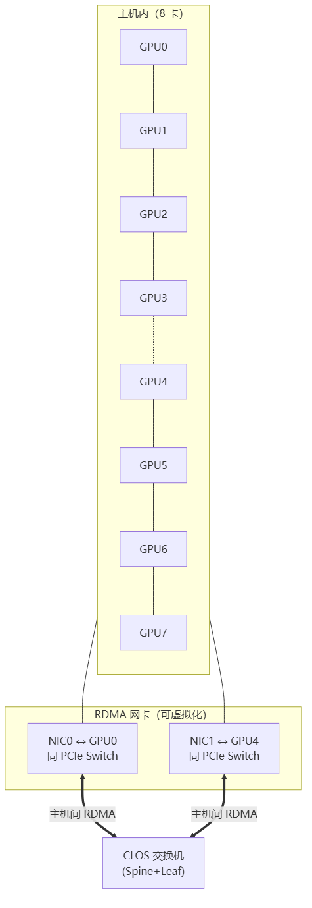
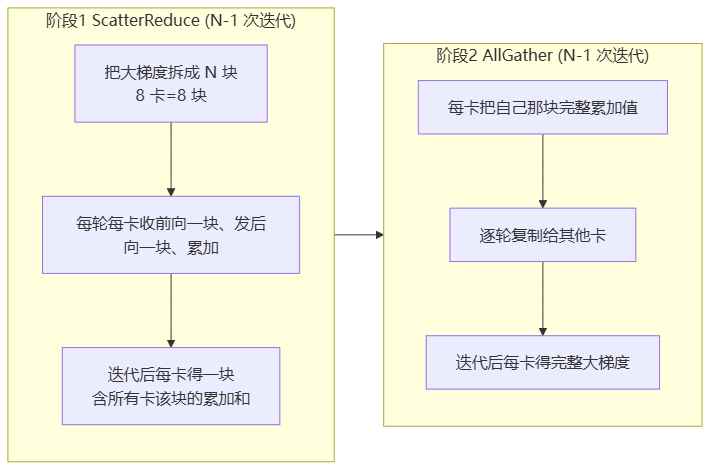
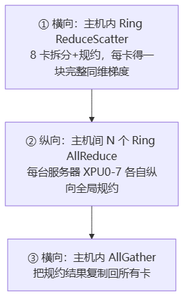
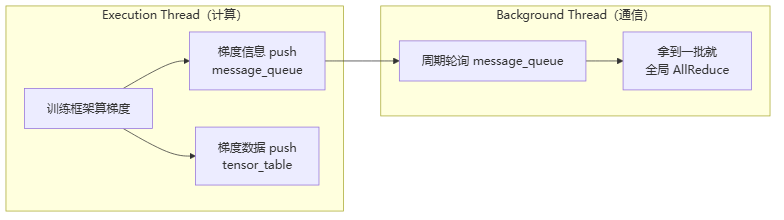
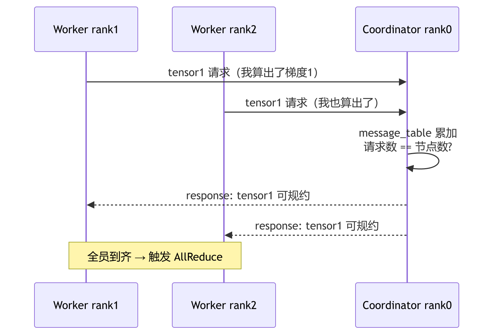

# 训练拓扑与服务框架

> **一句话**：集合通信原语（[[集合通信原语]]）要高效，得看物理网络长什么样——这就是**拓扑算法**。而把这些原语/拓扑封装成训练框架能直接用的东西，就是**服务框架**（如 Horovod）。前者解决"怎么传得快"，后者解决"计算和通信怎么配合不互相拖累"。

## 网络互联结构：拓扑算法的物理约束

拓扑算法不能脱离物理网络乱选。先看一台 8 卡服务器 + 集群的网络长什么样：

> 图解源文件：[`01-网络互联结构-拓扑算法的物理约束-flowchart.mmd`](../../../_attachments/ai-infra/distributed-training/训练拓扑与服务框架/whiteboard-mermaid/01-网络互联结构-拓扑算法的物理约束-flowchart.mmd)。

- **主机内**：GPU 通过 NVLink/PCIe 组成 ring，带宽 NVLink > PCIe Switch > QPI。
- **PCIe Switch 亲和性**：GPU 和网卡挂在同一个 PCIe Switch 上时，通信无需绕道 CPU 的 QPI，更快。
- **主机间**：每台服务器配 1/2/4/8 张 RDMA 网卡，通过 CLOS 架构交换机两两全互联。

**给应届生**："亲和性"= 谁和谁挨得近、走专用快车道。给 GPU 分配网卡时，要让网卡和它服务的 GPU 在同一个 PCIe Switch 下，否则数据要绕 CPU，慢一截。

### Torus 抽象：一切拓扑的统一视角

把上面这个网络抽象成**二维 Torus（环面）**：横向是主机内 ring，纵向是主机间 ring。Torus 横纵都能看成 ring，所以实际拓扑算法都是 **Ring-Based**。

## 拓扑算法四兄弟

| 算法 | 适用网络 | 三步走 | 适合网卡数 |
|---|---|---|---|
| **Ring AllReduce** | 主机内全互联 ring | ScatterReduce + AllGather | 主机内私有互联 |
| **2D-Ring**（Hierarchical） | 异构：主机内 ring + 主机间1网卡 | 主机内Ring + 主机间Ring + 主机内Broadcast | 1 张网卡 |
| **2D-Torus** | 主机内 ring + 主机间多网卡 | 主机内ReduceScatter + 主机间N个Ring + 主机内AllGather | 2/4/8 张网卡 |
| **2D-Mesh** | 同 2D-Torus | 主机内Ring + 主机间N个Ring | 2/4/8 张网卡 |

**给应届生**：选型口诀——**网卡几决定用啥拓扑**。1张网卡只能组1个主机间环 → 2D-Ring；多张网卡能组多个主机间环 → 2D-Torus/Mesh 把多网卡带宽吃满。Ring 简单但大集群跳数高（1000卡要跳999次）会慢，所以大规模必须上 2D 拓扑。

### Ring AllReduce = ScatterReduce + AllGather（重点）

这是最高效的 Ring AllReduce 组合，分两阶段：

> 图解源文件：[`02-Ring-AllReduce-=-ScatterReduce-+-AllGather（重点）-flowchart.mmd`](../../../_attachments/ai-infra/distributed-training/训练拓扑与服务框架/whiteboard-mermaid/02-Ring-AllReduce-=-ScatterReduce-+-AllGather（重点）-flowchart.mmd)。

**为什么高效**：① 大梯度拆小块（400MB→8×50MB），减计算和带宽压力；② 边算边传，通信时间藏进计算时间（[[通信隐藏]]）；③ 无单点瓶颈，每卡收发量均衡。

**给应届生**：对比 [[集合通信原语]] 里的"Reduce+Broadcast 笨办法"（数据全压 master）。Ring 把规约摊到每张卡上轮流做，没有中心瓶颈。这就是为什么 Ring AllReduce 成了数据并行的默认选择。

### 2D-Torus AllReduce（三步）

> 图解源文件：[`03-2D-Torus-AllReduce（三步）-flowchart.mmd`](../../../_attachments/ai-infra/distributed-training/训练拓扑与服务框架/whiteboard-mermaid/03-2D-Torus-AllReduce（三步）-flowchart.mmd)。

2D-Torus 把主机内/主机间两个维度都用满，多网卡带宽全吃，是大规模异构网络的首选。2D-Mesh 类似但第①步直接用 Ring AllReduce（数据量大些，效率略低）。

## Horovod：分布式训练服务框架

拓扑算法是"传得快"的底座，但训练框架直接调它会有问题——Horovod 就是来解决这些的。它要解决 7 个核心问题：

### 核心问题与解法

| 问题 | 痛点 | Horovod 解法 |
|---|---|---|
| 计算通信耦合 | 一出梯度就通信，易死锁且慢 | **计算通信解耦**：梯度先入队列，后台线程异步通信 |
| 计算通信串行 | 等所有梯度算完才通信，浪费时间 | **通信隐藏**：分桶边算边传，通信藏进计算 |
| 梯度落后者 | 没全算完就规约会丢梯度 | **梯度协商**：coordinator 确认全员都算出才规约 |
| 梯度融合 | 一个梯度一次通信，次数太多太慢 | **TensorFusion**：小梯度合并大 tensor 再传 |
| 易用性 | 迁移成本高 | 几行代码接入（init/wrap optimizer/broadcast） |
| 可移植 | 绑单一框架 | OP/OpKernel 插件化支持 TF/PyTorch/MXNet |
| 可靠性 | 卡坏网断训练崩 | 弹性训练（结合 Gloo） |

### 生产者-消费者模式（计算通信解耦的核心）

> 图解源文件：[`04-生产者-消费者模式（计算通信解耦的核心）-flowchart.mmd`](../../../_attachments/ai-infra/distributed-training/训练拓扑与服务框架/whiteboard-mermaid/04-生产者-消费者模式（计算通信解耦的核心）-flowchart.mmd)。

### 梯度协商：怎么保证不丢梯度

> 图解源文件：[`05-梯度协商-怎么保证不丢梯度-sequencediagram.mmd`](../../../_attachments/ai-infra/distributed-training/训练拓扑与服务框架/whiteboard-mermaid/05-梯度协商-怎么保证不丢梯度-sequencediagram.mmd)。

**给应届生**：梯度协商 = "点名"。128 张卡，同一层梯度要 128 张卡都算完才能 AllReduce，少一张就等（阻塞）。coordinator（rank0）数请求数，凑齐 N 个才放行。这是保证模型收敛/精度达标的保险——少等一个就规约，会有卡的梯度没算进去，模型就错了。

### Horovod 优缺点

**优点**：易用可移植、计算通信分离、通信隐藏、梯度协商保收敛、梯度融合、自带压缩。
**缺点**：与 CUDA 强绑定（对新训练芯片/DSA 不友好）、弹性训练复杂难上生产、消息队列/tensor_table 无容错（丢数据会丢梯度）。

## 延伸

- [[集合通信原语]] — 拓扑算法的乐高积木
- [[Ring-AllReduce]] — 概念锚点
- [[NCCL拓扑算法]] — 工业级实现：NCCL 怎么自动选 2D-Torus/Tree
- [[什么是分布式训练]] — 拓扑在第⑤步的位置
- [[通信隐藏]] — 计算通信并行的核心思想
- 专栏原文：[知乎 · 第4篇 网络结构与拓扑算法](https://zhuanlan.zhihu.com/p/496105041) ｜[第5篇 Horovod 服务框架](https://zhuanlan.zhihu.com/p/500101861)
