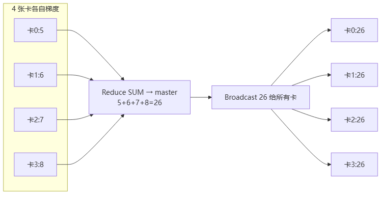
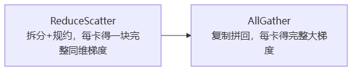

# 集合通信原语

> **一句话**：集合通信（Collective Communications）是一组进程**全体参与**的全局通信。最底层的 send/recv/Barrier 组合出"通信原语"（Broadcast/AllReduce 等），它们是所有拓扑算法的乐高积木。分布式训练第⑤步 AllReduce，就是这些原语的组合。

## 基础操作（乐高积木的零件）

- **send / receive**：点对点收发数据。
- **copy**：复制。
- **Barrier**：组内栅障——所有进程都到了才放行，用于同步。
- **signal / wait**：记录型信号量，发数据同时 signal 一个 event，对端 wait 到 event 才确认，保证进程间同步。

**给应届生**：这5个是"原子操作"。把它们按不同方式拼起来，就得到下面的"通信原语"。就像加法和乘法组合出各种算式。

## 通信原语全家桶（按收发方数量分类）

| 原语 | 方向 | 一句话 | 典型场景 |
|---|---|---|---|
| **Broadcast** | 1→多 | 一份数据发给所有卡 | 参数初始化同步 |
| **Scatter** | 1→多 | 数据切片后分发 | 模型并行初始化 |
| **Gather** | 多→1 | 各卡数据收到一张卡 | ReduceScatter 的反操作 |
| **AllGather** | 多→多 | 全收集（Gather+Broadcast） | 模型并行前向参数同步 |
| **Reduce** | 多→1 | 各卡数据**规约**到一张卡 | 求和/求最大到 master |
| **ReduceScatter** | 多→多 | 先规约再切片分发 | AllReduce 的组成部分 |
| **AllReduce** | 多→多 | 全规约，每卡都拿结果 | **数据并行梯度归约** |
| **AllToAll** | 多→多 | 全转置 | 模型并行矩阵转置 |

**给应届生**：记忆诀窍——名字带"All"的就是"每张卡都拿到结果"；带"Reduce"的会做运算（求和/求最大）；带"Scatter"的会切片。"All-Reduce = 全员都拿到规约结果"，这正是数据并行第⑤步要的。

### 规约运算符（Reduce 算什么）

Reduce 不是只会求和，常用运算符：`SUM`（累加）、`PROD`（累乘）、`MAX`/`MIN`、`MAXLOC`/`MINLOC`（带位置的最大/最小）、`LAND`/`LOR`/`BAND`/`BOR`/`LXOR`/`BXOR`（逻辑/按位与或异或）。需要加速卡支持对应算子才能生效。训练里梯度归约基本用 **SUM**。

## AllReduce：数据并行的核心

AllReduce 有两种实现，等价但性能不同：

### 方式一：Reduce + Broadcast

> 图解源文件：[`01-方式一-Reduce-+-Broadcast-flowchart.mmd`](../../../_attachments/ai-infra/distributed-training/集合通信原语/whiteboard-mermaid/01-方式一-Reduce-+-Broadcast-flowchart.mmd)。

**缺点**：① 所有数据都汇到一张卡（master 瓶颈，800MB 全压它）；② master 网络带宽成瓶颈；③ 全互联要求高。大集群几乎不用。

### 方式二：ReduceScatter + AllGather（Ring AllReduce 用的就是它）

> 图解源文件：[`02-方式二-ReduceScatter-+-AllGather（Ring-AllReduce-用的就是它）-flowchart.mmd`](../../../_attachments/ai-infra/distributed-training/集合通信原语/whiteboard-mermaid/02-方式二-ReduceScatter-+-AllGather（Ring-AllReduce-用的就是它）-flowchart.mmd)。

这种方式把大梯度拆成 N 小块（N=卡数），**边算边传**，通信时间藏在计算时间里，且没有单点瓶颈。详见 [[训练拓扑与服务框架]] 的 Ring AllReduce。

**给应届生**：记住这个等价式——**AllReduce = ReduceScatter + AllGather**。这是 Ring/Tree 等所有高效拓扑算法的数学基础。Reduce+Broadcast 是"笨办法"（中心化、有瓶颈），ReduceScatter+AllGather 是"聪明办法"（去中心化、流水线）。

## 数据并行 vs 模型并行：用哪些原语

| 并行方式 | 前向 | 反向 | 关键原语 |
|---|---|---|---|
| **数据并行** | 各卡各算 | AllReduce 梯度 | AllReduce |
| **模型并行** | AllGather 参数同步 | ReduceScatter | AllGather / ReduceScatter / AllToAll |

**给应届生**：数据并行"切数据、合梯度"→ AllReduce；模型并行"切模型、合参数"→ AllGather。问"数据并行为什么用 AllReduce"——因为每卡算的是**自己那份数据的梯度**，要把 N 份梯度加成一份全局梯度，正是 AllReduce 干的事。

## 延伸

- [[AllReduce]] — 概念锚点页
- [[训练拓扑与服务框架]] — 这些原语怎么组合成 Ring/2D-Torus 拓扑
- [[NCCL拓扑算法]] — 工业级实现：NCCL 怎么选拓扑
- [[什么是分布式训练]] — 原语在 6 步迭代中的位置
- 专栏原文：[知乎 · 第3篇 集合通信及其通信原语](https://zhuanlan.zhihu.com/p/493092647)
