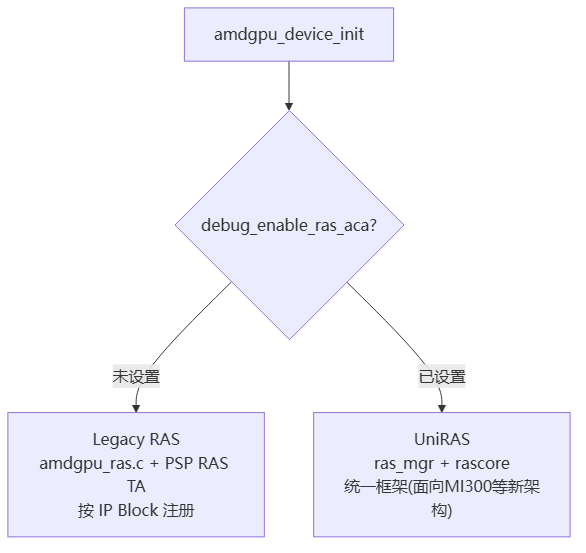
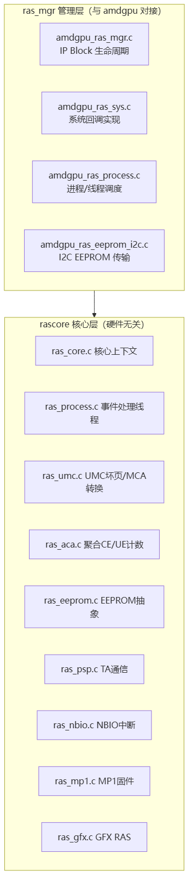
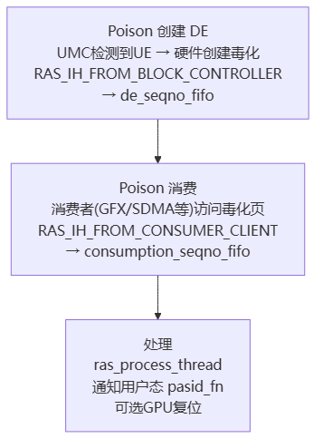
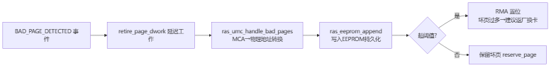

# AMD GPU RAS 代码架构

> **一句话**：AMD GPU 内核驱动（`drivers/gpu/drm/amd/ras/`）的 RAS 子系统，是一套"硬件检测→中断→分发→处理→恢复"的代码框架。核心是 **Poison（毒化）机制**——坏页被标记成"毒"，谁访问谁触发中断。它有 Legacy RAS 和 UniRAS 两套实现路径。

## 双路径架构：Legacy RAS vs UniRAS

AMD GPU RAS 存在两套实现，由 `adev->debug_enable_ras_aca` 开关切换：

> 图解源文件：[`01-双路径架构-Legacy-RAS-vs-UniRAS-flowchart.mmd`](../../../_attachments/ai-infra/gpu-ras/AMD-GPU-RAS/whiteboard-mermaid/01-双路径架构-Legacy-RAS-vs-UniRAS-flowchart.mmd)。

| 路径 | 触发 | 主要组件 | 用途 |
|---|---|---|---|
| Legacy RAS | `debug_enable_ras_aca` 未设 | amdgpu_ras.c, PSP RAS TA | 传统 IP Block 方式 |
| UniRAS | `debug_enable_ras_aca` 设置 | ras_mgr + rascore | 统一 RAS 框架，面向新架构 |

**给应届生**：Legacy 和 UniRAS 是"老接口 vs 新框架"的关系。老架构按 GPU 各个 IP 块（UMC/GFX/SDMA...）分别注册 RAS；新架构（如 MI300）用 UniRAS 统一管理。两套并存是为兼容，新卡走 UniRAS。

## 分层：管理层 ras_mgr + 核心层 rascore

> 图解源文件：[`02-分层-管理层-ras_mgr-+-核心层-rascore-flowchart.mmd`](../../../_attachments/ai-infra/gpu-ras/AMD-GPU-RAS/whiteboard-mermaid/02-分层-管理层-ras_mgr-+-核心层-rascore-flowchart.mmd)。

## 主线：检测→中断→分发→处理→恢复

> 图解源文件：[`03-主线-检测→中断→分发→处理→恢复-flowchart.mmd`](../../../_attachments/ai-infra/gpu-ras/AMD-GPU-RAS/whiteboard-mermaid/03-主线-检测→中断→分发→处理→恢复-flowchart.mmd)。

### 中断三类来源

- **RAS_IH_FROM_BLOCK_CONTROLLER**：硬件 RAS 控制器报错（如 UMC 检测到 UE）。
- **RAS_IH_FROM_CONSUMER_CLIENT**：消费者（GFX/SDMA/VCN/JPEG/MMHUB）访问了毒化页。
- **RAS_IH_FROM_FATAL_ERROR**：致命错误（ATHUB 错误事件）。

## 错误类型

| 枚举 | 名称 | 含义 | 处理 |
|---|---|---|---|
| PARITY | 奇偶校验 | 校验错误 | 记录/告警 |
| SINGLE_CORRECTABLE | 单比特 CE | 可纠正 ECC | 计数、可选退休 |
| MULTI_UNCORRECTABLE | 多比特 UE | 不可纠正 | 坏页退休、可能复位 |
| POISON | 毒化 | 内存毒化（软件标记坏页） | 消费时触发 Page Fault/中断 |

## Poison 机制（核心）

Poison 是 AMD RAS 的灵魂——UMC 检测到不可纠正错误（UE）后，把该页**标记成"毒"**，谁访问谁中断。

> 图解源文件：[`04-Poison-机制（核心）-flowchart.mmd`](../../../_attachments/ai-infra/gpu-ras/AMD-GPU-RAS/whiteboard-mermaid/04-Poison-机制（核心）-flowchart.mmd)。

**给应届生**：Poison = "立个危险标记牌"。显存某页坏了（UE），硬件不立刻处理，而是给它贴个"毒"标签继续用——等到哪个计算单元真的要读这页数据时（消费），才触发中断处理。这样把"发现坏页"和"处理坏页"解耦，避免一坏就停。坏页最终被"退休"（retire）——记录到 EEPROM 持久化，下次启动跳过该页。

## 坏页退休与 EEPROM 持久化

> 图解源文件：[`05-坏页退休与-EEPROM-持久化-flowchart.mmd`](../../../_attachments/ai-infra/gpu-ras/AMD-GPU-RAS/whiteboard-mermaid/05-坏页退休与-EEPROM-持久化-flowchart.mmd)。

**给应届生**：坏页退休 = "把坏页地址永久记到 EEPROM 小本本上"。EEPROM 是 GPU 板上的非易失存储，断电不丢。每次开机 RAS 从 EEPROM 加载坏页列表，提前避开这些页。坏页累积超阈值就触发 **RMA**（Return Material Authorization，返厂授权）——说明这卡坏页太多该换了。

## RAS 块（按 GPU IP 划分）

| 块 | 含义 | 角色 |
|---|---|---|
| UMC | 统一内存控制器 | 显存 ECC，坏页主要来源，Poison 创建者 |
| SDMA | 系统 DMA | 引擎 ECC，Poison 消费者 |
| GFX | 图形引擎 | 计算核心 ECC，Poison 消费者，含大量子块 |
| MMHUB | 内存 Hub | 内存路由，Poison 消费者 |
| ATHUB | 地址/数据 Hub | 致命错误来源 |
| PCIE_BIF | PCIe 总线 | 总线错误 |
| XGMI_WAFL | 多 GPU 互联 | 互联链路 |

## KFD SMI 事件（第127篇）

AMDGPU KFD（Kernel Fusion Driver）的 SMI 事件系统 + Event IOCTL，把 RAS 故障、调度事件等通过 SMI 接口暴露给用户态监控工具。

## PCIe 链路检测（第130篇）

新增模块 `ras_pcie_detect`：PCIe 链路异常（掉电、热拔出、链路训练失败）会让整个 GPU 从软件视角"消失"，需在中断前主动轮询配置空间寄存器检测。嵌入 rascore 核心层，提供标准化 PCIe 链路状态检测。

**给应届生**：PCIe 故障比 ECC 更"致命"——ECC 坏的是数据（还能退休避开），PCIe 断了整个 GPU 直接消失（软件找不到设备了）。所以要在中断触发前主动轮询 PCIe 配置空间，抢在设备"消失"前感知。

## 关键数据结构

- **amdgpu_ras（Legacy）**：`objs[]`（各块 ras_manager）、`recovery_work`、`page_retirement_thread`、`eeprom_control`、`poison_fifo`。
- **ras_core_context（UniRAS）**：`ras_aca`/`ras_umc`/`ras_eeprom`/`ras_psp`/`ras_nbio` 等子模块、`de_seqno_fifo`/`consumption_seqno_fifo`、`poison_supported`、`is_rma`。
- **EEPROM 表**：表头(20B) + RAS Info(256B，含 rma_status/health_percent) + 记录(24B/条，含 address/err_type/bank/channel)。

## 延伸

- [[GPU-RAS体系]] — RAS 全栈方案与四层设计
- [[Fabric-Manager与NVLink]] — NVIDIA 侧的互联 RAS（对照 AMD XGMI）
- [[千卡训练性能优化]] — RAS 是集群稳定的底层
- 专栏原文：[知乎 · 第128篇 AMD GPU RAS代码架构](https://zhuanlan.zhihu.com/p/2011570843000512649) ｜[第129篇 GPU驱动RAS故障检测子系统](https://zhuanlan.zhihu.com/p/2013933574345208744) ｜[第130篇 PCIe链路检测](https://zhuanlan.zhihu.com/p/2013942544107611964) ｜[第127篇 KFD SMI Events](https://zhuanlan.zhihu.com/p/2011568518471124538)
