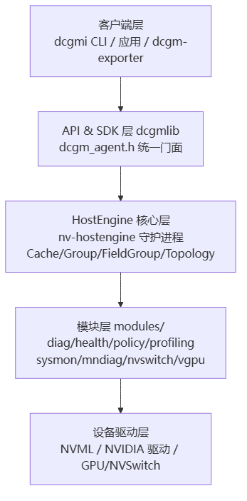
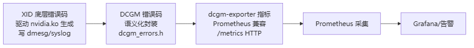
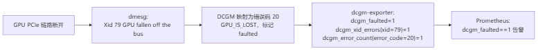

# DCGM 与监控

> **一句话**：DCGM（Data Center GPU Manager）是 NVIDIA 的 GPU 集群管理守护进程，向下采集 GPU/NVSwitch 健康与性能指标，向上通过 dcgm-exporter 把指标喂给 Prometheus。它把驱动层裸的 XID 错误码"翻译"成运维可读的 DCGM 错误码和监控指标，是 GPU 集群可观测层的中枢。

## DCGM 是什么

数据中心 GPU 集群动辄上千张卡，谁来统一采集它们的温度、ECC 错误、NVLink 状态、利用率？就是 DCGM——一个以 `nv-hostengine` 守护进程为核心的 C 库框架，提供健康监控、诊断（NVVS）、策略治理、性能采集能力。注意区分：

- **DCGM**（本页）：库 + 守护进程，采集与管理本体；
- **dcgm-exporter**：把 DCGM 的字段导出成 Prometheus 指标的导出器，云原生侧见 [[wiki/ai-infra/ai-cloud/GPU监控与运维|GPU 监控与运维]]。

**给应届生**：DCGM ≈ GPU 集群的"体检中心"。nv-hostengine 是体检医生（驻在每台 GPU 节点上），dcgmi 是你敲的体检命令，dcgm-exporter 是把体检结果发到 Prometheus 监控大屏的"数据快递员"。本页讲体检中心本身和错误码翻译。

## 4+1 架构：五层逻辑

> 图解源文件：[`01-4+1-架构-五层逻辑-flowchart.mmd`](../../../_attachments/ai-infra/gpu-ras/DCGM与监控/whiteboard-mermaid/01-4+1-架构-五层逻辑-flowchart.mmd)。

| 层 | 角色 | 关键件 |
|---|---|---|
| 客户端 | 人机接口 | dcgmi、应用、dcgm-exporter |
| API & SDK | 统一门面 | dcgmlib（dcgm_agent.h） |
| HostEngine | 控制平面 | nv-hostengine + Cache/Group/Topology 管理器 |
| 模块 | 领域逻辑 | diag 诊断、health 健康、policy 策略、profiling 性能… |
| 设备驱动 | 硬件接口 | NVML + 驱动 |

### HostEngine 核心管理器

- **Cache Manager**：维护 GPU/NVSwitch 监控字段缓存，控制采集频率；
- **Group Manager**：GPU 组与实体组，按主机/插槽/拓扑分组；
- **Field Group & Profile**：字段集合与预定义采集 Profile；
- **Topology**：抽象 NVLink/NVSwitch 拓扑。

### 模块层与 NVVS

`modules/` 各子目录通过统一 `DcgmModule` 接口注册到 HostEngine：diag（诊断）、health（健康）、policy（策略）、profiling（性能）、sysmon（系统监控）、mndiag（多节点诊断）、nvswitch、vgpu。**NVVS（NVIDIA Validation Suite）**是 DCGM 诊断能力的主要载体，跑内存/压力/链路测试，结果映射到 PASS/WARN/FAIL。

### 嵌入式 vs 远程模式

应用可用 `dcgmStartEmbedded` 在本进程内启动 HostEngine（无独立守护进程，低延迟）；也可 `dcgmConnect` 远程连接节点的 nv-hostengine（默认端口 5555）。dcgm-exporter 常用嵌入式模式同节点采集。

## DCGM 的 RAS 机制

DCGM 从四个层面支撑 [[GPU-RAS体系]] 的可观测层：

| 层面 | 内容 |
|---|---|
| 字段 Field | ECC 错误计数（SBE/DBE 聚合/易失）、温度/功耗/时钟事件、PCIe/NVLink 错误率、页退役/行重映射 |
| 错误码 Error | `dcgm_errors.h` 详尽枚举：ECC/页退役/行重映射/PCIe/NVLink/NVSwitch/热功耗/XID |
| 健康策略 | `dcgmPolicySet` 设阈值与响应（告警/隔离 GPU），health 模块持续聚合健康状态 |
| 诊断 | NVVS 主动触发硬件测试，结果与被动监控错误合并评估 |

## XID → DCGM → 指标：三层翻译链

**给应届生**：XID 错误码 ≈ GPU 故障的条形码，DCGM 是翻译员，dcgm-exporter 是快递员。一条故障从底层硬件冒出来，要经过三层"翻译"才能变成大屏上响的告警。

> 图解源文件：[`02-XID-→-DCGM-→-指标-三层翻译链-flowchart.mmd`](../../../_attachments/ai-infra/gpu-ras/DCGM与监控/whiteboard-mermaid/02-XID-→-DCGM-→-指标-三层翻译链-flowchart.mmd)。

### 1. XID：底层错误标识

GPU 驱动内核模块生成的最底层错误信号，记录在 `dmesg`/`syslog`：

| XID | 含义 |
|---|---|
| 31 | 显存页错误（ECC 不可纠正/非法访问） |
| 79 | GPU 从 PCIe 总线脱落（掉卡） |
| 123 | 驱动超时（kernel timeout） |
| 130 | GPU 供电不足/功耗超限 |
| 45 | NVLink 相关致命错误 |
| 74 | GPU 与 NVSwitch 连接故障 |

### 2. DCGM 错误码：运维级封装

DCGM 把 XID 映射成语义化错误码，并补充非 XID 类故障（温度过高、利用率异常）：

| DCGM 码 | 名称 | 对应 XID | 含义 |
|---|---|---|---|
| 20 | DCGM_ERR_GPU_IS_LOST | 79 | GPU 掉卡 |
| 23 | DCGM_ERR_ECC_UNCORRECTABLE | 31 | 显存不可纠正 ECC |
| 35 | DCGM_ERR_POWER_VIOLATION | 130 | 功耗超限 |
| 43 | DCGM_ERR_DRIVER_TIMEOUT | 123 | 驱动超时 |

每个错误码还带 `severity`（MONITOR/ISOLATE/RESET…）和 `category`（PERF/SOFTWARE/HARDWARE），供上层决策。

### 3. dcgm-exporter 指标：监控级载体

| 指标 | 类型 | 含义 |
|---|---|---|
| `dcgm_faulted` | 布尔 | GPU 是否故障（1=故障） |
| `dcgm_xid_errors` | 计数器 | 各 XID 累计次数（带 xid 标签） |
| `dcgm_error_count` | 计数器 | 各 DCGM 错误码累计次数 |
| `dcgm_ecc_errors_uncorrectable` | 计数器 | 不可纠正 ECC 错误数 |
| `dcgm_gpu_status` | 枚举 | 0=正常 1=警告 2=故障 |

## 典型用例：GPU 掉卡（XID 79）端到端

> 图解源文件：[`03-典型用例-GPU-掉卡（XID-79）端到端-flowchart.mmd`](../../../_attachments/ai-infra/gpu-ras/DCGM与监控/whiteboard-mermaid/03-典型用例-GPU-掉卡（XID-79）端到端-flowchart.mmd)。

排查三步：① PromQL `dcgm_faulted==1` 定位故障 GPU 编号；② 登录节点 `dmesg | grep Xid` 看原始日志；③ `dcgmi error -c 20` 查错误码含义定位根因。

**给应届生**：这条链路是 GPU 运维的标准范式——**先从监控大屏发现"哪张卡坏了"（指标层），再回节点看"具体什么错"（XID 日志层），最后查"这个错意味着什么"（DCGM 错误码语义）**。三层各管一段，缺哪层都瞎。

## 延伸

- [[GPU-RAS体系]] — DCGM 是可观测层的实现
- [[Fabric-Manager与NVLink]] — FM 的 SXid/Xid 由 DCGM 采集
- [[NVSentinel韧性系统]] — NVSentinel 的 GPU Health Monitor 正是基于 DCGM
- [[wiki/ai-infra/ai-cloud/GPU监控与运维|GPU 监控与运维]] — dcgm-exporter 的云原生部署侧
- 专栏原文：[知乎 · 第114篇 DCGM 4+1 架构视图](https://zhuanlan.zhihu.com/p/1990512854735024496) ｜[第115篇 XID/DCGM/dcgm-exporter 关联](https://zhuanlan.zhihu.com/p/1990545683846035012)
