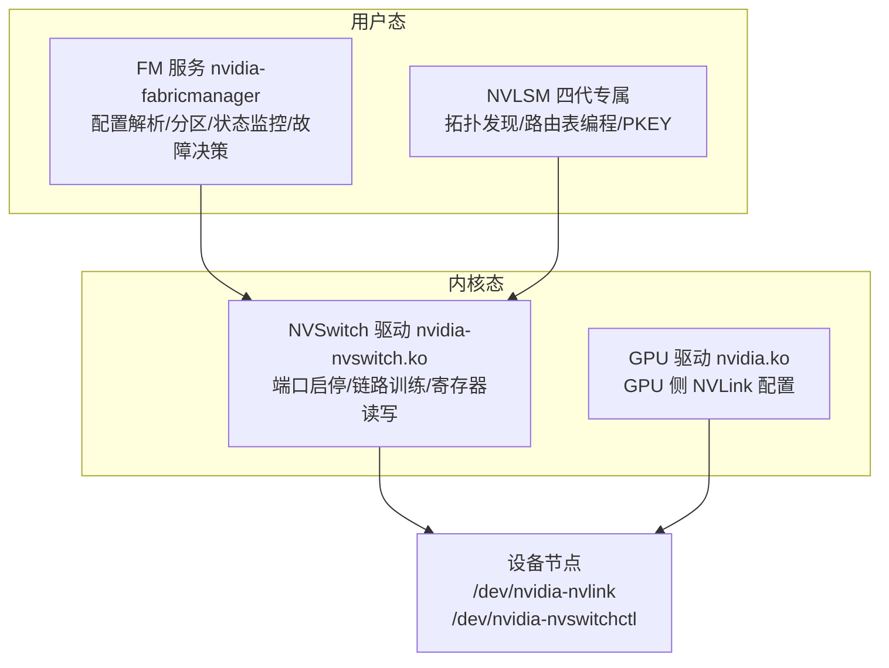
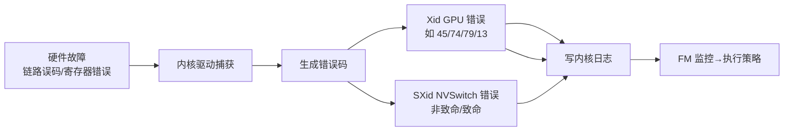
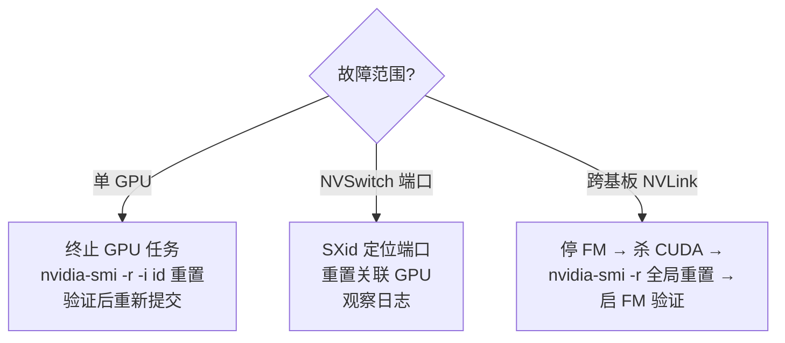
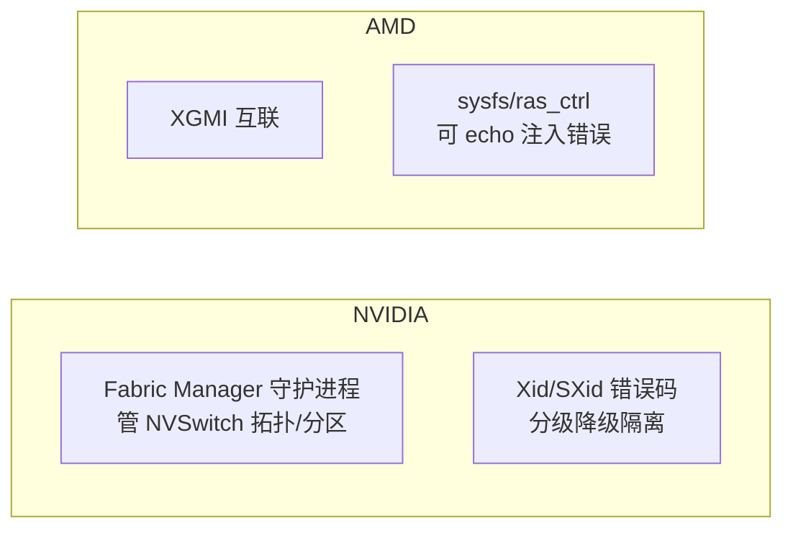

# Fabric Manager 与 NVLink

> **一句话**：Fabric Manager（FM）是 NVIDIA 管理 NVLink/NVSwitch 拓扑的守护进程，决定多 GPU 之间谁能用 NVLink 直连、链路怎么训练、链路坏了怎么降级隔离。它是 DGX/HGX 这类多 GPU 系统的必装软件中枢——可理解为"NVLink 高速公路的调度中心"。

## FM 解决什么

一台 DGX/HGX 上 8 张 GPU 要两两高速互联，靠的是 NVLink + NVSwitch 交换。但"哪些 GPU 之间直连、链路怎么训练成功、链路坏了怎么办、虚拟化下多租户怎么分"——拓扑管理、资源调度、故障容错、场景适配正是 FM 的职责。没有 FM，NVSwitch 只是裸硬件，GPU 之间无法按需建链。

**给应届生**：Fabric Manager ≈ NVLink 高速公路的调度中心。NVSwitch 是路口的立交桥硬件，FM 是控制信号灯、规划路线、出事故时封路改道的那个"大脑"。GPU 想和另一个 GPU 通信，要先问 FM 拿到"同一分区"的通行许可。

## 架构：用户态管理 + 内核态执行

FM 严格遵循"用户态决策、内核态执行"的分离原则：

| 层级 | 组件 | 职责 |
|---|---|---|
| 用户态 | FM 服务 | 配置解析、分区管理、状态监控、故障决策 |
| 用户态 | NVLSM（四代） | 拓扑发现、路由表编程、PKEY 配置 |
| 内核态 | NVSwitch 驱动 | 硬件资源操作、错误上报 |
| 内核态 | GPU 驱动 | GPU 侧 NVLink 配置、fabric 映射 |

### 四代架构升级：FM 与 NVLSM 拆分

前几代（一/二/三代，含 H100）FM 一肩挑"拓扑发现+路由配置+分区管理"；四代（B100/B200/B300）引入 **NVLSM（NVLink Subnet Manager）**后职责拆分：

- FM 负责"GPU 侧配置 + 分区生命周期"；
- NVLSM 负责"NVSwitch 侧路由 + 拓扑发现"；
- 二者通过 unix 域套接字（`/var/run/nvidia/nvlsm_ipc`）IPC 同步。

## 核心功能

### 1. NVLink 链路训练

链路建立的前提是"训练"成功（信号探测→速率协商→误码校准）。前几代 FM 主导训练，失败重试 3 次（可配 `LINK_TRAINING_RETRY_COUNT`）；四代支持 ALI，GPU 与 NVSwitch 自主训练，FM 仅监控结果。

### 2. 分区管理

分区（Partition）本质是"逻辑内存 fabric"，靠 **PKEY（分区密钥）**隔离不同分区的通信：同 PKEY 的 GPU 才能互通，NVSwitch 收到包校验 PKEY 不匹配则丢弃。支持运行时重载（`nvidia-fabricmanager -r`）。

### 3. 虚拟化三种模式

| 模式 | 实现 | 适用 |
|---|---|---|
| 全透传 | GPU/NVSwitch 直通 VM，VM 内跑 FM | 高性能虚拟化 |
| Shared NVSwitch | Service VM 跑 FM/NVLSM，Guest VM 按分区访问 | 云多租户 |
| vGPU | SR-IOV 虚拟出 VF，FM 主机侧配分区 | 轻量/云桌面 |

## RAS 处理方案

这是 FM 与 [[GPU-RAS体系]] 检测处置层呼应的核心。FM 通过标准化错误码实现全栈故障可见性。

### Xid 与 SXid 错误码

- **Xid（GPU 侧）**：Xid 45 NVLink 致命错误、Xid 74 GPU-NVSwitch 连接故障、Xid 79 GPU 掉 PCIe、Xid 13 SM 异常。
- **SXid（NVSwitch 侧）**：分非致命（仅记录，可能短暂降速）与致命（终止任务、需显式恢复）。

### 分级容错策略

FM 按"最小影响"分级响应，三个关键可配策略：

| 故障类型 | 参数 | 取值与效果 |
|---|---|---|
| 访问链路（GPU↔NVSwitch） | `ACCESS_LINK_FAILURE_MODE` | 0=禁用故障 GPU（默认）；1=降级带宽；2=仅日志 |
| 中继链路（NVSwitch↔NVSwitch） | `TRUNK_LINK_FAILURE_MODE` | 0=禁用故障 NVSwitch 对；1=降级；2=忽略 |
| NVSwitch 设备 | `NVSWITCH_FAILURE_MODE` | 0=隔离故障 NVSwitch（默认）；1=系统重启；2=忽略 |

### 降级模式与故障排除

**给应届生**：降级模式 = "坏一块不影响其余"。FM 自动忽略初始化失败/PCIe 不可见的 GPU，只配置可用 GPU 间的路由，集群仍能跑（虽然规模缩水）。对持续故障的 GPU/NVSwitch，管理员可手动标记"排除"，FM 重启后跳过它们。这对应 [[GPU-RAS体系]] 里"故障隔离"那一环。

### 标准化恢复流程

状态文件（`STATE_FILE_NAME`，默认 `state.json`）持久化分区配置与链路状态，FM 重启自动加载，无需重新配置。

## 监控生态

FM 与 NVIDIA 工具链深度集成：DCGM 实时采集 NVLink 链路状态/ECC/PCIe 错误（见 [[DCGM与监控]]）；NVML 提供 API 查询健康状态；**SMBPBI** 提供带外管理——OS 未启动也能访问 GPU/NVSwitch 错误信息，适合远程诊断。

## NVIDIA 与 AMD 互联 RAS 对照

NVIDIA 侧互联 RAS 走"子系统+守护进程+错误码体系"；AMD 侧 XGMI 把 RAS 能力暴露成 sysfs 文件，详见 [[AMD-GPU-RAS]]。

## 延伸

- [[GPU-RAS体系]] — RAS 全栈四层设计，FM 是检测处置层的实现
- [[DCGM与监控]] — FM 状态由 DCGM 采集并暴露
- [[AMD-GPU-RAS]] — AMD XGMI 互联 RAS 对照
- [[千卡训练性能优化]] — NVLink 拓扑完整是千卡带宽的前提
- 专栏原文：[知乎 · 第112篇 Fabric Manager 官方文档解读](https://zhuanlan.zhihu.com/p/1988358725304604008) ｜[第113篇 Fabric Manager RAS 处理方案](https://zhuanlan.zhihu.com/p/1988635210787608558)
