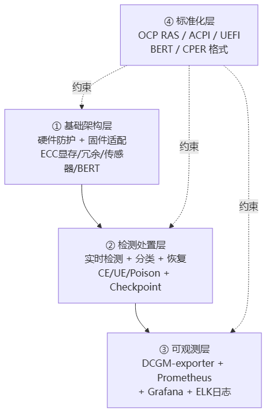
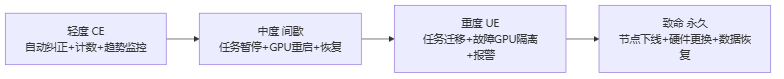
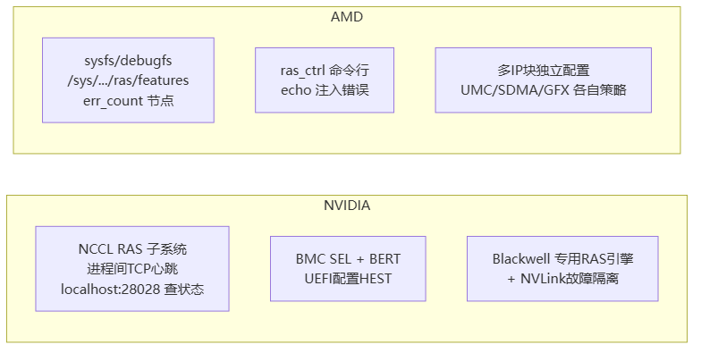

# GPU RAS 体系

> **一句话**：RAS = **R**eliability 可靠性 + **A**vailability 可用性 + **S**erviceability 可服务性。千卡集群跑几天必有卡坏，RAS 就是一套"故障预防→实时检测→精准定位→快速恢复"的全生命周期机制，让集群在故障下还能不停机。对应 [[分布式训练评价指标]] 里的"韧性"指标。

## RAS 解决什么问题

大规模 GPU 集群的硬件必然出故障：显存 ECC 错误、计算核心失效、NVLink/PCIe 链路断、GPU 消失、整机宕机。没有 RAS，一个故障就让整个训练任务崩溃重启，损失巨大。RAS 的核心目标：
1. 减少非计划停机时间
2. 提前识别潜在故障风险
3. 快速定位并处置故障
4. 简化运维流程，降低维护成本

## 全栈 RAS：四层设计

> 图解源文件：[`01-全栈-RAS-四层设计-flowchart.mmd`](../../../_attachments/ai-infra/gpu-ras/GPU-RAS体系/whiteboard-mermaid/01-全栈-RAS-四层设计-flowchart.mmd)。

### ① 基础架构层（硬件 + 固件）

- **硬件级 RAS 增强**：专用 RAS 引擎（如 Blackwell）、高可靠显存 HBM3E 支持 ECC（自动纠正单比特错误、标记多比特错误）、双路电源/冗余散热等冗余设计、温度/电压/电流传感器（超阈值触发热节流降频）。
- **固件与底层软件**：BMC 远程批量固件更新 + 备份回滚、驱动级错误监控模块、BERT（Boot Error Record Table）记录启动错误以 CPER 格式上报。

### ② 检测处置层（核心）

**给应届生**：记住这条主线——**检测→分类→处置→恢复**。

**故障四分类**：
| 类型 | 例子 | 能否纠正 | 影响 |
|---|---|---|---|
| 可纠正 CE | 单比特显存错误 | 硬件自动纠正 | 不影响业务 |
| 不可纠正 UE | 多比特显存错误、核心失效 | 不能 | 可能任务异常 |
| 间歇性 | 电压波动临时错误 | 重启可恢复 | 临时 |
| 永久性 | 硬件物理损坏 | 需更换 | 须换件 |

**分级处置**：

> 图解源文件：[`02-②-检测处置层（核心）-flowchart.mmd`](../../../_attachments/ai-infra/gpu-ras/GPU-RAS体系/whiteboard-mermaid/02-②-检测处置层（核心）-flowchart.mmd)。

**恢复手段**：
- **任务级**：Checkpoint/Restore 定期存状态，故障时迁移到备用 GPU 从最近 Checkpoint 恢复。
- **内核级**：SDEI NMI Watchdog 检测内核死锁，卡死时触发 NMI 打印调用栈并尝试重启。
- **集群级**：K8s + DCGM-exporter + Prometheus 采集指标，HPA 自动扩缩容规避故障节点。

### ③ 可观测层

DCGM-exporter（采 GPU 错误计数/温度/利用率）→ Prometheus → Grafana 仪表盘 + ELK 日志聚合。关键错误（如 UE）自动触发告警。

### ④ 标准化层

Google/Microsoft/NVIDIA 联合推动三大标准化：固件更新标准化、RAS 需求标准化（核心指标/错误分类）、管理接口标准化。遵循 ACPI/UEFI 规范（BERT、CPER 格式）。详见 [[OCP-GPU-RAS标准]]。

## NVIDIA vs AMD 的 RAS 实现

> 图解源文件：[`03-NVIDIA-vs-AMD-的-RAS-实现-flowchart.mmd`](../../../_attachments/ai-infra/gpu-ras/GPU-RAS体系/whiteboard-mermaid/03-NVIDIA-vs-AMD-的-RAS-实现-flowchart.mmd)。

**给应届生**：两家思路不同——NVIDIA 偏"子系统+网络化"（NCCL RAS 像个独立服务，进程间用心跳互探），AMD 偏"文件接口+可注入"（把 RAS 能力暴露成 sysfs 文件，能用 echo 命令主动注入错误测试）。AMD 的代码级架构（Legacy RAS vs UniRAS 双路径）见 [[AMD-GPU-RAS]]。

## 典型场景

- **AI 训练**：万亿参数模型，Blackwell GB200 + NVLink 故障隔离 + Checkpoint/Restore + NCCL RAS 监控分布式进程健康。
- **云服务**：K8s + HPA 故障节点负载自动迁移 + Prometheus SLA 告警（TTFT<2s、E2E latency<20s）+ 租户级 RAS 视图。
- **HPC**：ECC + 计算冗余校验 + BMC 远程诊断 + IB 网络故障节点快速脱离。

## 未来：预测性维护

RAS 正向"预测性维护"演进——用 AI 分析历史错误数据提前预测故障；跨厂商 RAS 接口进一步标准化，实现多厂商 GPU 集群统一管理。

## 延伸

- [[AMD-GPU-RAS]] — AMD GPU RAS 代码架构（Legacy/UniRAS 双路径、Poison、坏页退休）
- [[Fabric-Manager与NVLink]] — NVLink/NVSwitch 生态的 RAS
- [[DCGM与监控]] — GPU 监控指标导出
- [[NVSentinel韧性系统]] — K8s GPU 节点韧性闭环
- [[分布式训练评价指标]] — 可用性/可靠性/韧性的定义
- [[千卡训练性能优化]] — RAS 是千卡集群稳定运行的前提
- 专栏原文：[知乎 · 第108篇 GPU RAS处理方案](https://zhuanlan.zhihu.com/p/1987648353689936645) ｜[第109篇 OCP RAS标准](https://zhuanlan.zhihu.com/p/1988008157331600229)
