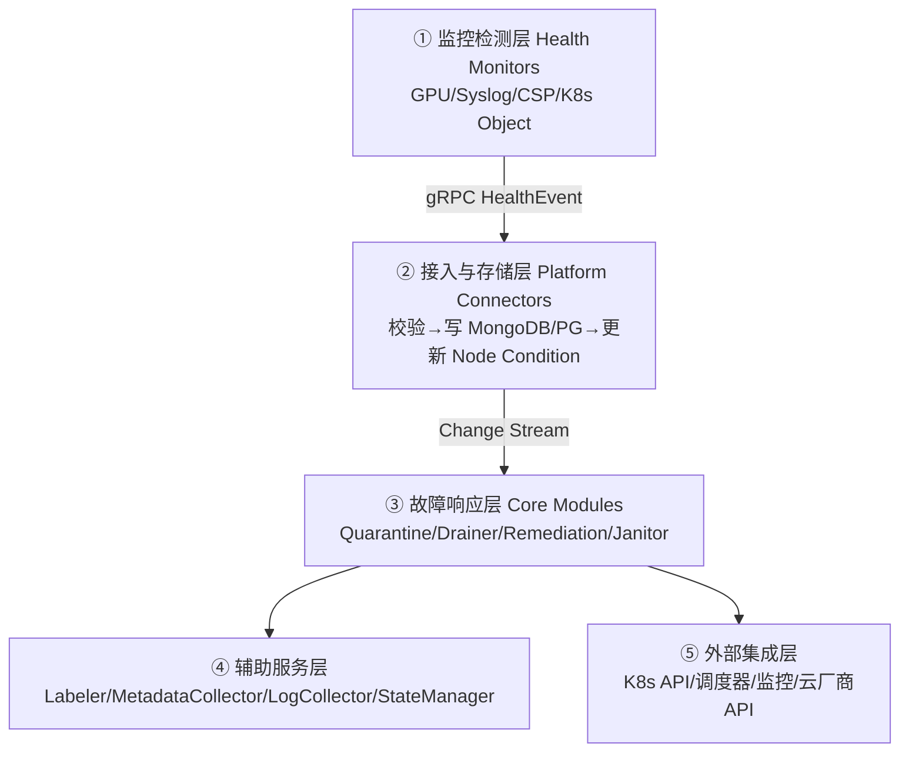
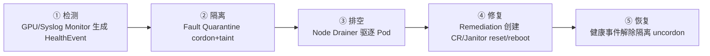

# NVSentinel 韧性系统

> **一句话**：NVSentinel 是 Kubernetes 上的 GPU 节点韧性（resilience）闭环系统，微服务 + 事件驱动，把"发现病卡→拉警戒线→把活迁走→修好→重新上岗"全自动串起来。它是 [[GPU-RAS体系]] "韧性闭环"在云原生侧的落地，对应 [[分布式训练评价指标]] 里的"韧性"指标。

## 解决什么

千卡集群每天都有卡坏。传统做法靠人：看告警→登节点→cordon→drain→重启→uncordon，慢且易错。NVSentinel 把这套流程自动化成 K8s 原生的检测→隔离→排空→修复→恢复闭环，目标是**最小化 GPU 集群停机时间**。

**给应届生**：NVSentinel ≈ K8s 集群的 GPU 急诊流程：发现病卡（检测）→ 拉警戒线（cordon/taint 隔离）→ 把活迁走（drain 排空）→ 修好（reset/reboot 修复）→ 重新上岗（uncordon 恢复）。全程自动，人只在"修不好要换件"时介入。

## 4+1 架构：五层逻辑

### ① 监控检测层（Health Monitors）

四类监控器各自盯不同信号源，统一输出 `HealthEvent`（字段含 agent/nodeName/isFatal/recommendedAction/errorCode/entitiesImpacted/quarantineOverrides）：

| 监控器 | 语言 | 盯什么 |
|---|---|---|
| GPU Health Monitor | Python+DCGM | 温度/电源/ECC/XID（依赖 DCGM，见 [[DCGM与监控]]） |
| Syslog Health Monitor | Go | journalctl 解析 XID/SXID、GPU fallen off bus |
| CSP Health Monitor | — | 云厂商维护事件（SCHEDULED_MAINTENANCE） |
| K8s Object Monitor | — | CEL 规则监控任意 K8s 对象状态 |

### ② 接入与存储层

**Platform Connectors** 暴露 gRPC 服务（监听 `/var/run/nvsentinel.sock`）：校验事件→写 MongoDB/PostgreSQL→更新 K8s Node Condition/Event→暴露 Prometheus 指标。内部用可配置 Transformer Pipeline 标准化事件。

**Store** 用 Change Stream 给下游模块做发布-订阅解耦：`healthevent`（原始事件）+ `healtheventstatus`（处理状态：nodeQuarantined/userPodsEvictionStatus/faultRemediated）。

### ③ 故障响应层（核心）

| 模块 | 职责 |
|---|---|
| Fault Quarantine | CEL 规则决策 cordon/taint，写回状态 |
| Node Drainer | 按命名空间策略驱逐 Pod（优雅→超时强删） |
| Fault Remediation | 按 recommendedAction 创建维护 CR、触发 Log Collector/Janitor |
| Health Events Analyzer | 分析事件模式（同卡 XID 频发），给推荐动作 |
| Janitor | 执行 reboot/terminate 重动作（经 CSP API），报 MTTR |
| Event Exporter | 导出 CloudEvents 到外部总线 |

### ④⑤ 辅助与外部集成

Labeler 给节点打能力标签；Metadata Collector 收 GPU/NVSwitch 拓扑上下文；Log Collector 以 Job 形式收集诊断日志上传文件服务器；State Manager 统管生命周期。外部通过 Taint+Toleration、Node Condition、自定义 CR、CloudEvents 与调度/监控/云厂商对接。

## 韧性闭环：检测→隔离→排空→修复→恢复

**给应届生**：这五步就是 K8s 故障节点的标准动作。cordon = "挂停业牌"（不再调度新任务到这节点）；drain = "请客走人"（把已有 Pod 优雅迁走）；reset/reboot = "治病"；uncordon = "重新开业"。NVSentinel 把这套手动 `kubectl cordon/drain` 自动化了。

## 推荐动作 recommendedAction

Health Events Analyzer 根据事件模式给出分级动作，是闭环的"决策中枢"：

| 动作 | 触发 | 范围 |
|---|---|---|
| NONE / STORE_ONLY | 轻微、首次 | 仅记录，不动手 |
| COMPONENT_RESET | 单卡可重置故障（XID 48/74） | 仅排空用该 GPU 的 Pod，单卡 reset |
| RESTART_VM / RESTART_BM | 多卡/跨 NVLink 重复错误 | 整节点重启 |
| REPLACE_VM | ECC 双比特、PCIe 脱落 | 整节点替换 |
| CONTACT_SUPPORT | 无自动策略/需现场诊断 | 长期隔离，转工单 |

## 大规模集群防风暴

千卡环境最怕"一条误报规则雪崩式隔离一堆节点"。NVSentinel 的防护设计：

- **事件去重合并**：同 GPU/NVLink 短时重复上报先合并，减少下游处理量；
- **区域化分级**：按机柜/拓扑域分级——单卡优先 reset、同域滚动排空、跨域广泛故障触发 Circuit Breaker 暂停自动隔离；
- **Circuit Breaker**：故障节点比例/API 失败率超阈值时熔断，转为观测模式并通知运维；
- **STORE_ONLY 观测优先**：新集群/新规则先只写库+导指标不真隔离，统计误报率后再切 `EXECUTE_REMEDIATION`。

**给应届生**：Circuit Breaker ≈ 保险丝——故障太多时自动跳闸停止隔离，防止"误报风暴"把半个集群 cordon 掉。这是大规模自动化系统必备的"自我保护"。

## 关键工程机制

- **幂等+重放**：Drainer/Remediation 对同一事件幂等，控制器重启不会重复排空/重复建 CR；
- **Leader Election**：Remediation 多副本时选主，避免重复执行修复；
- **RingBuffer + Workqueue**：Platform Connectors 用队列削峰，防突发流量压垮 API Server/DB；
- **dry-run**：几乎全模块支持，只记计划动作不真执行。

## 典型场景

**GPU XID 48 致命错误**：DCGM 捕获双比特 ECC → Syslog Monitor 封装 HealthEvent（isFatal=true, recommendedAction=REPLACE_VM）→ Connectors 写库+更新 Node Condition → Quarantine cordon → Drainer 驱逐 Pod → Remediation 触发 Log Collector + Janitor 终止节点 → SRE 换件后 uncordon 恢复。全链自动，人只在换件时介入。

**云厂商维护提前排空**：CSP Monitor 发现节点 N 分钟后维护 → 生成非致命事件 → Quarantine 加 `PreferNoSchedule` taint → Drainer 在维护窗口前排空 → 维护时节点已无业务，避免强制重启打断训练。

## 延伸

- [[GPU-RAS体系]] — 韧性闭环是 RAS 全栈的恢复环节
- [[DCGM与监控]] — NVSentinel 的 GPU Health Monitor 基于 DCGM
- [[Fabric-Manager与NVLink]] — FM 侧的 SXid 是 NVSentinel 检测信号源之一
- [[分布式训练评价指标]] — 韧性指标的落地
- [[wiki/ai-infra/ai-cloud/NVIDIA-AI-Cloud栈|NVIDIA AI Cloud 栈]] — 云原生 GPU 运维栈
- 专栏原文：[知乎 · 第116篇 NVSentinel 4+1 架构视图](https://zhuanlan.zhihu.com/p/1990861681732114130)
