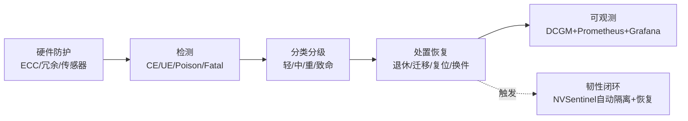

# GPU RAS 与故障管理

> 知乎专栏第108–116、127–130篇重写。千卡集群"必然出故障"的应对之道——RAS（可靠性/可用性/可服务性）让集群在故障下不停机。

## 推荐阅读顺序

1. [[GPU-RAS体系]] — 全栈方案四层设计 + NVIDIA/AMD 实现 + 故障分类处置
2. [[AMD-GPU-RAS]] — AMD RAS 代码架构：Legacy/UniRAS 双路径、Poison、坏页退休
3. [[Fabric-Manager与NVLink]] — NVLink/NVSwitch 互联的 RAS
4. [[DCGM与监控]] — DCGM 4+1 + XID 错误码 + dcgm-exporter 指标
5. [[NVSentinel韧性系统]] — K8s GPU 节点韧性闭环（检测→隔离→排空→修复）

## RAS 主线

**给应届生**：RAS 五步——防护→检测→分类→恢复→可观测。核心是"故障不可避免，但要可控"：坏页能退休就退休（不影响业务），实在不行就隔离换件，全程有监控告警。这是大集群能稳定运行的底层。

## 延伸

- [[wiki/ai-infra/index|ai-infra 专区首页]]
- [[分布式训练评价指标]] — 可用性/可靠性/韧性定义
- [[千卡训练性能优化]] — RAS 是千卡稳定的前提
- [[wiki/ai-infra/ai-cloud/GPU监控与运维|GPU 监控与运维]] — 云原生运维侧
