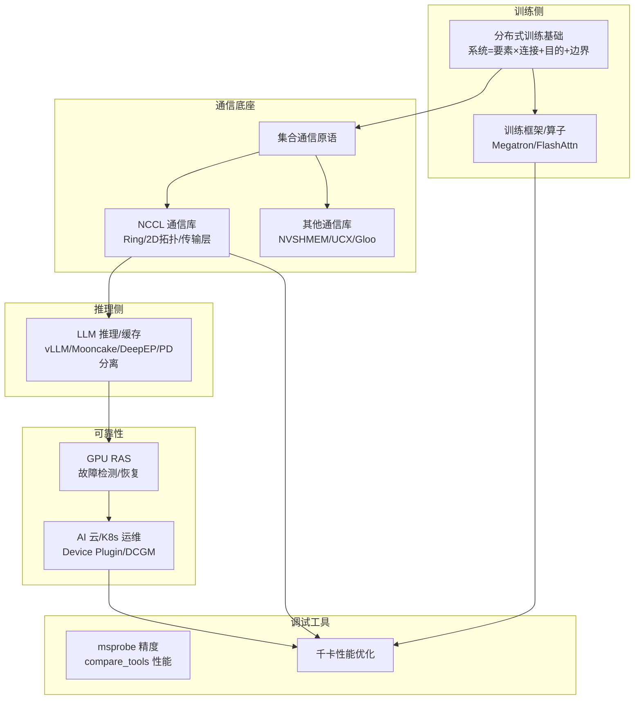

# ai-infra · AI 基础设施专区

> 知乎专栏「**大模型训练、推理与AI云平台**」（作者常平，134 篇）重写整合的应届生知识库。覆盖分布式训练、集合通信、LLM 推理、GPU 驱动与 RAS、云原生运维、调试工具全栈。原始材料见 `.raw/zhihu/`，施工蓝图见 [[wiki/ai-infra/_topic-map|主题图]]。

## 全景：训练 ↔ 推理 ↔ 通信 ↔ 可靠性

**给应届生**：这张图是整个专区的导航。记住一根主线——**训练靠通信（集合通信库）聚合梯度，推理靠通信（PD分离/KV传输）调度，两者都要 RAS 保稳定、要工具查问题、要性能优化调到快**。从任一节点进入都能顺着链路理解全貌。

## 九大集群导航

### 1. 分布式训练基础（入门地基）
[[wiki/ai-infra/distributed-training/index|→ 进入]] · 系统=要素×连接+目的+边界、6步迭代、评价指标、集合通信原语、拓扑与Horovod、NVLink与统一内存

### 2. NCCL 集合通信库（核心主体，~56篇）
[[wiki/ai-infra/nccl/index|→ 进入]] · 架构总览、性能优化、国产化、拓扑算法、传输层、核心模块、协议机制、未来演进

### 3. 其他通信库
[[wiki/ai-infra/comm-libs/index|→ 进入]] · NVSHMEM、UCX、FlagCX/FlagScale、TorchComms、Gloo

### 4. LLM 推理与缓存（当前热点）
[[wiki/ai-infra/llm-inference/index|→ 进入]] · PD分离、LMCache、Mooncake与NIXL、DeepEP、vLLM、UCM

### 5. 训练框架与算子
[[wiki/ai-infra/training-framework/index|→ 进入]] · Megatron张量并行、FlashAttention、TransformerEngine/TorchTitan、Google Highway向量化

### 6. AI 云 / K8s 运维
[[wiki/ai-infra/ai-cloud/index|→ 进入]] · NVIDIA AI Cloud栈、K8s GPU调度与运行时、GPU监控与运维

### 7. GPU RAS 与故障管理
[[wiki/ai-infra/gpu-ras/index|→ 进入]] · RAS体系、AMD代码架构、Fabric Manager、DCGM监控、NVSentinel韧性

### 8. 调试与性能工具
[[wiki/ai-infra/debug-tools/index|→ 进入]] · msprobe精度调试、compare_tools性能比对、千卡训练性能优化

## 概念锚点（跨集群共享）
[[AllReduce]] · [[Ring-AllReduce]] · [[通信隐藏]] · [[集合通信原语]] · [[NVLink]] · [[GPUDirect-RDMA]] · [[PD-分离]] · [[Prefill-Decode]]

## 道法术器

| 层级 | 含义 | 本专区入口 |
|---|---|---|
| 道 | 本质理论 | [[什么是分布式训练]] |
| 法 | 方法论 | [[训练拓扑与服务框架]] / [[千卡训练性能优化]] |
| 术 | 套路技巧 | [[wiki/ai-infra/nccl/NCCL拓扑算法|NCCL拓扑算法]] |
| 器 | 工具 | [[msprobe精度调试]] / [[compare_tools性能比对]] |

## 延伸
- 专栏地址：https://www.zhihu.com/column/c_1491039346714746880
- 原始材料索引：`.raw/zhihu/_index.md`
- 返回 [[wiki/index|wiki 总索引]]
