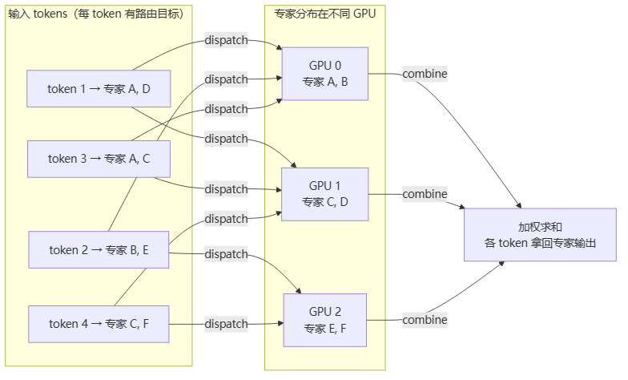
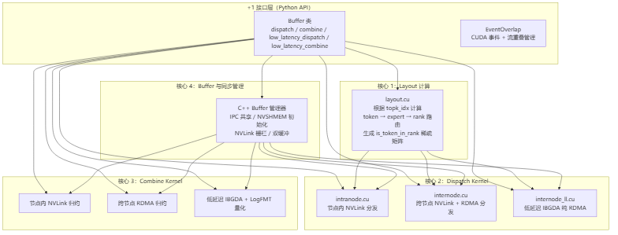
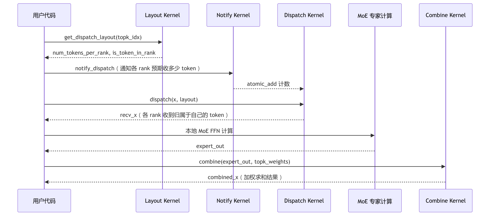

# DeepEP

> **一句话**：DeepEP 是 DeepSeek 开源的 MoE（Mixture of Experts）专家并行通信库，专门解决"专家分散在多卡，每个 token 要按路由跨卡找专家"带来的**动态稀疏 all-to-all 通信**——比传统 [[集合通信原语]] 的 all-to-all 复杂得多。它提供两套 kernel（高吞吐训练 + 低延迟推理），采用 4+1 架构，支撑了 DeepSeek-V3/R1 等超大 MoE 模型的训练和推理。

## 为什么 MoE 需要专门的通信库

MoE 模型的核心机制是**每个 token 只激活少数专家**（如 256 个专家里挑 8 个），但专家分布在多张 GPU 上。这带来一个传统集合通信库（如 [[wiki/ai-infra/nccl/index|NCCL]]）没有充分优化的场景：

> 图解源文件：[`01-为什么-MoE-需要专门的通信库-flowchart.mmd`](../../../_attachments/ai-infra/llm-inference/DeepEP/whiteboard-mermaid/01-为什么-MoE-需要专门的通信库-flowchart.mmd)。

**给应届生**：传统 [[AllReduce]] 或 [[Ring-AllReduce]] 是"全员同步"，所有 GPU 做同样的操作。而 MoE 的 all-to-all 像"每个 token 按需挂号找对应科室医生"——每个 token 只去它被路由的那几个专家所在的 GPU，通信模式**不规则、稀疏、动态变化**。用通用通信库（NCCL 的 `all_to_all`）也能跑，但 DeepEP 专门为这种"不规整 all-to-all"做了极致优化，延迟和带宽都好得多。

## 两套 Kernel：高吞吐 vs 低延迟

DeepEP 针对训练和推理的不同需求，提供了两套通信 kernel：

| 模式 | 适用场景 | 通信路径 | 延迟 | 带宽 | SM 占用 |
|------|----------|----------|------|------|---------|
| **高吞吐（Normal）** | 训练 / Prefill 大 batch | NVLink + RDMA 混合 | ~ms 级 | 51 GB/s (dispatch) / 50 GB/s (combine) | 20-24 SM |
| **低延迟（Low-Latency）** | 推理 Decode / 小 batch | 纯 RDMA (IBGDA) | 173 us (dispatch) / 314 us (combine) | 43 GB/s | **0 SM**（Hook 机制） |

**给应届生**：两套 kernel 的核心差异在于"用空间换时间还是用时间换空间"。高吞吐模式像货运卡车——装满一车再发，吞吐量大但发车间隔长。低延迟模式像快递小哥——每件随到随发，关键是用 **Hook 机制**让 RDMA 网卡在后台自己搬数据，GPU 的 SM（计算单元）完全不用管通信的事，可以专心做计算。这个"通信和计算彻底解耦"的设计是 DeepEP 推理性能的关键。

### 低延迟 Hook 机制

低延迟模式的核心是 **Hook-based receive**：`low_latency_dispatch()` 发出 RDMA 请求后立刻返回一个 `hook` 函数，GPU 在此期间可以执行其他计算，真正需要数据时才调用 `hook()` 等待 RDMA 完成。这实现了通信与计算的重叠，且不占用任何 SM。

## 4+1 架构

DeepEP 代码库采用"4 核心模块 + 1 接口层"的架构：

> 图解源文件：[`02-4+1-架构-flowchart.mmd`](../../../_attachments/ai-infra/llm-inference/DeepEP/whiteboard-mermaid/02-4+1-架构-flowchart.mmd)。

四个核心模块职责清晰：
- **Layout 计算**：把路由索引 `topk_idx` 翻译为"哪个 token 去哪个 rank 的哪个 expert"，输出稀疏矩阵，是后续通信的"地图"。
- **Dispatch Kernel**：按 Layout 结果把 token 数据跨卡分发到对应专家所在 GPU。多 SM 并行 + channel 分块传输。
- **Combine Kernel**：从各 rank 收集专家输出，按 `topk_weights` 加权求和（可融合 bias），返回给原始 token。
- **Buffer 与同步管理**：分配 NVLink/RDMA 通信缓冲区，管理 IPC 共享、NVSHMEM 对称堆、跨 GPU 栅栏同步。

## Dispatch/Combine 数据流

> 图解源文件：[`03-Dispatch-Combine-数据流-sequencediagram.mmd`](../../../_attachments/ai-infra/llm-inference/DeepEP/whiteboard-mermaid/03-Dispatch-Combine-数据流-sequencediagram.mmd)。

## 性能优化要点

源自第 37 篇的实战经验，按优化层次排列：

| 层次 | 关键手段 | 收益 |
|------|----------|------|
| **配置调优** | 根据 EP 规模选预设 dispatch/combine config，或自动搜索最优分块大小 | 10-30% 吞吐提升 |
| **SM 管理** | 训练用 20-24 SM，推理用 Hook 机制释放全部 SM | 推理 SM 占用降为 0 |
| **FP8 量化** | `use_fp8=True`，配合 `use_ue8m0` 压缩缩放因子 | 通信量减半（BF16 2B/元素 → FP8 1.03B/元素） |
| **流重叠** | `async_finish=True` + `allocate_on_comm_stream`，通信与计算并行 | 隐藏通信延迟 |
| **CUDA 图** | `num_worst_tokens` 参数避免 CPU-GPU 同步，支持 graph capture | CPU 开销接近 0 |
| **网络隔离** | IB 虚拟通道（VL）分离高吞吐和低延迟流量 | 消除互相干扰 |
| **底层 PTX** | `ld.global.nc.L1::no_allocate.L2::256B` 非缓存加载 | 加载带宽 2-3x |

## 与 PD 分离 / MoE 推理的关系

在 [[PD分离推理]] 架构中，Prefill 和 Decode 对通信的需求截然不同：
- **Prefill**（大批量 prompt 处理）：用 DeepEP **高吞吐模式**，NVLink + RDMA 混合，追求带宽。
- **Decode**（逐 token 生成）：用 DeepEP **低延迟模式**，Hook 机制让 SM 完全空闲给 Attention / FFN 计算，通信异步后台完成。

DeepEP 与 [[vLLM]]、[[Mooncake与NIXL]]、[[LMCache]]、[[UCM]] 共同构成 MoE 大模型推理的通信与缓存基础设施。

## 国产芯片启示

源自第 36 篇对 DeepEP 代码库的硬件需求分析，国产 AI 芯片要跑 DeepEP，至少需要在以下方面对标：

1. **System-scope 原子操作与内存一致性**：DeepEP 大量使用 `ld.acquire.sys` / `st.release.sys` / `atom.add.release.sys` 等跨 GPU 内存顺序原语做栅栏同步和 RDMA 信号量。芯片的 L2 缓存必须支持 Directory-based 一致性协议，原子操作需透传到互连总线。这是分布式通信正确性的基石，优先级最高。

2. **IBGDA 等效能力**：低延迟模式依赖 GPU 直接发起 RDMA（不经 CPU）。芯片需要暴露 HBM 物理地址窗口（类似 BAR1 ≥8GB），支持 PCIe P2P 让网卡直接读写 GPU 内存，且提供多 QP 并行（≥24 per rank）。

3. **SM 分组调度与资源隔离**：DeepEP 允许指定 kernel 只用部分 SM（如 20 个），剩余 SM 给计算。芯片调度器需支持"SM 集合划分"——这不是 CUDA 标准能力，而是 DeepEP 利用 SM 数量控制实现的计算-通信资源隔离。

## 延伸

- [[PD分离推理]] — MoE 推理中 Prefill/Decode 分别对应 DeepEP 的高吞吐和低延迟模式
- [[Mooncake与NIXL]] — KV Cache 传输引擎（Mooncake 出自月之暗面 Moonshot AI），与 DeepEP 的 token all-to-all 通信正交互补
- [[集合通信原语]] — all-to-all、AllReduce 等基础概念
- [[wiki/ai-infra/nccl/index|NCCL]] — 通用 GPU 集合通信库，DeepEP 在 MoE all-to-all 场景下对标和超越的对象
- [[wiki/ai-infra/comm-libs/NVSHMEM|NVSHMEM]] — DeepEP 跨节点通信的底层依赖（对称堆 + IBGDA）
- [[wiki/ai-infra/comm-libs/UCX|UCX]] — RDMA 通信框架，NVSHMEM 的传输层之一
- 专栏原文：[第35篇 4+1 架构](https://zhuanlan.zhihu.com/p/1973835289114980493) | [第36篇 国产芯片需求](https://zhuanlan.zhihu.com/p/1973837552881509302) | [第37篇 性能优化](https://zhuanlan.zhihu.com/p/1973842250569111030)
