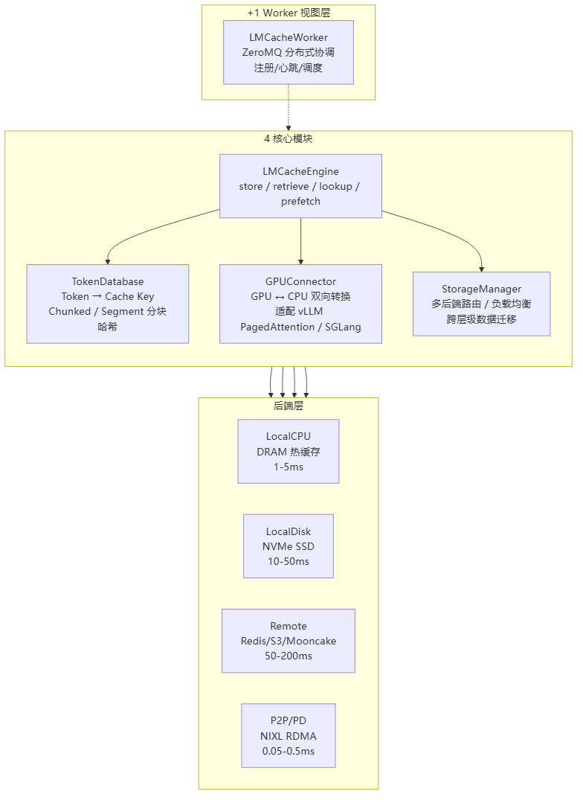
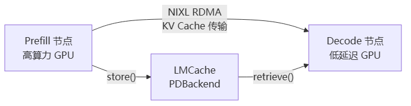

# LMCache

> **一句话**：LMCache 是 vLLM 生态的 KV Cache 复用管理库，把已经算好的 KV Cache 存起来，下次相同前缀（如系统 prompt、few-shot 示例）不用重复 prefill，直接取用——TTFT 降低 50%-90%，吞吐提升 2-10 倍。它支持 GPU/CPU/磁盘/远端四层冷热分级，并通过插件化后端对接 Redis、S3、Mooncake 等，同时已适配昇腾/AMD/Arm 等非 NVIDIA 硬件。

## 解决什么问题

LLM 推理有一个"重复劳动"问题：每次请求的系统 prompt（如"你是一个有用的助手"）、few-shot 示例、多轮对话历史，在 prefill 阶段都要重新算一遍 KV Cache——即使跟上一轮一模一样。

**给应届生**：KV Cache 复用就像"考试时把上次背好的笔记从抽屉里直接拿出来用，不用重新背一遍"。prefill 阶段 = 模型把 prompt 逐字读一遍，每读一个字就更新一次内部状态（Key/Value），读完整个 prompt 才攒出完整的 KV Cache（耗时，算力密集）；decode 阶段 = 直接翻这些"笔记"逐个生成新字（相对快，访存密集）。LMCache 做的事：把 prefill 算好的 KV Cache 存起来，下次相同前缀的请求直接复用，跳过 prefill。

核心收益：
- **TTFT 降低 50%-90%**：相同前缀命中缓存后，跳过 prefill 计算，首 token 延迟大幅下降。
- **吞吐提升 2-10 倍**：GPU 不再浪费算力重复编码相同的 prompt。
- **多模态加速**：相同图片不用重复编码视觉特征，二次请求延迟从 18s 降到 1s（Qwen-VL-2B 实测）。

## 4+1 架构

LMCache v1 的架构可拆为 4 个核心模块 + 1 个对外视图层：

> 图解源文件：[`01-4+1-架构-flowchart.mmd`](../../../_attachments/ai-infra/llm-inference/LMCache/whiteboard-mermaid/01-4+1-架构-flowchart.mmd)。

**给应届生**：4 个核心模块各司其职——TokenDatabase 负责"这段 prompt 之前见过没"（把 token 序列哈希成 cache key）；GPUConnector 负责"把 KV Cache 从 GPU 搬到 CPU 再搬回来"（适配 vLLM 的 PagedAttention 格式）；StorageManager 负责"存哪层"（热数据放 CPU 内存、温数据放 SSD、冷数据放远端 Redis）；Engine 是总调度。Worker 视图层是分布式场景的"管家"，协调多节点间的缓存共享。

## 后端层级：冷热分级

LMCache 的 KV Cache 存储按速度和容量分四层，逐级降级查找：

| 层级 | 存储介质 | 延迟 | 命中率 | 说明 |
|---|---|---|---|---|
| **L0 GPU** | GPU HBM | 最快 | 即时 | PagedAttention 管理的 KV Cache block |
| **L1 CPU** | CPU DRAM（pinned） | 1-5 ms | 70-90% | 热缓存，从 GPU offload 下来 |
| **L2 Disk** | 本地 NVMe SSD | 10-50 ms | 10-20% | 支持 GPUDirect Storage 直通 |
| **L3 Remote** | Redis / S3 / Mooncake | 50-200 ms | 5-10% | 跨节点共享，持久化 |

查找顺序：L1 命中直接返回 → 未命中查 L2 → 查 L3 → 都未命中则重新 prefill。L1 满时驱逐到 L2，L2 满时上传到 L3。

与 [[vLLM]] 的 **PagedAttention** 配合：LMCache 以 PagedAttention 的 **block** 为粒度管理 KV Cache（每个 block 存固定数量 token 的 K/V），通过 `slot_mapping`（Int64 索引数组）定位每个 token 的 KV 在哪个 block 的哪个位置。

### 插件化后端对接

LMCache 的远程后端采用**工厂模式 + 适配器模式**：URL scheme 自动路由到对应连接器。支持的后端包括 Redis（及 Sentinel/Cluster 高可用）、Valkey、S3（含 Express One Zone）、MooncakeStore（GPU Direct RDMA 零拷贝）、InfiniStore（RDMA）、文件系统（异步 I/O + 多路径负载均衡）等。新增后端只需写一个 `*_adapter.py` 文件，`ConnectorManager` 通过 `pkgutil` 自动发现。

## 双维度突破

第 8 篇专栏总结了 LMCache 2025 年中的两个关键突破：

### 跨硬件兼容

LMCache 最初依赖 NVIDIA CUDA 内核，2025 年 6 月重构硬件特定逻辑，打破 CUDA 绑定：
- **昇腾**：内核移植到昇腾自定义指令集。
- **AMD**：基于 HIP 兼容层整合 ROCm 工具链。
- **Arm**：针对 Arm CPU 优化缓存迁移路径，适配边缘设备。

这使得 LLM 推理堆栈做到硬件透明——同一套 LMCache 配置可在 NVIDIA/昇腾/AMD/Arm 上无缝部署。

### 多模态加速

v0.3.1 版本通过**图像哈希 + KV 缓存复用**解决多模态模型的重复编码问题：
- 将视觉占位符替换为 16 位哈希值（`apply_mm_hashes_to_token_ids()`），相同图像映射到唯一 token 序列。
- `RequestTracker` 存储哈希值与位置信息，精确匹配图像-提示词对。
- Qwen-VL-2B 实测：重复图像查询 KV 命中率接近 100%，二次请求延迟从 18 秒降到 1 秒。

## 与 PD 分离的关系

[[PD分离推理]]（Prefill-Decode Disaggregation）将 prefill 和 decode 拆分到不同 GPU 节点：prefill 节点算力强、算 KV Cache；decode 节点延迟低、只做逐 token 生成。

LMCache 是 PD 分离中 **KV Cache 传输层**的核心方案（[[PD分离推理]] 方案 1）：
- Prefill 节点通过 LMCache 的 `PDBackend` + NIXL P2P（RDMA）将 KV Cache 直接传到 decode 节点。
- Decode 节点从 `LocalCPU` 后端取 KV Cache 加载到 GPU，无需重复 prefill。

> 图解源文件：[`02-与-PD-分离的关系-flowchart.mmd`](../../../_attachments/ai-infra/llm-inference/LMCache/whiteboard-mermaid/02-与-PD-分离的关系-flowchart.mmd)。

## 应用示例

以下场景展示了 LMCache 在不同配置下的用法：

| 场景 | 推荐配置 | 效果 |
|---|---|---|
| **RAG 检索增强** | LocalCPU + Remote（Redis） | 复用检索片段，TTFT 降低 80% |
| **多轮对话** | LocalCPU + Blending | 复用对话历史，非连续缓存片段自动融合 |
| **长文本生成** | LocalCPU + LocalDisk | 大容量缓存，支持 128K+ 上下文 |
| **分布式推理** | P2P + Remote | 跨节点共享 KV Cache |
| **PD 分离** | PDBackend + NIXL | Prefill/Decode 独立扩展 |

**Blending（缓存融合）**：当缓存命中是非连续的（如 `[A] [C]` 有缓存但 `[B]` 缺失），LMCache 只重算缺失段的 token，将 `[A] + [B_partial] + [C]` 融合为完整 KV Cache。配合 CacheGen 压缩（算术编码，约 4x 压缩比），远端传输开销大幅降低。

## 国产芯片启示

源自第 28 篇对 LMCache 源码的硬件需求分析，面向国产 AI 芯片设计的要点：

1. **Int64 是硬门槛，无法妥协**。LMCache 所有 CUDA kernel 的索引、指针运算都依赖 Int64。以 DeepSeek-V3（80 层 x 128K 上下文）为例，KV Cache 偏移量可达 1678 亿——远超 Int32 上限（21 亿）。不支持 Int64 的芯片最多支持约 1638 tokens 上下文，基本无法运行任何现代 LLM 生产场景。用两个 Int32 模拟 Int64 会导致索引计算慢 5-10 倍，不可接受。

2. **UVA（统一虚拟寻址）和 Pinned Memory 是零拷贝的基础**。LMCache 通过 `cudaHostGetDevicePointer` 让 GPU kernel 直接访问 CPU pinned memory，避免 CPU-GPU 间的显式拷贝。无 UVA 时，每次 KV Cache 传输需 CPU-GPU-CPU 双向拷贝，延迟增加 20-100 倍，且 GPU 显存占用翻倍（需同时保留 CPU 和 GPU 各一份副本）。

3. **KV Cache block 的零拷贝与跨设备传输**。国产芯片需支持：Pinned Memory 注册（供 RDMA / UDMA 直接访问）、GPU Direct RDMA（GPU 显存不经 CPU 直接网卡传输）、与 vLLM attention backend 解耦的 GPUConnector 接口（适配 PagedAttention 的 block 粒度格式 `[2, num_layers, num_tokens, hidden_dim]` 等）。

## 延伸

- [[PD分离推理]] — LMCache 是 PD 分离中 KV Cache 传输的核心方案
- [[vLLM]] — LMCache 深度集成的推理引擎，PagedAttention 的 block 粒度是其缓存管理基础
- [[Mooncake与NIXL]] — 高性能后端：MooncakeStore（GPU Direct RDMA）和 NIXL（P2P 传输）
- [[DeepEP]] — 分布式推理中 MoE 专家并行的通信优化
- [[UCM]] — 统一缓存管理，与 LMCache 互补的缓存视角
- [[wiki/ai-infra/llm-inference/index|LLM 推理与缓存]] — 同集群索引页
- 专栏原文：[第8篇 · 双维度突破](https://zhuanlan.zhihu.com/p/1924834623222944541) | [第26篇 · 4+1 架构](https://zhuanlan.zhihu.com/p/1973113198912746479) | [第27篇 · 后端对接](https://zhuanlan.zhihu.com/p/1973119434026686451) | [第28篇 · 国产芯片需求](https://zhuanlan.zhihu.com/p/1973128132337897921)
