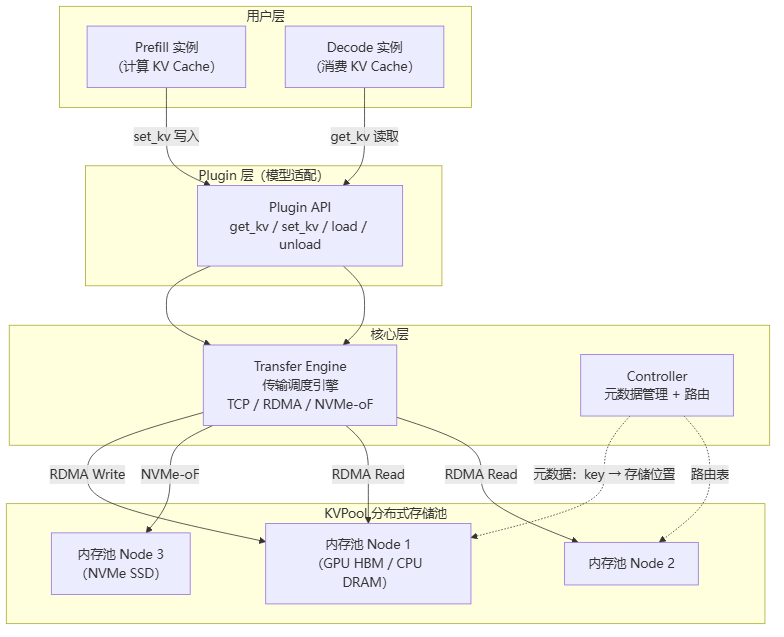
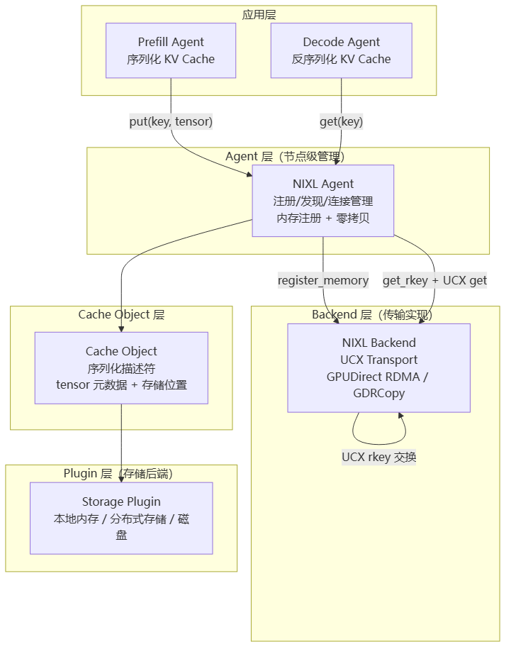

# Mooncake与NIXL

> **一句话**：Mooncake 和 NIXL 都是 [[PD分离推理]] 场景下 **KV Cache 跨实例传输引擎**——负责把 Prefill 实例算好的 KV Cache 搬到 Decode 实例。Mooncake（月之暗面 Moonshot AI 出品，Kimi 的服务底座）走"中央池化 + 大规模分布式"路线，NIXL（NVIDIA/NeMo 出品）走"点对点零拷贝 + UCX 加速"路线。两者都配合 [[LMCache]] 使用，共同解决 PD 分离中"KV Cache 怎么传得快传得稳"的核心问题。

## 为什么需要 KV Cache 传输引擎

[[PD分离推理]] 把 Prefill（预填充）和 Decode（逐 token 生成）分到不同 GPU 实例上，Prefill 算完后需要把 **KV Cache** 搬到 Decode 实例。这个搬运环节直接决定 PD 分离方案能否落地：

- Prefill 产出的 KV Cache 可能几百 MB 到几十 GB
- Decode 实例必须尽快收到才能开始生成
- 跨节点传输延迟 = 用户感知的 TTFT（Time To First Token）

**给应届生**：可以把 KV Cache 传输引擎想象成"快递公司"——Mooncake 就像建了一个中央仓库（KVPool），所有包裹先入库再统一派发，适合大规模集群调度；NIXL 则像点对点闪送（UCX + GPUDirect），包裹直接从发货方 GPU 内存飞到收货方 GPU 内存，中间不落地。两种模式各有适用场景。

## Mooncake：中央池化 KV Cache 传输

Mooncake 由月之暗面（Moonshot AI）开源，是 Kimi 的推理服务底座（论文《Mooncake: A KVCache-centric Disaggregated Architecture》），核心思想是 **算存分离**——把 KV Cache 从计算实例中剥离，放进一个独立的分布式存储池。

### 4+1 架构

> 图解源文件：[`01-4+1-架构-flowchart.mmd`](../../../_attachments/ai-infra/llm-inference/Mooncake与NIXL/whiteboard-mermaid/01-4+1-架构-flowchart.mmd)。

**给应届生**：KVPool 本质上是一个 **全局哈希表**，key = `(request_id, layer_id)`，value = 该层该请求的 KV Cache tensor。Prefill 往里面写，Decode 从里面读。Controller 负责记住"哪个 key 存在哪个节点的哪个存储介质里"——类似分布式文件系统的 namenode。

### Transfer Engine 的传输策略

Transfer Engine 是 Mooncake 的传输调度核心，支持三种传输方式：

| 传输方式 | 适用场景 | 延迟 | 吞吐 | 特点 |
|---|---|---|---|---|
| **TCP** | 小规模 / 无 RDMA 环境 | 高（ms 级） | 低 | 兼容性最好，无需特殊硬件 |
| **RDMA** | 节点间大块 KV Cache | 低（us 级） | 高 | 绕过 CPU，GPU 直接读写远端内存 |
| **NVMe-oF** | 超大 KV Cache 落盘 | 中 | 中 | 用 NVMe SSD 扩展容量，冷数据下沉 |

选择策略：小块用 TCP（省去 RDMA 建连开销），大块用 RDMA（零拷贝直传），超过 GPU 内存的用 NVMe-oF 溢出到 SSD。Transfer Engine 根据 tensor 大小和网络拓扑动态选路。

### 性能优化要点

1. **RDMA 零拷贝**：通过 GPUDirect RDMA，数据从 GPU HBM → 网卡 → 远端 GPU HBM，全程不经过 CPU 内存。这要求在 PCIe 拓扑上 GPU 和网卡挂在同一个 PCIe switch 下。
2. **流水线预取**：Decode 实例在当前 layer 计算时，Transfer Engine 已经在后台预取下一层的 KV Cache，掩盖传输延迟。
3. **NUMA 感知内存分配**：KVPool 的 CPU DRAM 缓冲区绑定到网卡所在 NUMA node，避免跨 NUMA 访问的延迟惩罚。
4. **分层存储**：热数据放 GPU HBM（最快但最小），温数据放 CPU DRAM，冷数据放 NVMe SSD（最慢但最大），Controller 按 LRU 自动迁移。

## NIXL：点对点零拷贝传输

NIXL（NVIDIA Inference Transfer Library）是 NVIDIA 为 NeMo 推理框架开发的 KV Cache 传输库，基于 [[wiki/ai-infra/comm-libs/UCX|UCX]] 实现点对点零拷贝传输。

### 4+1 架构

> 图解源文件：[`02-4+1-架构-flowchart.mmd`](../../../_attachments/ai-infra/llm-inference/Mooncake与NIXL/whiteboard-mermaid/02-4+1-架构-flowchart.mmd)。

**给应届生**：NIXL 三层抽象可以类比为"国际快递"——Agent 是快递站点（负责包裹的打包、贴单、追踪），Backend 是运输车队（UCX = 专线卡车，RDMA = 高速公路），Cache Object 是包裹标签（记录里面装了什么、存在哪个仓库的哪个货架）。

### 三层抽象详解

| 层 | 作用 | 关键机制 |
|---|---|---|
| **Agent** | 节点级管理器，每节点一个实例 | 进程间连接管理、内存注册、rkey 交换、故障检测 |
| **Backend** | 底层传输实现，封装 UCX | `ucp_tag_send/recv`、GPUDirect RDMA、GDRCopy（GPU 内存到 CPU 的快速拷贝） |
| **Cache Object** | 可序列化的 KV Cache 描述符 | 记录 tensor 形状/dtype/存储位置，支持跨进程传递引用而非拷贝数据 |

### 零拷贝数据路径

NIXL 的核心卖点是"零拷贝"——数据从 Prefill GPU 到 Decode GPU 只经过网卡，不经过 CPU：

1. Prefill Agent 调用 `agent->register_memory(tensor)` 将 GPU 内存注册到 UCX，获得 `rkey`（远程访问密钥）。
2. Agent 将 Cache Object（含 rkey + tensor 元数据）发给 Decode Agent。
3. Decode Agent 拿到 rkey 后，直接通过 UCX `get` 操作从远端 GPU 内存拉取数据——这个 `get` 走的是 GPUDirect RDMA，网卡 DMA 直读远端 GPU HBM 写入本地 GPU HBM。

整个过程 CPU 只参与控制面（交换元数据和 rkey），数据面完全由网卡 DMA 完成。

## Mooncake vs NIXL 对比

| 维度 | Mooncake | NIXL |
|---|---|---|
| **出品方** | 月之暗面（Moonshot AI）/ Kimi | NVIDIA / NeMo |
| **设计哲学** | 中央池化（KVPool），算存分离 | 点对点直传，零拷贝优先 |
| **存储模型** | 分布式全局 KV Cache 池，支持分层存储（HBM/DRAM/NVMe） | 去中心化，Cache Object 描述符 + 本地/远端存储 |
| **传输协议** | TCP / RDMA / NVMe-oF 三模 | UCX（RDMA 为主，含 GDRCopy fallback） |
| **零拷贝** | 支持 GPUDirect RDMA | 原生零拷贝（注册内存 + rkey 交换） |
| **适用规模** | 大规模集群（数百节点），面向高并发 Decode | 中小规模高性能场景，面向低延迟 |
| **元数据管理** | 中心化 Controller（类似 namenode） | 去中心化 Agent 间直接协商 |
| **与 LMCache 关系** | LMCache 作为缓存管理层调用 Mooncake 的 put/get | LMCache 通过 NIXL Backend 实现跨节点传输 |
| **硬件依赖** | RDMA 网卡（推荐）、NVMe SSD（可选） | RDMA 网卡（必需）、GPU 与网卡 PCIe 拓扑需优化 |

**给应届生**：选型口诀——"集群大用 Mooncake，延迟低用 NIXL"。Mooncake 的优势在于池化后可以做全局调度（负载均衡、冷热分层），适合服务数百用户的推理集群；NIXL 的优势在于零拷贝路径极短（us 级），适合对延迟敏感的实时场景。

## 与 LMCache 的配合

两者都不是独立使用的，通常与 [[LMCache]] 配合：LMCache 负责"缓存什么、缓存多久、何时淘汰"（缓存策略 + 生命周期），Mooncake / NIXL 负责"缓存怎么搬"（传输）。LMCache 提供统一接口，底层 `backend = mooncake` 或 `backend = nixl` 可切换传输后端——上层缓存逻辑不变，传输引擎可替换。

## 国产芯片启示

基于 Mooncake 和 NIXL 的设计，国产 AI 芯片要支持 PD 分离推理的 KV Cache 传输，需要满足以下硬件/接口要求：

### 1. RDMA 或等效的远端直接内存访问

两个传输引擎都依赖 RDMA 实现高性能。国产芯片需要：
- 网卡支持 RDMA（RoCE v2 或自研协议），并能通过 PCIe 直接访问 NPU/GPU 的 HBM（等效于 GPUDirect RDMA）。
- 如果自研芯片有独立的 device memory（如昇腾的 HBM），需要提供 **NPU-Direct** 能力：网卡 DMA 引擎能直接读写 NPU 设备内存，不需要 CPU 中转。

**给应届生**：可以理解为"网卡和 NPU 之间要有一条直通车道"，数据从 NPU 显存直接上高速（网卡），不需要先开到 CPU 内存这个"收费站"再上高速。没有这条直通道，延迟会增加 2-5 倍。

### 2. 内存注册与零拷贝支持

NIXL 的零拷贝依赖 UCX 的内存注册机制（`register_memory` → `rkey` 交换）。国产芯片需要：
- 提供类似 CUDA `cuMemGetAddressRange` 的 API，让传输库能获取设备内存的物理地址范围。
- 支持 **pinned memory**（页锁定内存），确保 GPU/NPU 内存在传输期间不会被换出。
- 如果有自研互联（如 HCCS），需要暴露给 UCX 做插件适配，让 UCX 能识别并利用自研链路。

### 3. 跨节点互连与 NUMA 拓扑

Mooncake 的 KVPool 和 NIXL 的 Agent 都需要感知硬件拓扑：
- 网卡和 NPU 应在同一 PCIe domain / NUMA node 上，避免跨 NUMA 的内存访问。
- 自研芯片如果有类似 NVLink 的跨节点直连（如昇腾的 HCCS），传输库应优先走这条通道（带宽远高于 RDMA）。
- KVPool 的全局内存池需要能够从不同节点分配并注册，要求各节点的 NPU 内存地址空间可被远端发现。

## 延伸

- [[PD分离推理]] — PD 分离的整体方案，KV Cache 传输是其中的关键子问题
- [[LMCache]] — 缓存管理层，Mooncake 和 NIXL 的上层接口
- [[DeepEP]] — DeepSeek 的 Expert Parallelism 通信库，与 Mooncake 同属大模型推理基础设施（注：DeepEP 出自 DeepSeek，Mooncake 出自月之暗面，两者出品方不同但常被放在一起讨论）
- [[vLLM]] — 主流推理框架，PagedAttention 的 KV Cache 管理与传输引擎对接
- [[UCM]] — 统一缓存管理，跨引擎 KV Cache 池化
- [[wiki/ai-infra/comm-libs/UCX|UCX]] — NIXL 的底层传输框架，国产芯片适配的关键切入点
- [[wiki/ai-infra/distributed-training/index|分布式训练基础]] — RDMA、集合通信等基础设施概念
- [[wiki/ai-infra/comm-libs/NVSHMEM|NVSHMEM]] — GPU 间单边通信，与 RDMA 同属高性能通信体系
- 专栏原文：第31篇 [Mooncake 4+1 架构](https://zhuanlan.zhihu.com/p/1973510900347593008) | 第32篇 [Mooncake 国产芯片](https://zhuanlan.zhihu.com/p/1973517891262488951) | 第33篇 [NIXL 4+1 架构](https://zhuanlan.zhihu.com/p/1973824105930306935) | 第34篇 [NIXL 国产芯片](https://zhuanlan.zhihu.com/p/1973825845337559269)
