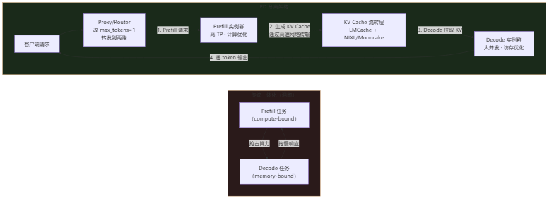
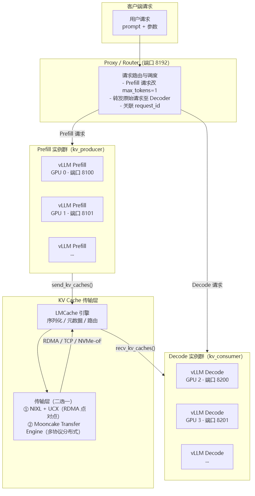
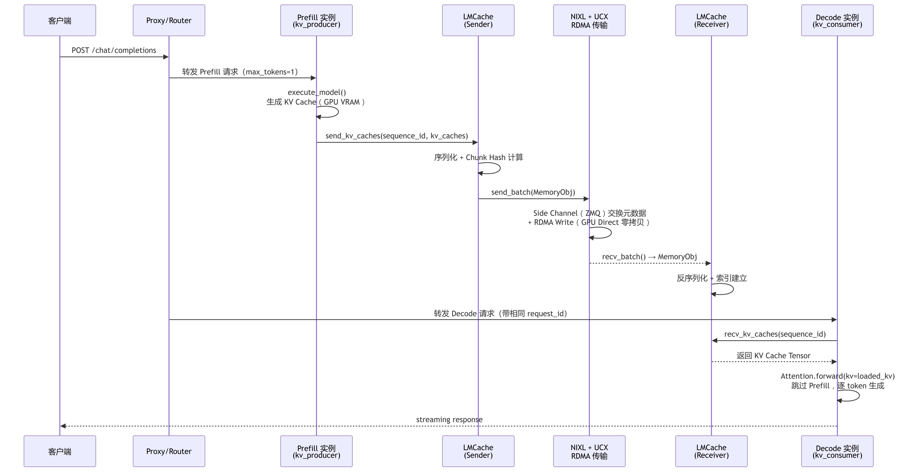

# PD分离推理

> **一句话**：PD 分离（Prefill-Decode Disaggregation）把 LLM 推理的两个阶段拆到不同 GPU 实例上运行 —— Prefill 专做"一口气读完 prompt 并生成 KV Cache"，Decode 专做"拿着 KV Cache 逐 token 往外蹦字"。两者计算特征截然不同，分开后才能各自配最合适的硬件、并行策略和通信方案，从而把首 token 延迟（TTFT）和 token 间延迟（ITL）同时压到最优。

## LLM 推理为什么有两个阶段

LLM 生成一个回答，内部走了两条完全不同的计算路径：

| 阶段 | 干什么 | 计算特征 | 瓶颈 |
|---|---|---|---|
| **Prefill（预填充）** | 一次性处理整个 prompt（比如用户输入的 2000 字），并行计算所有 token 的注意力，生成一份 KV Cache | **计算密集（compute-bound）**，矩阵乘法量大，GPU 算力拉满 | 算力（FLOPS） |
| **Decode（解码）** | 逐 token 生成输出，每步只看 KV Cache + 当前 token，产生下一个 token | **访存密集（memory-bound）**，每次只算 1 个 token，大部分时间在读写 KV Cache | 显存带宽（HBM bandwidth） |

**给应届生**：Prefill 就像考试前先把整本教材通读一遍、画出所有重点、做好笔记（生成 KV Cache）—— 一次性的重体力活。Decode 就像考试时看着笔记逐题作答 —— 每道题只需要翻笔记的某几页，轻量但重复很多次。把"通读做笔记"和"翻笔记答题"混在同一台机器上，就会互相干扰。

## 为什么必须分离

传统一体化架构（一个 vLLM 实例同时做 Prefill 和 Decode）有三个硬伤：

1. **TTFT 与 ITL 耦合**：Prefill 的长 prompt 处理（可能几十 ms）会把 Decode 的逐 token 生成（期望几 ms）卡住，首 token 延迟和后续 token 延迟互相拖累。
2. **尾延迟不可控**：正在做 Decode 的请求被突然插入的 Prefill 任务打断 —— 用户感觉"怎么突然卡了一下"。
3. **资源配置两难**：Prefill 要大量算力、Decode 要大量显存带宽，同一张 GPU 很难两边都做到最优。

分离后，Prefill 实例群用高算力 GPU + 大 TP（张量并行），Decode 实例群用适中 TP + 大并发 batch，各配各的，互不干扰。

> 图解源文件：[`01-为什么必须分离-flowchart.mmd`](../../../_attachments/ai-infra/llm-inference/PD分离推理/whiteboard-mermaid/01-为什么必须分离-flowchart.mmd)。

## PD 分离架构总览

核心思路：把推理拆成三个角色 —— Prefill 实例、Decode 实例、中间的 KV Cache 传输层。

> 图解源文件：[`02-PD-分离架构总览-flowchart.mmd`](../../../_attachments/ai-infra/llm-inference/PD分离推理/whiteboard-mermaid/02-PD-分离架构总览-flowchart.mmd)。

**给应届生**：可以把 PD 分离想象成餐厅后厨的分工 —— Prefill = 切菜备料（一次性备好所有食材），Decode = 掌勺出菜（一道一道炒）。中间那个 KV Cache 传输层就是"传菜口"—— 备好的料通过传菜口快速递给炒菜师傅，不能卡、不能丢。Proxy 就是前厅服务员，把客人点的菜分发给备料区和炒菜区。

## 方案1：vLLM + LMCache + NIXL + UCX

这是 vLLM 社区主推的 PD 分离方案，适合**点对点高性能场景**（同机多卡或小规模集群）。

### 组件栈

| 层级 | 组件 | 职责 |
|---|---|---|
| 推理引擎 | [[vLLM]] | PagedAttention 内存管理、Continuous Batching、Chunked Prefill、TP/PP 并行 |
| KV 缓存层 | [[LMCache]] | KV Cache 的存储、检索、序列化、Chunk 管理（默认 256 tokens/chunk） |
| 传输抽象 | NIXL | 点对点高性能通信抽象、GPU Direct RDMA、拓扑感知路径选择 |
| 底层通信 | [[wiki/ai-infra/comm-libs/UCX|UCX]] | RDMA（IB/RoCE）、GPU Direct（cuda_copy/cuda_ipc）、TCP fallback |

### 数据路径

> 图解源文件：[`03-数据路径-sequencediagram.mmd`](../../../_attachments/ai-infra/llm-inference/PD分离推理/whiteboard-mermaid/03-数据路径-sequencediagram.mmd)。

**关键性能**：Prefill 生成 KV Cache 约 50ms + RDMA 传输 32MB KV Cache 约 1ms（70GB/s）+ Decode 首 token 约 10ms，总 TTFT 约 62ms。同节点 GPU Direct RDMA 延迟 < 1us。

## 方案2：DeepSeek-V3 + Mooncake Transfer Engine

以 DeepSeek-V3（671B）为服务模型、借用 Mooncake Transfer Engine（LMCache 可通过 MooncakeStore Connector 对接）的方案，适合**多节点分布式集群**。

> [!warning] Mooncake ≠ DeepSeek 出品
> Mooncake Transfer Engine 出自**月之暗面 Moonshot AI**（Kimi 服务底座），不是 DeepSeek 出品。本方案是把开源的 Mooncake 作为 KVCache 传输组件，复用到 DeepSeek-V3 推理服务里——两者是"模型"与"传输引擎"的搭配关系，非同一出品方。详见 [[Mooncake与NIXL]]。

### 为什么 DeepSeek 需要单独一套方案

DeepSeek-V3（671B 参数）有三重特殊挑战：

| 挑战 | 具体问题 | 对应方案 |
|---|---|---|
| **海量 Expert 通信** | 256 experts / Top-8，EP=32 时 All-to-All 粒度 32 节点 | [[DeepEP]] 高吞吐 + 低延迟双模式 |
| **MLA KV Cache 压缩** | KV latent rank=512，比传统 7168 压缩 14 倍，但需传输后本地解压 | LMCache + Mooncake 传输 FP8 latent KV |
| **FP8 混合精度** | 权重和激活都用 FP8 E4M3，需同步传输 scaling factor | [[DeepEP]] + DeepGEMM 原生 FP8 支持 |

### 组件栈

| 层级 | 组件 | 职责 |
|---|---|---|
| 推理引擎 | [[vLLM]] | 同上，额外集成 DeepEP / DeepGEMM 后端 |
| KV 缓存层 | [[LMCache]] | MooncakeStore Connector 替代 NIXL Channel |
| 传输引擎 | [[Mooncake与NIXL\|Mooncake Transfer Engine]] | 多协议（TCP/RDMA/NVMe-oF）、多 NIC 聚合（4x200Gbps → 87GB/s，8x400Gbps → 190GB/s） |
| 分布式存储 | MooncakeStore | Master 服务（gRPC，端口 50051）+ HTTP 元数据服务器（端口 8080）+ Raft HA |
| Expert 通信 | [[DeepEP]] | 高吞吐模式（Prefill，20-24 SMs，43-58 GB/s）和低延迟模式（Decode，0 SMs，77-194us） |
| GEMM 加速 | DeepGEMM | FP8 Grouped GEMM（MoE 专用），JIT 编译，TMA 加速，比 cuBLAS 提升 9-36% |

数据路径与方案1同构（Prefill 经 LMCache/MooncakeStore 写入分布式 KVPool → Decode 拉取），区别在于多了一个中心化 Master 角色。完整时序见 [[Mooncake与NIXL]] 的 Mooncake 数据路径图。

**关键差异**：Mooncake 方案比 NIXL 方案多了一个中心化 Master 角色（负责全局段分配、元数据管理、副本策略、故障切换），KV Cache 先存到分布式存储再被 Decode 拉取，而不是点对点直传。

## 两条技术栈对比

| 维度 | 方案1：NIXL + UCX | 方案2：Mooncake Transfer Engine |
|---|---|---|
| 传输模式 | 点对点直传（Prefill → Decode） | 分布式存储中转（Prefill → Store → Decode） |
| 协议 | UCX（RDMA/IB/RoCE）+ TCP fallback | TCP / RDMA / NVMe-oF 多协议 |
| 网卡聚合 | 单 NIC 180-200 GB/s | 多 NIC 聚合 87-190 GB/s |
| 元数据管理 | 无中心节点（Side Channel 协商） | Master 服务（gRPC + Raft HA） |
| 扩展性 | < 50 节点 | 大规模集群（动态扩缩） |
| 故障切换 | 连接断开即失败 | 自动副本切换、Master HA |
| 部署复杂度 | 需编译 UCX + 配置 RDMA 环境 | pip install + 启动 Master 服务 |
| 适用场景 | 小规模、高性能、低延迟 | 大规模、高可用、易运维 |

## Proxy/Router 的角色

Proxy 是整个 PD 分离架构的"交通指挥"：

1. **接收客户端请求**（OpenAI 兼容 API，端口 8192）
2. **修改 Prefill 请求**：将 `max_tokens=1`（Prefill 只需生成 KV Cache，不需要真正输出 token）
3. **转发到 Prefill 实例**：带 `request_id` 标识
4. **关联 Decode 请求**：同一个 `request_id` 转发到 Decode 实例，Decode 端根据 `sequence_id` 等待 KV Cache 到达

**给应届生**：Proxy 的 `max_tokens=1` 是个巧妙的 trick —— Prefill 实例只负责跑完 prompt 生成 KV Cache、输出一个 token 就停，真正的逐 token 生成交给 Decode 实例。这样 Prefill 实例做完就释放，不用占着资源干 Decode 的活。

## 国产芯片启示

从 PD 分离架构反推，自研 AI 芯片需要关注以下几点：

1. **KV Cache 跨节点高带宽传输是刚需**：PD 分离的核心数据路径就是 Prefill 把 KV Cache 发给 Decode。对于大模型（如 DeepSeek-V3 的 32K 序列），单请求 KV Cache 就有 32MB（MLA 压缩后），如果并发上百请求，传输带宽需求轻松突破数百 GB/s。自研芯片必须支持 RDMA（或等效的高速片间直连），不能只靠 TCP 慢慢传。

2. **RDMA + GPU Direct（GDR）是标配能力**：两种方案都依赖 GPU Direct RDMA —— GPU 显存直接写 RDMA 网卡，不经过 CPU 中转。如果自研芯片的显存控制器不支持 NIC 直接 DMA 访问，KV Cache 传输就需要 GPU→CPU→NIC→CPU→GPU 的多次拷贝，TTFT 会增加 4-8ms，在 50-100ms 的总延迟里占比不小。

3. **Prefill 和 Decode 实例适合异构配置**：Prefill 要堆算力（高 TP、大 batch），Decode 要堆显存带宽和并发数。自研芯片集群可以考虑 Prefill 用高算力型号、Decode 用性价比型号，或者同一芯片通过不同的 TP/频率配置来适配两个阶段 —— 这在传统一体化架构中做不到，但 PD 分离天然支持这种异构。

## 延伸

- [[LMCache]] — KV Cache 管理层详解（Chunk 管理、多种 backend、PD 配置）
- [[Mooncake与NIXL]] — 两种传输层方案深入对比
- [[DeepEP]] — MoE Expert 并行通信（高吞吐/低延迟双模式）
- [[vLLM]] — 推理引擎核心（PagedAttention、Continuous Batching）
- [[UCM]] — 统一缓存管理
- [[wiki/ai-infra/llm-inference/index|LLM 推理与缓存]] — 本集群索引
- [[wiki/ai-infra/comm-libs/UCX|UCX]] — 底层通信框架（RDMA/GPU Direct 细节）
- [[wiki/ai-infra/distributed-training/index|分布式训练基础]] — 训练与推理在通信上的异同
- 专栏原文：[知乎 · 第29篇 vLLM PD分离](https://zhuanlan.zhihu.com/p/1973174452696134562) | [知乎 · 第30篇 DeepSeek PD分离](https://zhuanlan.zhihu.com/p/1973176113875420674)
