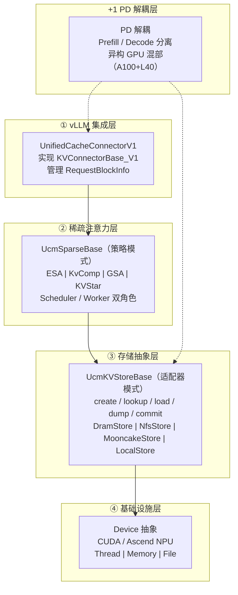
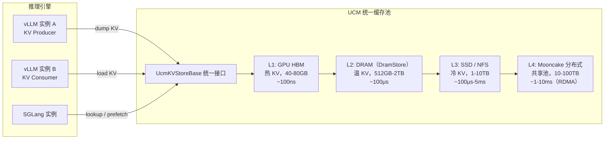

# UCM

> **一句话**：UCM（Unified Cache Management）是 LLM 推理的**统一缓存管理系统**——把分散在多个推理引擎中的 KV Cache、前缀缓存、稀疏注意力检索统一池化调度，跨请求复用、跨实例共享、跨存储分级，让多轮对话和长上下文推理延迟降低 3-10 倍。

## 解决什么问题

LLM 推理中 KV Cache 是最大的内存消耗者，但通常各管各的：

- vLLM 实例 A 算过的 KV Cache，实例 B 不知道，**重复计算**。
- 多轮对话每次重新 prefill 历史消息，**浪费算力**。
- 长文档（32K+ token）KV Cache 塞满 GPU 显存，**OOM**。
- Prefill（计算密集）和 Decode（访存密集）混在同一 GPU 上，**资源错配**。

UCM 用一个统一抽象把 KV Cache 从"引擎私有财产"变成"跨引擎共享资源池"。

**给应届生**：UCM 好比把多个 App 的缓存（浏览器缓存、系统缓存、磁盘缓存）统一交给一个管家调度，按优先级和冷热分配抽屉空间——谁急给谁，冷数据挪到便宜的大仓库（SSD/NFS），热数据留在贵但快的小抽屉（GPU HBM/DRAM）。对比 [[LMCache]] 更像是单个 vLLM 引擎内的"本地缓存复用优化"，UCM 是跨引擎的"统一缓存池化层"。

## 4+1 架构

UCM 采用 4 层核心模块 + 1 个 PD 解耦横切层：

| 层 | 干什么 | 关键抽象 |
|---|---|---|
| ① vLLM 集成 | 嵌入 vLLM 的 KV Cache 管线 | `UnifiedCacheConnectorV1` |
| ② 稀疏注意力 | 多种免训练检索算法，减少需加载的 KV 块 | `UcmSparseBase`，Scheduler/Worker 双角色 |
| ③ 存储抽象 | 统一 KV Cache 持久化、加载、预取接口 | `UcmKVStoreBase`，工厂模式动态加载 |
| ④ 基础设施 | 跨硬件设备、内存、线程抽象 | Device（CUDA / Ascend NPU） |
| +1 PD 解耦 | Prefill 和 Decode 分离到异构 GPU | `toy_proxy_server`（FastAPI） |

## 核心能力

### 前缀缓存与稀疏注意力

- **前缀缓存**：多轮对话的历史消息 KV Cache 可复用，第二轮起只算新增 token，延迟降低 60-80%。
- **稀疏注意力**：对长序列不加载全部 KV 块，只加载"开头窗口 + 结尾窗口 + 检索到的中间关键块"。

**给应届生**：就像开卷考试不需要逐页翻书——先看目录（init_window）、瞄一眼当前页附近（local_window）、再根据关键词快速定位重点章节（sparse retrieval），就能答对题。UCM 的稀疏注意力同理：保留首尾的 KV 块，中间只检索最相关的部分，内存省 70-90%，质量保持 95%+。

| 算法 | 内存节省 | 质量损失 | 适用场景 |
|---|---|---|---|
| **ESA**（基于驱逐） | 70-90% | <5% | 通用长上下文 |
| **KvComp**（哈希编码检索） | 80-95% | <3% | 极长序列 64K+ |
| **GSA**（分组稀疏） | 60-80% | <7% | 分组查询 |
| **KVStar**（多步检索） | 75-90% | <5% | 多步解码 |

### 统一缓存池化数据流

多个引擎通过统一接口共享同一套四级缓存池，UCM 按冷热自动分级：刚算出的 KV 在 GPU HBM，最近访问过的在 DRAM，长期不用的落到 SSD / 分布式存储。

### PD 解耦

将 Prefill（计算密集型）和 Decode（访存密集型）分离到不同 GPU：A100/H100 跑 Prefill，L40/T4 跑 Decode，通过共享存储（Mooncake/NFS）传递 KV Cache。成本比全 A100 部署降低约 40%，是 [[PD分离推理]] 的核心实现方案之一。

## 性能优化（第 46 篇要点）

三级优化体系：

| 级别 | 工作量 | 提升 | 典型手段 |
|---|---|---|---|
| **L1 基础** | 改配置 | 20-40% | 设对缓存大小、选对存储后端 |
| **L2 高级** | 调参+分析 | 40-70% | 稀疏算法选择、异步 I/O、批处理 |
| **L3 专家** | 深度定制 | 70-90% | 自定义 kernel、PD 解耦、多层存储 |

**关键优化项**：

- **缓存大小**：DRAM 不足时命中率 <30%，合理配置可达 60-80%。Qwen2.5-14B 在 32K 序列、1000 并发下建议约 5GB DRAM 缓存。
- **异步 I/O**：单次加载 >10 个 KV 块时开启异步，TTFT 降低 20-30%。
- **分层 vs 批量加载**：显存紧张（<40GB）用分层加载降峰值；显存充足用批量加载提吞吐。
- **稀疏比例自适应**：序列越长稀疏越激进——8K 用 50%、32K 用 30%、64K 用 15%。
- **存储后端**：单机低延迟用 DramStore，多节点共享用 NfsStore，PD 解耦用 MooncakeStore（RDMA）。

## 与集群组件的关系

UCM 是 KV Cache 管理的上层抽象，底层可接入多种组件：

- **[[LMCache]]**：vLLM 内的 KV Cache 复用优化，可被 UCM 作为底层缓存策略——LMCache ≈ 单引擎内缓存，UCM ≈ 跨引擎统一池化。
- **[[Mooncake与NIXL]]**：UCM MooncakeStore 依赖 Mooncake 做分布式存储 + NIXL 提供 RDMA 传输。
- **[[PD分离推理]]**：UCM 的 PD 解耦层直接服务于此架构——Prefiller 写 KV Cache 到共享存储，Decoder 读取。
- **[[vLLM]]**：UCM 当前主要集成对象，通过 `KVConnectorBase_V1` 接口嵌入 vLLM v1 引擎。
- **[[DeepEP]]**：MoE 模型的专家并行通信库，与 UCM 正交——UCM 管 KV Cache，DeepEP 管 Expert 路由通信。

## 国产芯片启示

UCM 代码已包含 Ascend NPU（昇腾）的设备抽象实现（`ucm/store/device/ascend/`），说明它对国产硬件的兼容性是有意识设计的。对自研芯片而言：

1. **统一内存池抽象**：UCM 的 `Device` 层要求硬件提供统一的内存注册/分配接口。自研芯片要接入 UCM 生态，驱动层需提供类似 CUDA `cudaHostRegister` 或 Ascend CANN 的内存管理 API，让 KV Cache 块可以在 GPU HBM、CPU DRAM、NVMe 之间零拷贝迁移。
2. **跨引擎接口标准化**：UCM 的池化价值前提是多个推理引擎都能通过 `UcmKVStoreBase` 读写同一份 KV Cache。自研芯片的推理框架应优先适配这套接口，而非自建封闭缓存系统——接口标准化是国产芯片融入 LLM 推理生态的捷径。

## 延伸

- [[LMCache]] — vLLM 内的 KV Cache 复用，UCM 的底层可选组件
- [[PD分离推理]] — UCM PD 解耦层服务的架构模式
- [[Mooncake与NIXL]] — UCM MooncakeStore 依赖的分布式存储与 RDMA 通信
- [[DeepEP]] — MoE 专家并行通信，与 UCM 正交但同属推理基础设施
- [[vLLM]] — UCM 当前主要集成的推理引擎
- [[wiki/ai-infra/llm-inference/index|LLM 推理与缓存]] — 同集群总索引
- [[wiki/ai-infra/distributed-training/index|分布式训练基础]] — 分布式上下文
- 专栏原文：[第45篇 4+1 架构](https://zhuanlan.zhihu.com/p/1974521042316845979) · [第46篇 性能优化](https://zhuanlan.zhihu.com/p/1974576296500679086)
