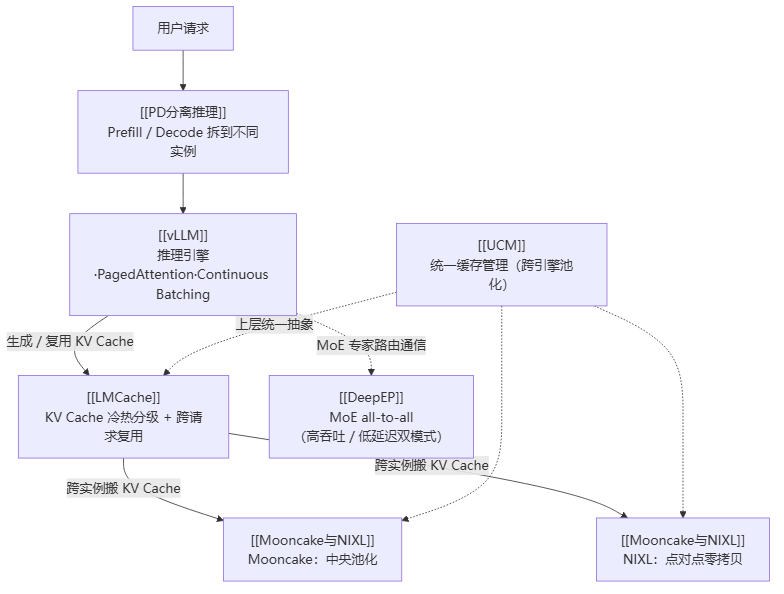

# LLM 推理与缓存

> **一句话**：本集群讲 LLM 推理怎么"算得快、存得省、传得稳"。主线是 **PD 分离**——把 Prefill（算 KV Cache）和 Decode（用 KV Cache 蹦字）拆到不同 GPU，再用 KV Cache 传输引擎把两者连起来。vLLM 是引擎、LMCache/UCM 管缓存、Mooncake/NIXL 传缓存、DeepEP 管 MoE 通信。原始材料见 `.raw/zhihu/`，对应知乎专栏第 8、26–37、43–46、29–30 篇。

## 主线：以 PD 分离串起 6 个组件

> 图解源文件：[`01-主线-以-PD-分离串起-6-个组件-flowchart.mmd`](../../../_attachments/ai-infra/llm-inference/index/whiteboard-mermaid/01-主线-以-PD-分离串起-6-个组件-flowchart.mmd)。

**给应届生**：把这页当导航图，记住一根主线——**Prefill 算出 KV Cache，Decode 消费 KV Cache，中间所有组件都在围绕"KV Cache 怎么存、怎么省、怎么传、怎么管"打转**。vLLM 是舞台（引擎），KV Cache 是主角，LMCache/Mooncake/NIXL/UCM 是围绕主角的道具，DeepEP 是 MoE 模型特有的通信戏份，PD 分离是把这些组件组合起来的导演方案。

## 阅读顺序

| 顺序 | 页面 | 讲什么 | 篇号 |
|---|---|---|---|
| ① 入口 | [[PD分离推理]] | 为何把 Prefill/Decode 拆开、两条技术栈（vLLM+NIXL / Mooncake Transfer Engine） | 29-30 |
| ② 引擎 | [[vLLM]] | PagedAttention 分页管 KV Cache、Continuous Batching、V1 优化 | 43-44 |
| ③ 缓存 | [[LMCache]] | KV Cache 跨请求复用、4+1 架构、四层冷热后端 | 8,26-28 |
| ④ 传输 | [[Mooncake与NIXL]] | KV Cache 跨实例传输：Mooncake（月之暗面池化）vs NIXL（UCX 零拷贝） | 31-34 |
| ⑤ MoE 通信 | [[DeepEP]] | MoE 专家并行 all-to-all、高吞吐/低延迟双 kernel | 35-37 |
| ⑥ 统一管理 | [[UCM]] | 跨引擎统一缓存池化、稀疏注意力、PD 解耦 | 45-46 |

建议先读 [[PD分离推理]] 建立全局观，再按 ②③④ 顺序深入"缓存怎么存、怎么传"，⑤ 是 MoE 专属通信、按需读，⑥ 是上层统一抽象、最后看。应届生若只读一页，读 [[PD分离推理]]——它把其余 5 个组件的角色都讲清了。

## 概念锚点

- **Prefill / Decode**：LLM 推理两阶段。Prefill 一次性处理整个 prompt 生成 KV Cache（计算密集 compute-bound）；Decode 逐 token 复用 KV Cache 生成（访存密集 memory-bound）。详见 [[PD分离推理]]、[[vLLM]]。
- **KV Cache**：Attention 每层算出的 Key/Value 缓存，避免重复计算历史 token。是推理显存大头，本集群所有组件都围绕它。
- **PagedAttention**：vLLM 把 KV Cache 切成固定大小 Block 管理（类比 OS 分页 + 页表），消灭显存碎片、支持前缀共享。详见 [[vLLM]]。
- **PD 分离（Disaggregation）**：把 Prefill 和 Decode 部署到不同 GPU 实例，各自配最优硬件/并行策略；KV Cache 跨实例传输是核心难题。详见 [[PD分离推理]]。
- **Expert Parallelism / MoE all-to-all**：MoE 模型专家分散多卡，每个 token 按路由跨卡找专家，需动态稀疏 all-to-all 通信（不同于传统 [[集合通信原语]] 的规整通信）。详见 [[DeepEP]]。
- **Mooncake KVPool / NIXL 零拷贝**：两条 KV Cache 传输路线——Mooncake 走中央池化分布式存储（月之暗面 Moonshot AI），NIXL 走点对点 GPU Direct RDMA 零拷贝（NVIDIA/NeMo，基于 UCX）。详见 [[Mooncake与NIXL]]。

## 国产芯片启示汇总

各组件对自研 AI 芯片的关键要求（应届生视角，详见各页 `## 国产芯片启示` 小节）：

| 组件 | 核心硬件 / 接口要求 |
|---|---|
| [[PD分离推理]] | KV Cache 跨节点高带宽传输刚需；RDMA + GPUDirect（GDR）是标配，否则多次 CPU 中转拖慢 TTFT |
| [[LMCache]] | **Int64 索引是硬门槛**（长上下文偏移超 Int32）；UVA + Pinned Memory 支撑零拷贝 |
| [[Mooncake与NIXL]] | RDMA / GPUDirect RDMA（NPU-Direct）；内存注册（rkey 交换）；UCX 插件适配自研互联 |
| [[DeepEP]] | System-scope 原子操作 + 内存一致性；IBGDA 等效（GPU 直接发 RDMA）；SM 分组调度做计算-通信隔离 |
| [[vLLM]] | attention backend 须支持分页 KV（`block_tables` 间接寻址）；运行时需 CUDA Stream 级异步能力 |
| [[UCM]] | 统一内存池抽象（HBM/DRAM/NVMe 间零拷贝迁移）；跨引擎接口标准化是融入生态的捷径 |

**给应届生**：把这些要求串起来看，国产芯片要跑通现代 LLM 推理栈，三件事绕不开——**① 大地址空间（Int64）② 网卡/NPU 直连零拷贝（RDMA / GPUDirect）③ 算子支持分页 / 稀疏 KV 访问**。这三条是从训练侧（[[集合通信原语]]、[[wiki/ai-infra/nccl/index|NCCL]]）到推理侧通用的硬件基本功，也是专栏反复强调的"对国产 AI 芯片设计的兼容性需求"主线。

## 延伸

- 上级：[[wiki/ai-infra/index|ai-infra 专区首页]]
- 训练侧对照：[[什么是分布式训练]] · [[集合通信原语]] · [[wiki/ai-infra/distributed-training/index|分布式训练基础]]
- 通信底座：[[wiki/ai-infra/nccl/index|NCCL]] · [[wiki/ai-infra/comm-libs/NVSHMEM|NVSHMEM]] · [[wiki/ai-infra/comm-libs/UCX|UCX]]
- 专栏：[知乎《大模型训练、推理与AI云平台》](https://www.zhihu.com/column/c_1491039346714746880)（作者常平，本集群对应第 8、26–37、43–46、29–30 篇）
