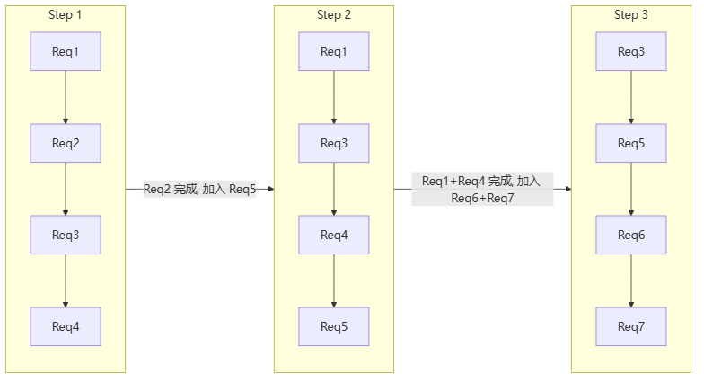
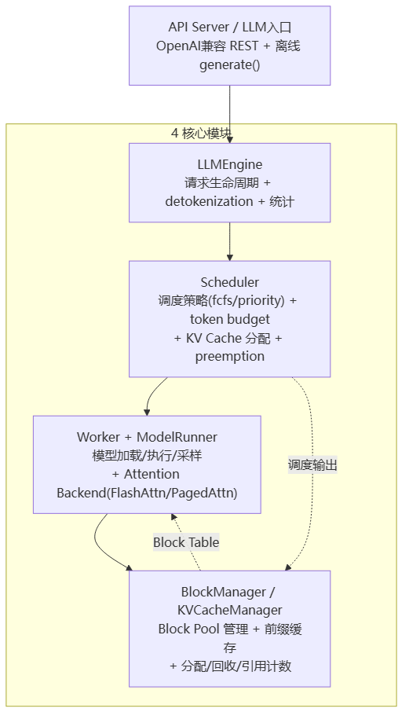
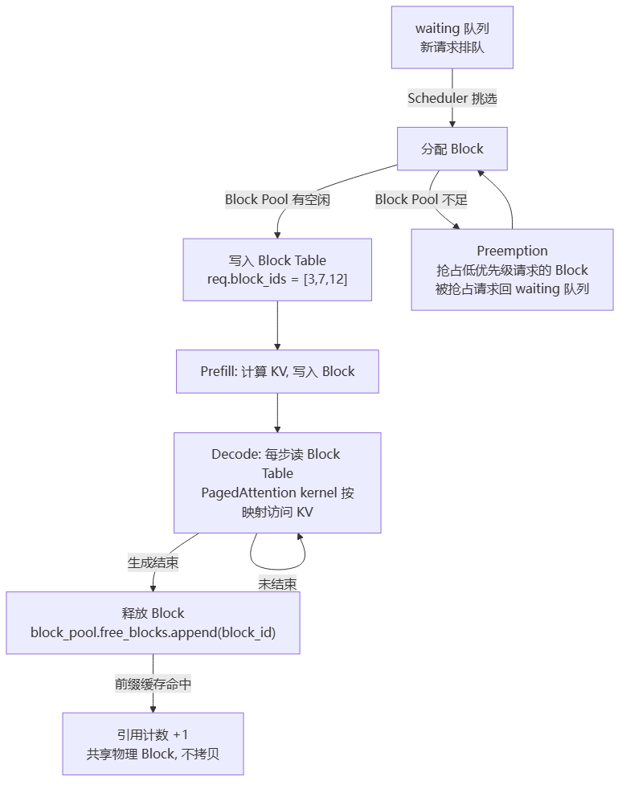

# vLLM

> **一句话**：vLLM 是当今 LLM 推理的事实标准引擎。它用 **PagedAttention**（像操作系统分页一样管理 KV Cache）消灭显存碎片，用 **Continuous Batching**（请求随到随走、不等齐）榨干 GPU 利用率，V1 架构通过异步调度 + 多进程 + 默认前缀缓存把吞吐再推高 15-30%。

## vLLM 解决什么问题

LLM 推理的瓶颈在显存和调度。每个请求要存一份 KV Cache（Key-Value 缓存），传统做法预分配固定大小——请求短了浪费，请求长了溢出，显存碎片化严重。同时，传统 static batching 必须等一批请求全部完成才能换下一批，GPU 空闲等最慢的那个。

vLLM 的两大杀手锏精确打在这两个痛点上。

## 两大杀手锏

### PagedAttention：把 KV Cache 当"内存页"管

**给应届生**：操作系统把物理内存切成 4KB 的"页"，进程按需申请、不连续分配、通过页表映射——这样没有外部碎片，内存利用率高。vLLM 把 KV Cache 也切成固定大小的 **Block**（默认 16 个 token 一块），每个请求的 KV 不要求连续存放，而是通过 **Block Table** 映射到物理 Block。这就像「操作系统给进程分配物理页框，页表记录虚拟地址到物理地址的映射；vLLM 给序列分配 KV Block，Block Table 记录逻辑位置到物理 Block 的映射」。

```
逻辑层:  序列 A 的 token_0~15 → Block 3
        序列 A 的 token_16~31 → Block 7
        序列 A 的 token_32~47 → Block 12

物理层:  Block Pool = [Block_0, Block_1, ..., Block_N]
         每个 Block: [block_size, num_layers, 2, num_kv_heads, head_dim]
```

好处：
- **零内部碎片**：按需分配，不预占 max_seq_len 的空间
- **共享前缀**：多个请求共用同一个 system prompt，Block Table 指向相同物理 Block，引用计数管理
- **显存利用率** 从传统方案的 20-40% 提升到接近 100%

### Continuous Batching：流水线不停，做完就换

**给应届生**：传统 static batching 像「一辆大巴等人齐了才发车，车上最慢的乘客决定了到达时间」。Continuous Batching 像「流水线传送带——工人做完手上的活立刻从队列取下一个，传送带永远不停」。在 vLLM 中，每个 step 都可能：老请求生成完最后一个 token 就退出 batch，新请求从 waiting 队列补进来。



> 图解源文件：[`01-Continuous-Batching-流水线不停-做完就换-flowchart.mmd`](../../../_attachments/ai-infra/llm-inference/vLLM/whiteboard-mermaid/01-Continuous-Batching-流水线不停-做完就换-flowchart.mmd)。

效果：GPU 利用率接近 100%，吞吐量比 static batching 提升 2-3 倍。

## 4+1 架构视图

vLLM V1 的"4"是四个核心模块，"1"是对外接口层（API Server / LLM 入口）。



> 图解源文件：[`02-4+1-架构视图-flowchart.mmd`](../../../_attachments/ai-infra/llm-inference/vLLM/whiteboard-mermaid/02-4+1-架构视图-flowchart.mmd)。

- **LLMEngine**：用户入口，管理请求的添加/中止/追踪，负责 detokenization 和输出后处理。在线服务对应 `AsyncLLMEngine`。
- **Scheduler**：核心大脑。每个 step 从 waiting 队列选请求、分配 token budget、调用 KVCacheManager 分配 Block。内存不足时触发 preemption（抢占低优先级请求的 Block）。
- **Worker + ModelRunner**：真正跑模型的地方。构建 Input Batch（token_ids / position_ids / block_tables），执行 `model.forward()`，采样下一个 token。
- **BlockManager**：PagedAttention 的物理实现。维护 Block Pool（free / allocated），支持前缀缓存（block hash -> physical block 映射，引用计数复用）。

## Prefill 与 Decode 两阶段

vLLM 默认混合调度，也可 [[PD分离推理]] 拆开部署：

| 阶段 | 干什么 | 特点 |
|---|---|---|
| **Prefill** | 一次处理 prompt 全部 token，生成 KV Cache + 第一个 token | 计算密集，受限于 GPU 算力 |
| **Decode** | 每次只输入一个 token，用已有 KV Cache 自回归生成 | 显存密集，受限于 KV Cache 容量 |

Chunked Prefill 将长 prompt 切成多个 chunk 分步 prefill，避免一个超长请求阻塞所有 decode——这对公平性和 P99 延迟至关重要。

在 PD 分离方案中，Prefill 实例用高算力 GPU（如 H100），Decode 实例用大显存 GPU（如 A100 80GB），KV 通过 [[LMCache]] 或 [[Mooncake与NIXL]] 里的 NIXL/RDMA 传输。

## V1 性能优化（相对 V0）

V1 架构（vllm >= 0.11.1）相对 V0 做了系统性重构，关键优化：

| 优化点 | 说明 | 提升 |
|---|---|---|
| **async_scheduling** | 异步调度，减少 GPU 等待调度决策的空闲间隙 | 吞吐 +5-15% |
| **多进程模式** | `VLLM_ENABLE_V1_MULTIPROCESSING`，Manager 进程不持 GPU，Worker 进程独立执行 | 稳定性 + 资源隔离 |
| **前缀缓存默认开启** | `enable_prefix_caching` 默认 True，重复 system prompt 自动复用 | Prefill 减少 85%+ |
| **更优 CUDA Graph** | `FULL_AND_PIECEWISE` 混合模式：Decode 用全图（最低延迟），Prefill 用分段图（最大灵活） | 延迟 -15-25% |
| **并发 partial prefill** | `max_num_partial_prefills` 控制同时处理的部分 prefill 数，短请求可插队 | P99 延迟 -25-35% |
| **Torch Compile** | Level 3 激进编译 + Inductor 后端 | 额外 +5-10% |
| **FP8 量化** | H100 上权重 + KV Cache 都用 FP8，显存减半，速度反增 | 吞吐 +50%（H100） |

### PagedAttention + Continuous Batching 的 KV Cache 块流转



> 图解源文件：[`03-PagedAttention-+-Continuous-Batching-的-KV-Cache-块流转-flowchart.mmd`](../../../_attachments/ai-infra/llm-inference/vLLM/whiteboard-mermaid/03-PagedAttention-+-Continuous-Batching-的-KV-Cache-块流转-flowchart.mmd)。

## 国产芯片启示

vLLM 对自研芯片的适配要求不低：

- **PagedAttention 要求 attention backend 支持分页 KV 访问**：kernel 需要根据 Block Table 间接寻址 KV Cache，而非连续地址访问。自研芯片的 attention 算子必须实现 `block_tables` 参数接口，这比标准 FlashAttention 复杂一个层级。
- **V1 异步调度对驱动/运行时接口有要求**：async scheduling 依赖高效的 CPU-GPU 同步机制和 stream 管理。自研芯片的运行时需要提供类似 CUDA Stream 的异步执行能力，否则异步调度反而可能引入额外等待。

## 延伸

- [[PD分离推理]] — vLLM 支持的 Prefill/Decode 分离部署方案
- [[LMCache]] — PD 分离中 KV Cache 的缓存与传输层
- [[Mooncake与NIXL]] — KV 跨节点 RDMA 传输（NIXL/UCX）
- [[UCM]] — 统一缓存管理
- [[DeepEP]] — 专家并行通信
- [[wiki/ai-infra/llm-inference/index|LLM 推理与缓存]] — 本集群索引
- 专栏原文：[知乎 · 第43篇 vLLM 4+1架构](https://zhuanlan.zhihu.com/p/1974211314755859200) / [知乎 · 第44篇 V1性能优化](https://zhuanlan.zhihu.com/p/1974229128749290012)
