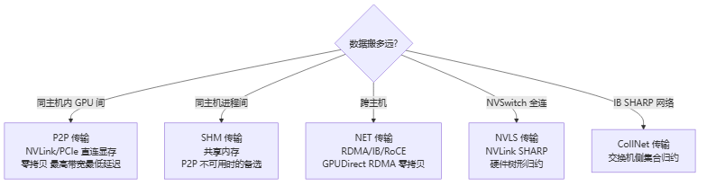

# NCCL 传输层

> **一句话**：NCCL 有多种"传输层"，按数据要搬多远选不同物理路径——**节点内 GPU 间用 P2P**（NVLink/PCIe 直连显存）、**同节点进程间用 SHM**（共享内存）、**跨节点用 NET**（RDMA 网卡）、**NVSwitch 全连用 NVLS**、**IB SHARP 用 CollNet**。选对了才跑得快。

## 7 种传输层

> 图解源文件：[`01-7-种传输层-flowchart.mmd`](../../../_attachments/ai-infra/nccl/NCCL传输层/whiteboard-mermaid/01-7-种传输层-flowchart.mmd)。

| 传输 | 常量 | 适用 | 关键技术 |
|---|---|---|---|
| **P2P** | TRANSPORT_P2P | 节点内 GPU 间 | NVLink/PCIe 直连显存，零拷贝 |
| **SHM** | TRANSPORT_SHM | 节点内进程间 | 共享内存（P2P 备选） |
| **NET** | TRANSPORT_NET | 跨节点 | RDMA + GPUDirect RDMA |
| **NVLS** | NVLink SHARP | NVSwitch 全连 | 硬件树形归约 |
| **CollNet** | CollNet | IB SHARP | 交换机侧集合归约 |

**给应届生**：选传输层 = 选"走哪条路"。同机柜内 8 张卡传数据，走 NVLink（P2P，像楼内电梯）；跨机房传，走 RDMA 网卡（NET，像跨城快递）。NCCL 初始化时探测每对 GPU 的物理距离，自动选最快的路。

## P2P 传输（节点内首选）

P2P（Peer-to-Peer）是节点内 GPU 间最快传输，**零拷贝**直接访问对方显存。

### 4 种 P2P 模式

| 模式 | 原理 | 适用 |
|---|---|---|
| **P2P_DIRECT** | 同进程 GPU 直接指针访问 | 最优，NVLink 全连 |
| **P2P_IPC** | Legacy CUDA IPC | 跨进程 |
| **P2P_CUMEM** | CUDA 11.3+ cuMem API | 新 API |
| **P2P_INTERMEDIATE** | 中间节点转发 | 无直连时绕路 |

支持 **P2P Read**（GPU 主动读远端）和 **P2P Write**（GPU 主动写远端）两种模式。

**给应届生**：P2P_DIRECT 最理想——一张卡的 kernel 直接读写另一张卡的显存，像访问自己显存一样（因为 NVLink 把它们连成一片）。前提是硬件支持 `cudaDeviceCanAccessPeer` 且 NVLink 全连。没有直连就退化成 INTERMEDIATE（绕中间卡转发），慢一截。

## SHM 传输（节点内备选）

P2P 不可用时（如某些 PCIe 拓扑不支持 peer access）退而用共享内存：多进程映射同一块 CPU 内存，数据经 CPU 内存中转。比 P2P 慢（多一次 GPU↔CPU 拷贝）但兼容性好。

## NET 传输（跨节点核心）

跨节点通信靠 NET 传输，底层是 RDMA（InfiniBand 或 RoCE）。关键能力是 **GPUDirect RDMA（GDR）**：网卡直接 DMA GPU 显存，绕过 CPU。

> 图解源文件：[`02-NET-传输（跨节点核心）-flowchart.mmd`](../../../_attachments/ai-infra/nccl/NCCL传输层/whiteboard-mermaid/02-NET-传输（跨节点核心）-flowchart.mmd)。

详见 [[GPUDirect-RDMA]]。NET 传输的细节（QP 管理、GDR Flush、内存注册）见 [[NCCL协议与机制]] 的 GDR 部分。

**给应届生**：跨节点传输最大的坑是"网卡能否直读 GPU 显存"。能（GDR 支持）→ 数据 GPU→网卡→对端 GPU，CPU 不沾手，快。不能 → 数据 GPU→CPU 内存→网卡→对端 CPU→对端 GPU，CPU 成搬运工，慢且占 CPU。所以跨节点训练必须确认 GDR 生效（NCCL 日志会打印 `NCCL INFO NET/ : Using GPUDirect RDMA`）。

## NVLS 传输（NVSwitch 全连）

NVLS（NVLink SHARP）利用 NVSwitch 硬件做树形归约——交换机/硬件侧直接做 reduce，不靠软件 kernel 逐跳传。适合 DGX 这种 NVSwitch 全连接架构，带宽利用率和延迟都最优。

## CollNet 传输（IB SHARP）

CollNet（Collective Network）对接 InfiniBand 的 SHARP（Scalable Hierarchical Aggregation and Reduction Protocol）——交换机侧硬件做集合归约。把 reduce 卸载到交换机，减少 GPU 计算和网络流量。

**给应届生**：NVLS 和 CollNet 都是"硬件加速归约"——把 reduce 这种集合运算交给交换机/专用硬件做，GPU 只管收发最终结果。普通 Ring/Tree 是 GPU 之间互相算，硬件加速是交换机帮你算。需要对应硬件（NVSwitch / IB SHARP 交换机）才生效。

## 传输层选择优先级

NCCL 自动按物理拓扑选传输，优先级（节点内场景）：P2P > SHM > NET。

| 场景 | 选用传输 | 理由 |
|---|---|---|
| 节点内 GPU 全连（NVLink） | P2P_DIRECT | 零拷贝，最快 |
| 节点内 P2P 不可用 | SHM | 兼容备选 |
| 跨节点 | NET (GDR) | RDMA 零拷贝 |
| NVSwitch 全连 | NVLS | 硬件归约 |
| IB SHARP 网络 | CollNet | 交换机归约 |

## 延伸

- [[NCCL架构总览]] — 传输层在整体架构的位置
- [[NCCL拓扑算法]] — 算法搭配传输
- [[NCCL协议与机制]] — GDR/Group/Plugin 机制
- [[GPUDirect-RDMA]] — GDR 概念锚点
- [[NVLink]] — NVLink/NVSwitch 互联
- [[wiki/ai-infra/comm-libs/UCX|UCX]] — 通用通信框架（NCCL NET 可对接）
- [[千卡训练性能优化]] — 传输选择与带宽利用
- 专栏原文：[知乎 · 第75篇 P2P传输层](https://zhuanlan.zhihu.com/p/1982219722570352144) ｜[第80篇 传输层对比](https://zhuanlan.zhihu.com/p/1982221210554224914) ｜[第83篇 P2P Direct](https://zhuanlan.zhihu.com/p/1982946325973725456)
