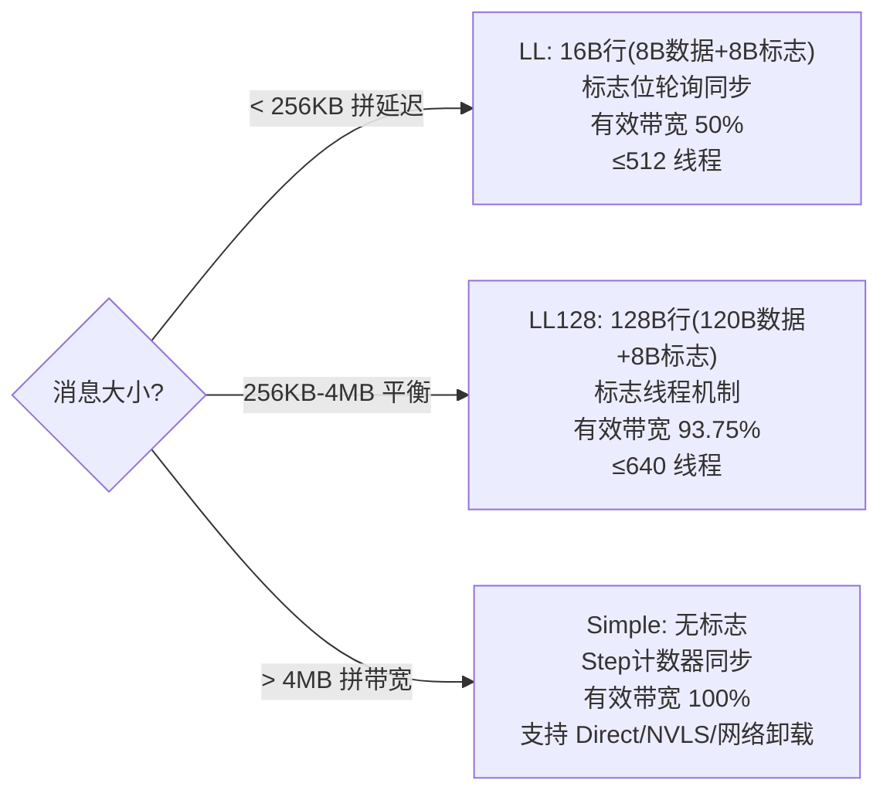

# NCCL 协议与机制

> **一句话**：这页收口 NCCL 的「横向机制」——初始化怎么建 communicator、插件怎么换后端、数据按什么协议打包、操作怎么批量聚合、跨节点怎么零拷贝、故障怎么自愈、运行怎么追踪。它们贯穿在 [[NCCL架构总览]] 的各层之间，是 NCCL 「能跑起来、跑得稳、看得见」的骨架。

## 初始化与插件加载（第19、97篇）

`ncclInit`（`init.cc`）用 `std::call_once` 全局只跑一次：设 8MB 栈 → 初始化 GDR/Bootstrap 网络 → 注册 NVTX。之后 `ncclCommInitRank` → `initTransportsRank` 跑**两次 AllGather**：第一次交换 `ncclPeerInfo`（版本/节点数/GPU 唯一性）+ 拓扑发现；第二次交换图信息，通道数取所有 rank 的最小值。

插件是 NCCL 的「可替换后端」机制，共 4 类（`plugin_open.cc`）：

| 类型 | 环境变量 | 作用 |
|---|---|---|
| NET | `NCCL_NET_PLUGIN` | 换网络后端（IB/Socket/自研） |
| TUNER | `NCCL_TUNER_PLUGIN` | 换算法选择策略 |
| PROFILER | `NCCL_PROFILER_PLUGIN` | 注入性能探针 |
| ENV | `NCCL_ENV_PLUGIN` | 换环境变量来源 |

加载用 `dlopen(libnccl-<type>-<name>.so)` + `dlsym("ncclNetPlugin_v11")` 版本协商（v11→v6 往回试），一个外部 NET 插件启用即互斥禁用其余。第三方开发 5 步：拷 ABI 头 → 实现版本化结构体 → 编 `libnccl-<type>-<name>.so` → 设 `LD_LIBRARY_PATH` → 设 `NCCL_*_PLUGIN`，不改 NCCL 源码。

**给应届生**：Plugin=可替换后端（像装驱动不改主体）；版本协商=从最新 API 往回试，新旧 NCCL 都能对接。NET 插件是国产芯片对接 NCCL 的主入口——实现 `ncclNetPlugin_v11` 那套函数指针就能把自己的网络栈挂进来，详见 [[NCCL国产化需求]]。

## 通信协议：LL / LL128 / Simple（第95篇）

设备端 kernel 内部按消息大小在三种协议间取舍，是 [[NCCL性能优化]] 延迟-带宽模型的落地：

- 都跑在 `NCCL_STEPS=8` 流水线上（8 步循环缓冲）。
- Simple 用 `loadStepValue` 轮询 `connStepCache + NCCL_STEPS < step + StepPerSlice`；NVLS 模式用 `multimem.ld_reduce.acquire.sys.global.min.u64` 原子归约读。
- 环境变量：`NCCL_PROTO` 强制锁协议；`NCCL_LL_BUFFSIZE=128KB` / `NCCL_LL128_BUFFSIZE=1MB` / `NCCL_BUFFSIZE=4MB`。

**给应届生**：LL=每件货挂号（实时但带宽腰斩到 50%）；LL128=一车配一个编号员（93.75%）；Simple=整批发只对总数（100% 但要等满车）。协议切换是 NCCL 自动按字节大小做的，你通常不用管。

## Group 机制：批量聚合（第96篇）

把多个集合/P2P 操作打包统一执行，减少内核启动开销、支持通信与计算 overlap。`ncclGroupStart` 只 `depth++`，`ncclGroupEnd` 在最外层（`depth==0`）才真正执行——**嵌套 Group 像套娃，最外层才结算**。

执行流程：P2P Preconnect → `ncclPrepareTasks`（`ncclTaskCollSorter` 按**流量降序**分桶，大流量优先）→ 任务在 4× 范围内聚合 → `getAlgoInfo` 选算法 → Symmetric Register → `doLaunches` 按 Clique 分组多轮 barrier 同步（前 5μs 自旋后 yield）。阻塞走 `groupLaunch()` 同步，非阻塞 `pthread_create` 异步返回 `ncclInProgress`。单 Job 时免 pthread 省 10-20μs。`NCCL_LAUNCH_MODE=Group|Parallel` 控制 barrier 行为。

## GDR：零拷贝跨节点（第74篇）

GPUDirect RDMA 让 IB 网卡直接访问 GPU 显存、绕过 CPU。两条路径：传统 `nv_peer_mem`（内核模块）vs **DMA-BUF**（CUDA 11.7+/Kernel 5.12+ 内核原生，免装模块）。能力位 `NCCL_PTR_HOST/CUDA/DMABUF`，拓扑 `ncclTopoCheckGdr` + `ncclTopoNeedFlush`，GDR 档位 `NCCL_NET_GDR_LEVEL`（默认 PHB）。

数据路径：注册（`cuMemGetHandleForAddressRange` 拿 dmabuf_fd → `regMrDmaBuf`，**MR 缓存**命中 <100ns vs 未命中 ~50μs）→ 发送方等 CTS → `IBV_WR_RDMA_WRITE_WITH_IMM` 零拷贝写对端显存 → **Flush**（GDRCopy ~150ns 或 RDMA Read 1 字节 ~1-2μs）保证弱序内存可见 → 轮询 CQE。多 QP（`NCCL_IB_QPS_PER_CONNECTION`，1→4 提到 42GB/s，1→8 提到 80-90GB/s）扩带宽。详见 [[GPUDirect-RDMA]] 与 [[NCCL传输层]]。

## RAS：可靠性自愈（第21篇）

每进程一个独立 RAS 线程（`ras.cc`），基于 ring 拓扑做心跳监控，`poll()` 事件驱动、异步非阻塞。保活 `rasConnSendKeepAlive` 携带 `peersHash`——哈希不匹配才传完整 peers 列表（O(1) 检查省带宽）。多级超时：

| 超时 | 阈值 | 动作 |
|---|---|---|
| 保活 | 1s | 发 KeepAlive |
| 警告 | 5s | 启 Fallback 沿 ring 找下一个活跃节点 |
| 卡死 | 20s | 重建 socket |
| 死亡 | 60s | `rasPeerDeclareDead` + `RAS_BC_DEADPEER` 沿 ring 广播 |

默认端口 28028，`NCCL_RAS_ADDR`/`NCCL_RAS_TIMEOUT_FACTOR` 可调，`NCCL_DEBUG_SUBSYS=RAS` 看日志。对照 [[AMD-GPU-RAS]] 的硬件 RAS，NCCL RAS 是通信层软件可靠性。

## 追踪 Trace（第22篇）

设计中的细粒度 Trace 架构，覆盖 GPU/CPU 端事件，输出 Chrome Trace 格式。事件 16 字节紧凑（type:16 + size:32 + timestamp:64），事件 ID 分段：控制/集合/Primitives/数据传输/同步/Proxy/网络/传输。`NcclTraceClockSync` 对齐 CPU/GPU 时钟，`CpuTimestampUpdateThread` 每 100μs 更新 volatile 时间戳。缓冲区 GPU 512×64K、CPU 32×2M 事件，`Dump` 时先 `ncclCudaMemcpy` GPU 事件到主机再写 `NCCL_TRACE_DUMP_DIR`（默认 `/tmp/nccl_trace`）。编译期 `ENABLE_NCCL_TRACE` 控制开关。

**给应届生**：Trace=给 NCCL 装「行车记录仪」；CPU 时间戳线程=每 100μs 对一次表的秒针，把 GPU 和 CPU 两条时间轴对齐才能拼出完整 timeline。

## CUDA 接口清单与拓扑算法指定（第82、94篇）

- **CUDA API**（第82篇）：NCCL 调用 100+ 个 CUDA 接口（Runtime 43 + Driver 57），Driver API 用 `cudaGetDriverEntryPoint` 按版本动态加载、优雅降级。主力是 **cuMem 虚拟内存**（11.3+，`cuMemCreate→AddressReserve→Map→SetAccess`，`gpuDirectRDMACapable=1`，是 GDR/NVLS/Fabric 的底座）、P2P IPC（`cudaIpcGetMemHandle` 64 字节句柄）、Graph Capture、NVLS Multicast（12.1+）。
- **环境变量指定拓扑算法**（第94篇）：算法枚举 TREE/RING/COLLNET_DIRECT/COLLNET_CHAIN/NVLS/NVLS_TREE/PAT 共 7 种（`NCCL_NUM_ALGORITHMS=7`）。可用 `NCCL_ALGO`/`NCCL_PROTO` 强制锁定；文章演示新增 `NCCL_ALGO_2DRING`（Hierarchy Ring：节点内环+节点间环，节点数需完全平方数，跨节点次数 O(N)→O(√N)，4×8 节点 128MB +29%）。自动检测与搜索机制见 [[NCCL拓扑算法]]。

## 延伸

- [[NCCL架构总览]] — 这些机制挂载的架构骨架
- [[NCCL拓扑算法]] — 算法自动选择与拓扑搜索
- [[NCCL传输层]] — GDR/P2P/NET 传输细节
- [[NCCL核心模块]] — Bootstrap/Enqueue/Proxy 等模块代码级实现
- [[NCCL性能优化]] — 协议效率因子与调优
- [[GPUDirect-RDMA]] — GDR 零拷贝原理
- [[wiki/ai-infra/comm-libs/UCX|UCX]] — NCCL NET 传输可对接的通用框架
- 专栏原文：[第19篇](https://zhuanlan.zhihu.com/p/1971861222346458577) ｜[第21篇 RAS](https://zhuanlan.zhihu.com/p/1971869740239656045) ｜[第22篇 追踪](https://zhuanlan.zhihu.com/p/1971874423599501740) ｜[第74篇 GDR](https://zhuanlan.zhihu.com/p/1981507594146305320) ｜[第82篇 CUDA API](https://zhuanlan.zhihu.com/p/1982590380101882027) ｜[第94篇 指定拓扑算法](https://zhuanlan.zhihu.com/p/1983600291682223282) ｜[第95篇 协议](https://zhuanlan.zhihu.com/p/1984770740919215073) ｜[第96篇 Group](https://zhuanlan.zhihu.com/p/1985707892381333042) ｜[第97篇 Plugin](https://zhuanlan.zhihu.com/p/1985711681888879384)
