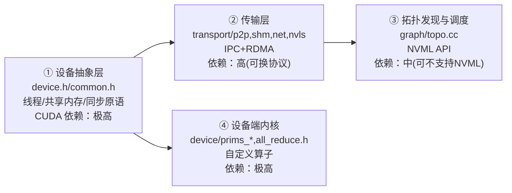
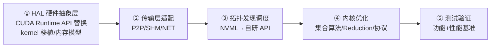

# NCCL 国产化需求

> **一句话**：国产 AI 芯片做集合通信库，**建议基于 NCCL 移植而非自研**——保持 PyTorch/vLLM 等调用方接口兼容、复用生态与第三方插件。移植的痛苦集中在「设备抽象层」和「设备端内核」两层（CUDA 依赖度极高），其本质是把 CUDA 的线程模型/内存模型/同步原语映射到自研芯片的硬件能力上。所以这页既是**移植指南**，也是**芯片硬件设计需求清单**——硬件不满足，移植就是无米之炊。

## 移植策略：移植 NCCL，别重造轮子

自研集合通信库费时费力、破坏用户编程习惯、难兼容第三方 NCCL 插件、维护成本高。基于 NCCL 移植只需替换自定义算子 + NVLink 通信接口，即可快速拉起一个可运行版本，后续再补齐产品化特性。成功先例：AMD ROCm 移植出 **RCCL**（接口与 NCCL 二进制兼容）。

**给应届生**：国产芯片厂商常纠结「自研 vs 移植」。结论是移植——因为上层框架（PyTorch 的 `torch.distributed`）只认 NCCL 那套 API，你自研一套用户就得改代码，没人愿意。RCCL 就是教科书级范例：API 名字、行为、环境变量几乎照搬 NCCL，把 CUDA 后端换成 HIP。

## NCCL 四层架构与移植难度

| 层 | CUDA 依赖度 | 移植要点 |
|---|---|---|
| 设备抽象 | 极高 | Warp/Block/Grid 线程模型、共享内存、barrier 原语——硬件设计阶段就要考虑 |
| 传输层 | 高 | NVLink→自研互联协议；CollNet 非必须可砍；RDMA 若兼容标准 IB 可直接复用 |
| 拓扑层 | 中 | NVML API 可换自研管理 API，甚至可不支持 NVML |
| 设备内核 | 极高 | 全是自定义算子，依赖硬件向量/归约指令，最痛苦 |

## 五阶段移植工作分解

关键工程点：建一个 `ncclDeviceOps_t` 抽象层（getDeviceCount/setDevice/malloc/memcpy/stream/event 等回调），把所有 `cudaMalloc/cudaMemcpy` 调用收口到这一层，后续只换实现。

## 硬件设计要求（核心）

### 线程层次与寄存器

- **Warp = 32 线程 SIMT 锁步**（`WARP_SIZE=32`）：必须支持 32 线程同步执行、warp 内隐式同步、分支 divergence（SIMT stack）。
- **Block 128-640 线程**（`NCCL_MIN_NTHREADS=128`，`NCCL_MAX_NTHREADS=640`），独立调度、Block 间不通信。
- **寄存器**：最小 32 个 64 位寄存器/线程，典型 64，高性能 128；每 SM 64-128KB，1-2 cycle 访问。

### 计算单元：向量与归约

- **128 位向量指令**（`v2.u64`，P0 必须）：NCCL 主数据通路靠 `ld.volatile.global.v2.u64` 一次搬 16 字节。
- **Pack/Unpack**：支持 1/2/4/8/16 字节重组 + 类型转换，16 字节对齐。
- **Reduction 硬件加速**：Sum/Prod/MinMax/PreMulSum（FMA），目标 1 cycle/warp（32 元素）。

### 内存子系统

- **共享内存**：≥64 KB/Block（推荐 128 KB），≥2 TB/s 每 SM，≤20 cycle，≥32 bank 防 bank 冲突，16 字节对齐。`ncclShmemData` 结构静态占 ~10KB，各协议动态需求 Simple~30KB / LL128~40KB / NVLS~50KB。
- **全局内存**：必须支持 warp 内 32 线程合并访问（coalesced），stride=32，16 字节对齐，128 字节缓存行匹配 PCIe TLP。
- **内存一致性 + multimem**（NVLS 等价）：Hopper 的 `multimem.ld_reduce.acquire` 原子归约读——国产芯片若有类似硬件归约原语可大幅加速 NVLS 算法，没有就退化为 volatile load。

### 同步、原子与互联

- **Barrier/原子**：`barrier_sync`（命名屏障）、warp 级 `__syncwarp`/`__any_sync`、原子操作（sum/min/max/cas）。
- **片内互联**：满足多 SM 间低延迟通信。
- **芯片间互联（NVLink 等价）**：建议 ≥200 GB/s 双向、<500 ns 延迟。P2P 类型 DIRECT/INTERMEDIATE/IPC/CUMEM 需硬件支持直连访问。
- **GPU-Direct RDMA 等价 + DMA-Buf**（Linux 5.x+）：显存直通网卡绕过 CPU，跨节点省 CPU 开销，详见 [[GPUDirect-RDMA]]。

**给应届生**：把这份需求清单看成「NCCL 跑得动 vs 跑得好」的及格线。**P0 必须项**（Warp=32、128 位向量、合并访问、≥64KB 共享内存、barrier/原子、芯片间直连）少了任何一项，NCCL 内核根本编译/跑不起来；**P1/P2**（multimem 归约、NVLS、大页、多流虚拟化）少了只是性能打折，不影响可用性。硬件设计阶段就要按 P0 卡线，否则后期软件层再努力也补不回来。

## 特性优先级

| 级别 | 特性 |
|---|---|
| **P0 必须** | Warp=32 SIMT、128 位向量、合并访问、≥64KB 共享内存、barrier/原子、芯片间直连、Reduction 加速 |
| **P1 重要** | multimem 归约、GPU-Direct RDMA、DMA-Buf、≥128KB 共享内存、多流/虚拟化 |
| **P2 增强** | NVLS/CollNet、大页内存、调试与性能分析接口 |

## 编程模型与接口要求

- **内核启动**：等效 `<<<grid,block,shmem,stream>>>`，支持动态共享内存、1-1024+ 动态 Block 数。
- **内存管理**：显式内存管理（推荐，非统一内存），含 IPC（`IpcGetMemHandle/OpenMemHandle` 等价）做进程间共享。
- **流与事件**：stream/event 创建/记录/同步语义。
- **拓扑 API**：`nvmlDeviceGet*`（PCIe/NvLink 能力）→ 自研管理 API 替换；拓扑层甚至可不依赖 NVML。

## 性能目标与对标

- 节点内延迟 <10 μs、跨节点 ~100 μs；带宽利用率 >80%（对标 NVIDIA 85-95%）。
- 用 `busBw`（总线带宽）对标硬件峰值，而非 `alBw`。

## 延伸

- [[NCCL架构总览]] — 四层架构的完整视图
- [[NCCL核心模块]] — 各模块源码级细节（移植时要逐个换）
- [[NCCL传输层]] — P2P/SHM/NET/NVLS 传输移植目标
- [[NCCL协议与机制]] — LL/LL128/Simple 协议（内核移植重点）
- [[GPUDirect-RDMA]] — GDR 零拷贝的国产等价需求
- [[NVLink]] — 芯片间互联对标
- [[wiki/ai-infra/comm-libs/FlagCX与FlagScale|FlagCX]] — 异构跨芯片通信库的另一种思路
- 专栏原文：[知乎 · 第16篇 构建集合通信库工作分析](https://zhuanlan.zhihu.com/p/1971319954541348800) ｜[第17篇 对国产芯片设计要求](https://zhuanlan.zhihu.com/p/1971339020949775717)
