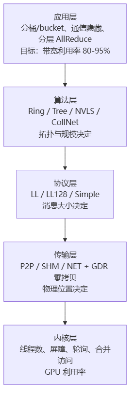
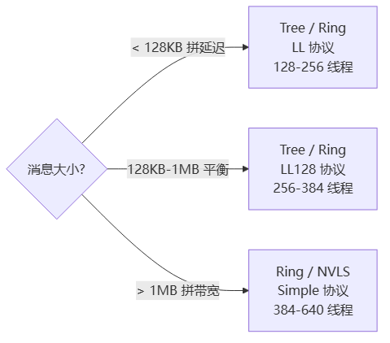
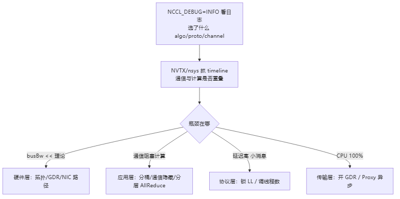

# NCCL 性能优化

> **一句话**：NCCL 性能优化的内核是**延迟-带宽模型** `Time = Latency × NumOps + DataSize / Bandwidth`。NCCL 在初始化时为每个「算法×协议×传输」组合预算出延迟和带宽，运行时按消息大小自动挑最快的那组——小消息拼延迟（Tree+LL），大消息拼带宽（Ring+Simple）。调优者的活儿是用环境变量微调通道数、线程数、缓冲区，把硬件带宽利用率顶到 85%+。

## 优化金字塔：五层各管一件事

> 图解源文件：[`01-优化金字塔-五层各管一件事-flowchart.mmd`](../../../_attachments/ai-infra/nccl/NCCL性能优化/whiteboard-mermaid/01-优化金字塔-五层各管一件事-flowchart.mmd)。

**给应届生**：越上层收益越大、越省力。上来就调 `NCCL_NTHREADS` 是「在最底层抠几个百分点」，而把梯度分桶变大、做通信与计算重叠（[[通信隐藏]]），往往一口气涨 20%。先看上层有没有做对，再下沉到内核层。

## 性能模型：怎么预算「快慢」

NCCL 给每个 `(coll, algorithm, protocol)` 三元组存一张延迟表和一张带宽表（`comm->bandwidths/latencies`），来自 `src/graph/tuning.cc` 的常量：

- **带宽** = 链路理论带宽 × 通道数 × 协议效率因子 × 算法修正。
  - LL 协议效率 ≈ 0.5（每帧带 2 倍元数据，带宽腰斩）；LL128 ≈ 0.92；Simple ≈ 1.0。
  - Tree 对 AllReduce 额外扣 8%；PAT 扣 25%；NVLS 在 Hopper 上 ×0.85、Blackwell ×0.74（多卡争 NVSwitch）。
- **延迟** = 基础延迟（6.8/14/8.4 μs，对应 LL/LL128/Simple）+ 硬件延迟（NVLink 0.6~4μs、PCI 1~5.7μs、NET 2.7~14μs）× 步数。
  - Ring 步数 = `2(N-1)`（AllReduce）；Tree 步数 = `2·log2(N)`。

> 图解源文件：[`02-性能模型-怎么预算「快慢」-flowchart.mmd`](../../../_attachments/ai-infra/nccl/NCCL性能优化/whiteboard-mermaid/02-性能模型-怎么预算「快慢」-flowchart.mmd)。

**给应届生**：记住这条「消息大小 → 协议」的分界线，面试常问。小消息走 LL（低延迟，每包带流水号双写换速度）；中等走 LL128（128B 对齐、接近满带宽）；大消息走 Simple（大块直搬，带宽优先）。NCCL 自己会按 `ncclTopoGetAlgoTime()` 算每个组合的时间取最小，不用你手选——除非用 `NCCL_ALGO`/`NCCL_PROTO` 强制锁死。

## 算法效率：Ring vs Tree

| 算法 | 总传输量 | 步数 | 算法效率 | 适合 |
|---|---|---|---|---|
| Ring | `2D(N-1)/N` | `2(N-1)` | `N/[2(N-1)]`→50% | 大消息、大规模 |
| Tree | `2D·log2(N)` | `2·log2(N)` | 100%（每节点处理全量） | 小消息、N<16 |

Ring 效率随 N 增大趋近 50% 但步数线性涨；Tree 步数只 `log2(N)` 但每步要传全量 D，带宽吃不消。所以**小消息靠 Tree 省延迟，大消息靠 Ring 省带宽**——两者在 1MB 附近交叉。

## 内核层优化要点

- **线程数自适应**（`NCCL_NTHREADS`/`NCCL_LL128_NTHREADS`）：必须 32 的倍数，小消息 128-256、大消息 512-640。
- **NCCL_STEPS=8 流水线**：8 步循环缓冲区，把轮询频率降 8×，缓存命中 ~90%，延迟降 20-30%。
- **合并访问**：128B 加载对齐时 1 个事务（128GB/s），未对齐 32 个事务（4GB/s）——32× 差距，靠 `sliceSize` 对齐 16 元素保证。
- **屏障/投票**：warp 内用 `__syncwarp`/`__any_sync`（1 cycle），跨 warp 才用命名屏障 `barrier_sync`（~10 cycles），能 warp 内解决就不上块级。
- **NVLS multimem 指令**（Hopper+）：`multimem.ld_reduce.acquire` 直接从 HBM 读、绕 L1、原子归约，延迟降 30-40%。

## 内存与零拷贝

- **CUDA 内存池 + CuMem 大页**（CUDA 12.2+，`NCCL_CUMEM_ENABLE`）：减少页表抖动。
- **步进缓冲区复用**：`NCCL_STEPS` 个 buffer 循环复用，省显存。
- **GPUDirect RDMA（GDR）**：GPU 显存直通网卡，绕过 CPU 中转，详见 [[GPUDirect-RDMA]] 与 [[NCCL传输层]]。
- **Direct 模式**：节点内 P2P 直接写对端显存，零拷贝。

## 关键环境变量速查

| 变量 | 作用 | 调优场景 |
|---|---|---|
| `NCCL_MIN/MAX_NCHANNELS` | 通道数上下限（默认 1/64） | 大消息想压满多 NIC → 调大 |
| `NCCL_NTHREADS` / `NCCL_LL128_NTHREADS` | 每通道线程数 | 延迟/带宽权衡 |
| `NCCL_BUFFSIZE` / `NCCL_LL_BUFFSIZE` / `NCCL_LL128_BUFFSIZE` | 各协议缓冲区 | 大消息调大避免频繁同步 |
| `NCCL_ALGO` / `NCCL_PROTO` | 强制锁算法/协议 | 调试、对照基线 |
| `NCCL_NET_GDR_LEVEL` / `NCCL_NET_GDR_READ` | GDR 档位 | 跨节点降 CPU 开销 |
| `NCCL_P2P_LEVEL` | P2P 桥接层级（NVL/PIX/SYS） | 跨 PCIe 桥时放开 |
| `NCCL_IB_HCA` / `NCCL_IB_TC` / `NCCL_SOCKET_IFNAME` | 选网卡/IB 端口/拥塞控制 | 多 NIC 路径均衡 |
| `NCCL_DEBUG=INFO` / `NCCL_DEBUG_SUBSYS` | 日志级别/子系统 | 看拓扑与算法选择 |
| `NCCL_TIMEOUT` / `NCCL_COMM_BLOCKING` | 超时与阻塞通信 | 集群排错 |

**给应届生**：通道数 `NCCL_MAX_NCHANNELS` 不是越大越好——超过硬件链路数只是徒增争用，且 `>8` 个操作会失去 warp 同步。经验值：每 NIC 2-4 通道起步，看 `busBw` 是否还在涨，涨不动就停。

## 性能诊断：先定位瓶颈再动手

> 图解源文件：[`03-性能诊断-先定位瓶颈再动手-flowchart.mmd`](../../../_attachments/ai-infra/nccl/NCCL性能优化/whiteboard-mermaid/03-性能诊断-先定位瓶颈再动手-flowchart.mmd)。

- 看 `busBw`（总线带宽）而非 `alBw`（算法带宽）——`busBw` 才是真正打到链路上的速率，对标硬件峰值。
- 大规模训练常用**分层 AllReduce**（节点内 Ring + 节点间 Tree，见 [[NCCL拓扑算法]]）和**梯度压缩**（fp16/bf16 甚至 int8 量化）。

## 延伸

- [[NCCL架构总览]] — 性能模型来自哪几层
- [[NCCL拓扑算法]] — Ring/Tree/NVLS 的拓扑选择
- [[NCCL传输层]] — GDR/P2P/NET 零拷贝细节
- [[NCCL协议与机制]] — LL/LL128/Simple 协议实现
- [[通信隐藏]] — 应用层最有效的优化
- [[千卡训练性能优化]] — 千卡规模的综合调优
- [[什么是分布式训练]] — 第⑤步 AllReduce 为何是性能焦点
- 专栏原文：[知乎 · 第14篇 性能优化一](https://zhuanlan.zhihu.com/p/1970972337257050240) ｜[第15篇 性能优化二](https://zhuanlan.zhihu.com/p/1970974724336129387)
