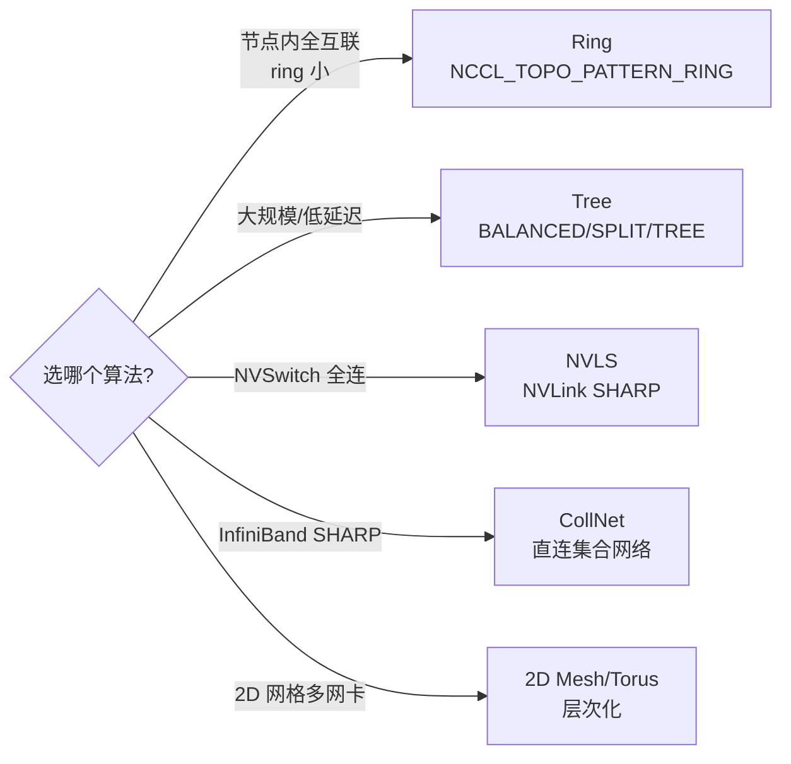
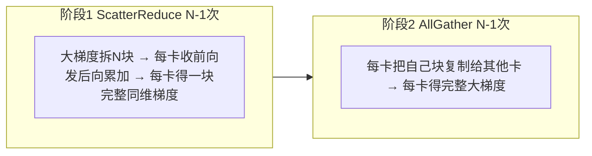
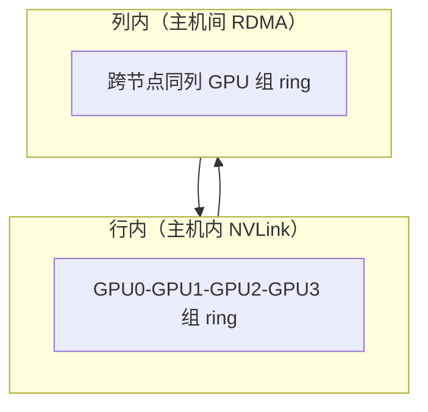

# NCCL 拓扑算法

> **一句话**：NCCL 初始化时自动探测硬件拓扑，从 Ring/Tree/2D-Mesh/Torus 等算法里选最优的。算法选择强相关物理网络——节点内全连用 Ring，多网卡异构用 2D-Torus，大规模用 Tree。也可用环境变量强制指定。

## NCCL 支持的拓扑模式



| 算法 | 模式常量 | 适用 |
|---|---|---|
| Ring | `NCCL_TOPO_PATTERN_RING` | 节点内 ring、小规模 |
| Tree | `BALANCED_TREE`/`SPLIT_TREE`/`TREE` | 大规模、低延迟 |
| NVLS | `NCCL_TOPO_PATTERN_NVLS` | NVSwitch 全连接 |
| CollNet | `NCCL_TOPO_PATTERN_COLLNET_DIRECT` | InfiniBand SHARP |

**给应届生**：这些是 NCCL 内部的拓扑"模板"。初始化时它探测出"8 卡怎么连的"，然后从这些模板里挑最匹配的。比如你的 8 卡全用 NVSwitch 连（像 DGX），就选 NVLS；普通节点内 ring 就选 Ring。Ring 简单但大集群跳数高会慢，所以大规模上 Tree。

## 核心算法详解

### Ring AllReduce（最基础）

详见 [[Ring-AllReduce]] 和 [[训练拓扑与服务框架]]。NCCL 的 Ring = ScatterReduce + AllGather，每个 GPU 只向右发、从左收，无中心瓶颈。



**局限**：ring 大时跳数高（N 卡跳 N-1 次），时延增加。

### Tree AllReduce

用二叉树组织通信，根节点聚合再广播。适合大规模、低延迟。NCCL 用 **Double Binary Tree**（双二叉树）：两棵互补的树并行通信路径，提高吞吐。

**给应届生**：Ring 像"大家围一圈传话"（每人传给右边），Tree 像"班长收作业再发回去"（树根聚合）。Ring 每人负载均匀但跳数多，Tree 跳数少（log N）但根节点压力大——用双二叉树分摊根的负载。千卡集群一般 Tree 更优。

### 2D-Mesh / 2D-Torus（层次化）

把 GPU 组织成二维网格，行内+列内分层通信。适合多网卡异构网络（主机内 NVLink + 主机间多 RDMA 网卡）。



- **2D Mesh**：行列网格，边界不回环。
- **2D Torus**：网格边界回环（wrap-around），每维度都是 ring。

**给应届生**：2D-Mesh/Torus 把"一维 ring"升级成"二维网格"——主机内走行（NVLink 快），主机间走列（RDMA），两个维度并行搬数据。多网卡时每个网卡管一列，带宽全吃满。详见 [[训练拓扑与服务框架]] 的 2D-Torus 三步走。

### Halving-Doubling（减半加倍）

基于递归二叉树的 AllReduce：Reduce-Scatter（减半）+ AllGather（加倍）两阶段，类似 Ring 的 ScatterReduce+AllGather 但用树形分治，适合大消息。

### Butterfly（蝶形）

分阶段对等交换，每阶段每个进程与唯一"伙伴"交换。广泛用于 FFT、递归倍增的 AllReduce/AllGather。通信步数少（log N）但每步全员参与。

## 拓扑自动检测与选择

NCCL 初始化时 `ncclTopoComputeSearch()` 自动搜索最优通信图，无需手动指定。它探测：
- **节点**：GPU/PCI/NVS(NVSwitch)/CPU/NIC/NET
- **链路**：LOC/NVL(NVLink)/C2C/PCI/SYS/NET
- **路径类型**（11 种）：如 PATH_NVL（NVLink 直连）、PATH_PCI（同 PCIe Switch）、PATH_SYS（跨 CPU NUMA）、PATH_NET（跨节点）

然后根据拓扑图 + 算法性能模型自动选最优算法+传输。

**给应届生**：NCCL 初始化那堆 `NCCL INFO` 日志就是在干这事——它逐个探测"GPU0 到 GPU1 走 NVLink 还是 PCIe？跨节点走哪个网卡？"，建拓扑图，搜最优路径。这就是为什么初始化慢但之后快。

## 用环境变量强制指定（第94篇）

默认自动选择。需要跳过搜索、强制指定时用环境变量：

```bash
export NCCL_ALGO=Ring        # 强制算法: Ring/Tree/CollNet/PAT
export NCCL_PROTO=LL128      # 强制协议: Simple/LL/LL128
export NCCL_NET_GDR_LEVEL=... # GDR 相关
export NCCL_P2P_DISABLE=0    # 禁用/启用 P2P
export NCCL_IB_DISABLE=0     # 禁用/启用 IB
```

**给应届生**：自动选择大部分时候最优，但偶发拓扑探测不准或硬件异常时，手动指定能绕过问题。调优时先看 NCCL 自动选了啥（日志），不对再手动覆盖。这是排障和调优的常见手段。

## 延伸

- [[NCCL架构总览]] — 拓扑层在整体架构的位置
- [[NCCL传输层]] — 算法搭配的物理传输
- [[NCCL协议与机制]] — 拓扑检测机制 + Group/Plugin
- [[Ring-AllReduce]] / [[训练拓扑与服务框架]] — 算法原理基础
- [[千卡训练性能优化]] — 拓扑选择与加速比
- 专栏原文：[知乎 · 第18篇 拓扑算法](https://zhuanlan.zhihu.com/p/1971623892499014753) ｜[第61-69篇 各拓扑详解](https://zhuanlan.zhihu.com/p/1976054948421715577) ｜[第94篇 环境变量指定](https://zhuanlan.zhihu.com/p/1983600291682223282)
