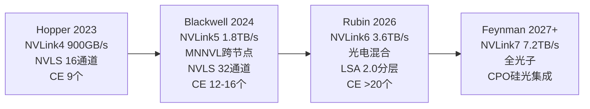
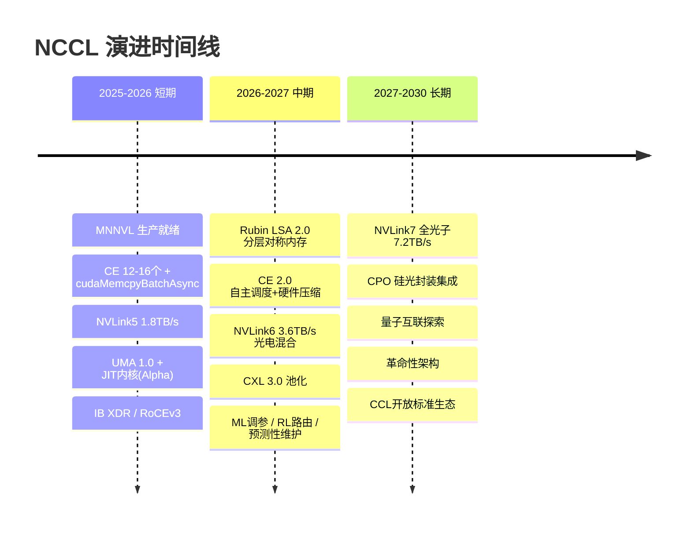

# NCCL 未来演进

> **一句话**：NCCL 未来 3-5 年的演进由四股力推动——集群从数千扩到数万 GPU、推理要微秒级延迟、多代异构共存、能耗 PUE 收紧。主线是**硬件加速把软件干的活搬进芯片**：Symmetric Kernel 用对称内存、CE Collective 让 Copy Engine 代劳（0% SM 占用）、MNNVL 让 NVLink 跨节点直连。再往后是 NVLink 走向全光子、CXL 内存池化、CPO 光电共封装，以及 NCCL 自身从「手写算子」走向 JIT 内核融合 + ML 自适应调优。

## 驱动力与已落地的新特性

四个驱动力：**规模**（数千→数万 GPU）、**延迟**（推理要 μs 级）、**异构**（多代 GPU/互联共存）、**能耗**（PUE 约束）。NCCL 2.25+ 已落地三件新武器：

| 特性 | 机制 | 收益 |
|---|---|---|
| **Symmetric Kernel** | LSA 对称内存直访 + 12 种内核变体（AllReduce/AllGather/ReduceScatter × LL/ST/MC） | 小消息(<1MB)延迟降 30-50% |
| **CE Collective** | Copy Engine 代发，无内核参与；`cudaMemcpyBatchAsync`(CUDA 12.8+) | **0% SM 占用**，完全释放计算资源 |
| **MNNVL** | 跨节点 NVLink 直连，`cliqueId` 定域，Fabric Manager 2.0 | 跨节点无需交换机，1.8TB/s 直连 |

**给应届生**：CE Collective（CE = Copy Engine 拷贝引擎）是思路转变——以前 AllGather 要占 SM 跑 kernel 搬数据，现在让 GPU 上的专用拷贝单元干这活，SM 全留给模型计算。NVLS 多播用 MC（3 操作/rank）比标准 P2P 的 UC（6 操作/rank）同步开销减半。详见 [[NCCL核心模块]] 的 Symmetric Kernel / CE 模块。

## 硬件演进主线

- **NVLink 代际**：4.0(900GB/s) → 5.0(1.8TB/s) → 6.0(3.6TB/s, 光电混合, <100ns) → 7.0(7.2TB/s, 全光子, 2028+)。
- **Copy Engine 数量**：Ampere 2-3 个 → Hopper 9 个 → Blackwell 12-16 → Rubin >20。CE 越多，CE Collective 能并行搬的流越多。
- **CXL 3.0 内存池化**（2026-27）：256GB/s、TB 级共享内存池、缓存一致性，把多 GPU 显存抽象成统一池（UMA 2.0）。
- **CPO（Co-Packaged Optics）**：硅光子与 GPU 封装内集成，单 lane 400Gbps，功耗降 60%，ns 级延迟——把「电→光→电」的交换机跳数砍掉。

**给应届生**：看 NVLink 带宽翻倍节奏——每代约 ×2。但单靠堆带宽不够，瓶颈会转移：节点内打满后，跨节点交换机和 CPU 中转成了新短板，于是有 MNNVL（NVLink 直接跨节点）和 CPO（光进封装）。这是「硬件演进 = 不断把瓶颈挪到下一个能解决的层」。

## 软件架构演进

- **UMA 2.0 统一内存**：把 GPU 本地/同节点/跨节点/CXL 内存抽象成分层地址空间（L0/L1/L2/L3），自动迁移。
- **JIT 内核编译 + 算子融合**：从「预编译固定 kernel」走向运行时按拓扑/消息生成 kernel，并把通信与计算算子融合（Persistent Kernel 长驻）。
- **拓扑动态适配**：多层拓扑建模 + 运行时按负载动态切算法/路径。
- **智能化**：ML 性能预测模型（调参准确率 >95%）、强化学习路由、预测性维护（故障提前 30 分钟预警 + 自动路径切换）、弹性通信（`ncclCommShrink`/`Revoke` 自动恢复）。

## 网络与跨域

- **下一代网络**：InfiniBand XDR 800Gbps、RoCEv3、UEC（Ultra Ethernet）初步支持。
- **WAN 跨地域训练**：广域通信优化，跨机房/跨地域分布式训练。
- **多厂商统一抽象**：推动 **CCL 开放标准**（Collective Communication Library Standard），让 NCCL/RCCL/国产库上层接口统一，避免厂商锁定。
- **CPU-GPU 协同**：CPU 参与的集合通信（异构归约）。

## 路线图

## 对国产化的启示

文章给国产芯片的具体建议：**自研高速 SerDes 链路（"ChipLink"）** 替代 NVLink 做芯片间直连，并做多播/广播硬件加速（NVLS 等价）。这与 [[NCCL国产化需求]] 的 P0 要求一致——没有硬件归约原语和高速直连，软件层补不回来。

## 挑战与风险

- **硬件复杂度**：MNNVL/CPO/CXL 调试难、故障域扩大。
- **规模**：数万-数十万 GPU 下，单点故障常态化，靠弹性通信 + 端到端校验 + ECC 重传兜底。
- **厂商锁定 vs 可移植性**：NVLS/MNNVL 是 NVIDIA 专有，押注越深越难跨厂商；CCL 标准是对冲。

## 延伸

- [[NCCL架构总览]] — 演进的起点
- [[NCCL核心模块]] — Symmetric Kernel / CE / MNNVL 模块代码级分析
- [[NCCL传输层]] — NVLS/MNNVL 传输层
- [[NCCL国产化需求]] — 国产芯片如何跟进演进
- [[NVLink]] — NVLink 代际演进
- [[GPUDirect-RDMA]] — GDR 在网络演进中的位置
- [[wiki/ai-infra/comm-libs/NVSHMEM|NVSHMEM]] — 细粒度通信的另一种演进方向
- [[wiki/ai-infra/llm-inference/DeepEP|DeepEP]] — 推理时代的专家并行通信
- 专栏原文：[知乎 · 第93篇 NCCL 未来3-5年演进预测](https://zhuanlan.zhihu.com/p/1983312562935312897)
