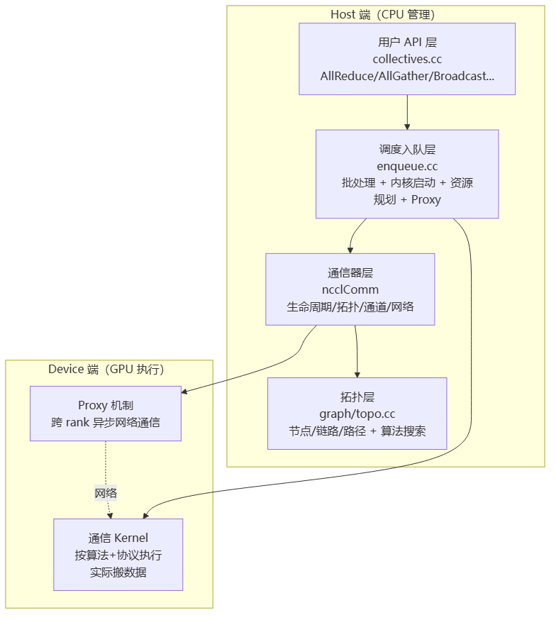

# NCCL 架构总览

> **一句话**：NCCL（NVIDIA Collective Communications Library）是 NVIDIA 的多 GPU/多节点集合通信库，分布式训练软件栈的**事实标准底座**——数据并行第⑤步 AllReduce 就靠它。它分层设计：Host 端管理（建通信器、选拓扑、调度）+ Device 端执行（GPU kernel 真正搬数据）。

## NCCL 是什么

NCCL 解决"多张 GPU 之间怎么高效传梯度/数据"的问题。它把上层框架（PyTorch/Megatron）的 `all_reduce()` 调用，翻译成 GPU 上真正跑的 kernel + 网络传输。

**给应届生**：训练框架（PyTorch）只管喊"我要 AllReduce"，但它不知道你的 8 张卡是用 NVLink 还是 PCIe 连、是单机还是多机。NCCL 就是中间那层"翻译官+调度员"——它探测硬件拓扑，选最快路径，生成 GPU kernel，让数据用最优方式搬。这就是为什么分布式训练离不开 NCCL。

## 三大设计维度

NCCL 的核心能力体现在三个维度，每个维度多种选择：

| 维度 | 可选项 | 选择依据 |
|---|---|---|
| **算法** | Ring / Tree / CollNet / NVLS / PAT | 拓扑与规模 |
| **协议** | Simple / LL(低延迟) / LL128 | 消息大小 |
| **传输** | P2P / SHM / NET / NVLS / CollNet | 物理位置（节点内/跨节点） |

**给应届生**：这三个维度是正交的——算法决定"数据怎么流"（环形/树形），协议决定"怎么打包"（普通/低延迟），传输决定"走哪条物理路"（NVLink/网卡）。NCCL 初始化时根据硬件自动组合出最优配置。比如节点内 8 卡 NVLink 全连，选 Ring + Simple + P2P；跨节点千卡，可能选 Tree + LL128 + NET。

## 分层架构：Host 管理 + Device 执行



> 图解源文件：[`01-分层架构-Host-管理-+-Device-执行-flowchart.mmd`](../../../_attachments/ai-infra/nccl/NCCL架构总览/whiteboard-mermaid/01-分层架构-Host-管理-+-Device-执行-flowchart.mmd)。

### Host 端四层

1. **用户 API 层**（`collectives.cc`）：标准集合通信接口 AllReduce/AllGather/Broadcast/Reduce/ReduceScatter/Send/Recv，支持 int8-64/float16/32/64/bfloat16/float8。封装参数调 `ncclEnqueueCheck()` 进调度层。
2. **调度入队层**（`enqueue.cc`）：工作批处理（`addWorkBatchToPlan` 合并多操作）、内核启动、资源规划（分配通道/线程块/共享内存）、Proxy 集成（`addProxyOpIfNeeded`）。
3. **通信器层**（`comm.h`/`init.cc`）：`ncclComm` 管理生命周期、拓扑信息、通道配置、共享资源（Proxy 状态、GIN 状态、内部 CUDA 流、计数器）。
4. **拓扑层**（`graph/topo.cc`）：探测硬件拓扑（GPU/PCI/NVS/CPU/NIC/NET 节点，NVL/PCI/SYS/NET 链路，11 种路径类型），搜索最优通信图。

### ncclComm 核心结构

```c
struct ncclComm {
  uint64_t startMagic;
  struct ncclCudaContext* context;      // CUDA 上下文
  struct ncclSharedResources* sharedRes; // 共享资源(Proxy/GIN/CUDA流)
  struct ncclChannel channels[MAXCHANNELS]; // 通道(最多64)
  struct ncclTopoSystem* topo;           // 拓扑信息
  struct ncclPeerInfo* peerInfo;         // 对端信息
  ncclNet_t* ncclNet;                    // 网络层
  ...
};
```

**给应届生**：`ncclComm` 是一次集合通信的"大管家对象"。`ncclCommInitRank()` 初始化时建好它，里面塞满这次通信需要的所有东西——拓扑（谁连谁）、通道（数据走哪几条路）、网络（怎么跨节点）。之后每次 AllReduce 都复用它。通道最多 64 个，是为了并行（一条路不够用，多条路同时搬）。

## Channel：NCCL 的并行基本单元

通信被切分到多个 **Channel**（通道），每个 Channel 是独立的逻辑通信路径，最多 64 个。Channel 让一条大通信拆成多条并行流，充分利用多链路带宽。

## 初始化流程（简化）


> 图解源文件：[`02-初始化流程（简化）-flowchart.mmd`](../../../_attachments/ai-infra/nccl/NCCL架构总览/whiteboard-mermaid/02-初始化流程（简化）-flowchart.mmd)。

**给应届生**：NCCL 第一次初始化很慢（要探测拓扑、建连接、选算法），但之后每次 AllReduce 很快——因为通信器建好后，kernel 计划都缓存了。所以分布式训练启动时第一个 step 慢，后面就稳了。这也是为什么 NCCL 初始化阶段要打很多日志（拓扑发现过程）。

## 与其他通信库的关系

NCCL 是 NVIDIA 生态的标准库。其他通信库与它互补：
- [[wiki/ai-infra/comm-libs/NVSHMEM|NVSHMEM]] — 细粒度点对点 + kernel 内发起（NCCL 管集合通信）
- [[wiki/ai-infra/comm-libs/UCX|UCX]] — 通用通信框架（NCCL 的 NET 传输可对接）
- [[wiki/ai-infra/comm-libs/Gloo|Gloo]] — Meta 的 CPU 侧集合通信库
- [[wiki/ai-infra/comm-libs/FlagCX与FlagScale|FlagCX]] — 适配器层：统一封装 NCCL/HCCL/CNCL 等异构 CCL（智源 BAAI 出品）

## 延伸

- [[NCCL拓扑算法]] — Ring/Tree/2D-Torus 等拓扑怎么选
- [[NCCL传输层]] — P2P/SHM/NET/NVLS 传输层详解
- [[NCCL协议与机制]] — LL/LL128/Simple 协议 + Bootstrap/Proxy/Group
- [[NCCL核心模块]] — Channel/Graph/Enqueue 等模块代码级分析
- [[NCCL性能优化]] — 延迟带宽模型与调优
- [[NCCL国产化需求]] — 国产芯片如何对标 NCCL
- [[什么是分布式训练]] — NCCL 在第⑤步 AllReduce 的位置
- [[Ring-AllReduce]] — NCCL 默认算法
- 专栏原文：[知乎 · 第9-13篇 NCCL架构](https://zhuanlan.zhihu.com/p/1970224908391921361)
