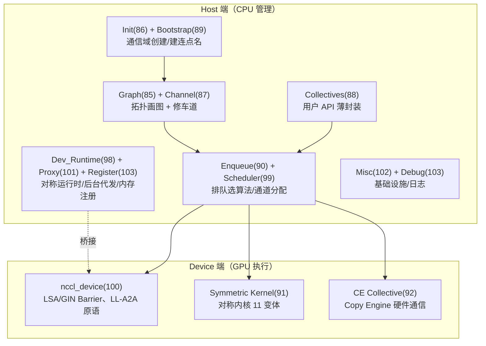

# NCCL 核心模块

> **一句话**：这页是 NCCL 源码 15 个核心模块的代码级导览，按 Host（CPU 侧管理）/ Device（GPU 侧执行）分层。主线一句话：用户调 `ncclAllReduce` → Collectives 登记 → Enqueue 排队选算法 → 启动 GPU kernel → 跨节点部分由 Proxy 代发；初始化时 Bootstrap 建连、Graph 画图、Channel 修路。新近的 Symmetric Kernel / CE / Dev_Runtime 是利用对称内存与硬件 Copy Engine 的低延迟新通路。

## 模块全景与数据流主线

**给应届生**：NCCL 的模块分工就是「Host 是指挥部、Device 是搬运工」——CPU 侧（Init/Bootstrap/Graph/Channel/Enqueue）负责勘测路网、画图、排班、发车单，GPU 侧（nccl_device/Symmetric Kernel/CE）才真正搬数据。Proxy 是中间的「外勤」，替 GPU 处理跨节点的网络收发，让 GPU kernel 不必死等网络。记住这条分工，15 个模块谁干什么就清晰了。

## Host 用户 API 层

- **Collectives（88，`collectives.cc` 仅 217 行）**：最薄一层。把用户参数封成 `ncclInfo`（coll/op/buff/count/datatype/op/root/comm/stream/chunkSteps/sliceSteps），转发给 `ncclEnqueueCheck`。11 个集合函数（AllReduce/AllGather/ReduceScatter/AlltoAll/Broadcast/Reduce/Send/Recv...）+ 5 种归约（Sum/Prod/Max/Min/Avg）+ 12 种数据类型（含 FP8 e4m3/e5m2）。**比喻：前台接待窗口，只登记需求不调度。**

## Host 初始化与建连层

- **Init（86，`init.cc`）**：通信域全生命周期。`ncclComm`（channels[64]、topo、peerInfo、sharedRes、bootstrap、abortFlag/destroyFlag/revokedFlag）、`ncclConfig_t`（magic=`0xcafebeef`）。`ncclCommInitRank`→`initTransportsRank` 跑两次 AllGather 协商 PeerInfo 与图信息。常量：`MAXCHANNELS=64`、`NCCL_STEPS=8`、`DEFAULT_BUFFSIZE=4MB`、`NCCL_NUM_ALGORITHMS=7`/`PROTOCOLS=3`。**比喻：开机总装流水线，从零件装配到可发车。**
- **Bootstrap（89，`bootstrap.cc` 1216 行）**：通信域建立前用 Socket/ncclNet 让各 rank 互发现。Root 监听 → Worker 发 extInfo → 配对相邻 rank 建环形 → `bootstrapAllGather`（双向环形，步数 nranks/2）交换全部地址 → 初始化 Proxy。`ncclBootstrapHandle` 适配 `ncclUniqueId` 128 字节。`NCCL_OOB_NET_ENABLE=0` 默认走 Socket。**比喻：建连点名，发签到表+排座位让大家彼此认识。**

## Host 拓扑与通道层

- **Graph（85，`graph/`）**：拓扑发现 + 最优路径搜索。`ncclTopoSystem`（6 类节点 GPU/PCI/NVS/CPU/NIC/NET）→ `ncclTopoComputePaths`（BFS 算 11 种路径类型）→ `ncclTopoSearchRec`（DFS + 启发式，按带宽消耗跟踪）选 Ring/Tree/CollNet/NVLS 图 + `tuning.cc` 性能建模。`NCCL_SEARCH_TIMEOUT=1<<14`。
- **Channel（87，`channel.cc`）**：每条 Channel 是独立并行通信路径。`ncclChannel`（peers/ring/tree/collnet/nvls/workFifoProduced）、`ncclChannelPeer`（send/recv[NCCL_MAX_CONNS=2]）、`ncclConnInfo`（buffs[3]/head/tail/connFifo）。`initChannel`→`selectTransport`（P2P/SHM/NET）→ connect 建连 → `cudaMemcpyAsync` 拷 connInfo 到设备。**比喻：并行车道，多车道并行提带宽，最多 64 条。**

## Host 调度层

- **Enqueue（90，`enqueue.cc` 2737 行）**：核心调度引擎。`ncclKernelPlan`/`ncclKernelPlanner`。流程：`ncclPrepareTasks`（分组 func×op×type + 4× 聚合 + `getAlgoInfo`）→ `scheduleCollTasksToPlan`（Round-Robin 分通道）→ `finishPlan`（Args/FIFO/Persistent 决策）→ `uploadWork` 写 FIFO → `ncclLaunchKernel`（CGA/MemSyncDomain/NVLinkCentric）→ `uploadProxyOps` 通知 Proxy。`MAX_WORK_PER_BATCH=64`、`MAX_KERNEL_ARGS_SIZE=4096`。**比喻：排队上车+发车计划，把一群任务编进同一班车。**
- **Scheduler（99，`scheduler/symmetric_sched.cc`）**：专处理对称内存任务。`ncclMakeSymmetricTaskList`（找对称窗口 `NCCL_WIN_COLL_SYMMETRIC` + 分类）→ `ncclSymmetricTaskScheduler`（按 `cell=1024B` 用 16 位分数 workHi/fracHi 切分到通道）→ 选最优 Symmetric Kernel。**比喻：调度器，给每条车道分配精确到字节的工作量配额。**
- Group 机制见 [[NCCL协议与机制]]。

## Host 运行时/代理/注册层

- **Dev_Runtime（98，`dev_runtime.cc`）**：Host↔Device 对称运行时核心，Symmetric Kernel/CE/nccl_device 的底座。`ncclDevrState`/`ncclDevrMemory`/`ncclDevrWindow`/`ncclDevComm`。`symMemoryObtain`（去重+LSA 映射+多播绑定+GIN 注册）→ `symWindowCreate` → `symTeamObtain`（`cuMulticastCreate`+`BindMem`）。bigSize 对齐 1GB。**比喻：对称内存的地籍登记+门牌系统，给每块内存发统一门牌号。**
- **Proxy（101，`proxy.cc`）**：独立服务/进度线程处理跨 rank 异步网络 I/O。`ncclProxyOp`/`ncclProxyArgs`。主线程 `ncclProxySaveOp` 入队 → 发布到 `ncclProxyOpsPool` + `pthread_cond_signal` → Progress Thread 批量取 → 调传输层 progress 实际收发。**比喻：后台代发跨节点的快递员，GPU 只管把货交到柜台。**
- **Register（103，`register/`）**：预注册用户缓冲区，给 NET/NVLS/IPC/CollNet 提供物理内存句柄，避免每次通信重复映射。`ncclRegCache`（按 begAddr 排序）+ `ncclReg`。命中加引用、未命中建记录调传输层注册，归零 `regCleanup`。`NCCL_LOCAL_REGISTER=1`。**比喻：内存门禁登记，给缓冲区办一次通行证反复用。**

## Host 基础设施层

- **Misc（102，`misc/`）**：参数管理、CUDA/IB/GDR 动态加载（`dlopen libgdrapi.so`/`libibverbs.so`）、Socket（`SCM_RIGHTS` 传 fd）/IPC/SHM、`/etc/nccl.conf` 配置、`ncclStrongStream`（捕获感知）、`PtrCheck`/`CommCheck`（魔数校验）。**比喻：水电煤基础设施工具箱。**
- **Debug（103，`debug.cc`）**：多级日志 + 子系统掩码过滤，惰性初始化。级别 NONE/VERSION/WARN/INFO/ABORT/TRACE，子系统 INIT/COLL/P2P/SHM/NET/GRAPH/TUNING/ENV。`NCCL_DEBUG`/`NCCL_DEBUG_SUBSYS`（支持 `^` 取反）/`NCCL_DEBUG_FILE`（`%h`/`%p` 占位符）。`TRACE` 需 `ENABLE_TRACE` 编译期开启否则空宏。**比喻：带过滤器的话筒，按子系统开关只放大你想听的声音。**

## Device 设备端层

- **nccl_device（100，`nccl_device/`）**：GPU 内核原语层，提供 LSA Barrier（节点内，`multimem.red.add` 原子）、GIN Barrier（跨节点，信号递增+轮询）、LL-A2A（低延迟 AlltoAll，双缓冲 Epoch 切换）三类会话。预定义团队 `ncclTeamWorld`/`Lsa`/`Rail`。CUDA 12.6+。**比喻：GPU 内核里的同步与通信工具箱。**
- **Symmetric Kernel（91，`sym_kernels.cc`）**：NCCL 2.27+ 利用对称内存（LSA）+ NVLS Multimem，单节点内 GPU 用相同虚拟地址直接互访、零拷贝、单内核多任务批处理。11 个内核变体（AllReduce/AllGather/ReduceScatter × LL/ST/MC），`NCCL_SYM_KERNEL_CELL_SIZE=1024`、16 warp=512 线程、性能模型 `queryModel` 选最优。小消息延迟降 30-50%。**比喻：对称内核，所有 GPU 用同一门牌号直接串门免中转。**
- **CE Collective（92，`ce_coll.cc`，CUDA 12.5+）**：用硬件 Copy Engine 替代 CUDA 内核做集合通信，免内核启动开销、**0% SM 占用**。`ncclCeImplemented` 仅支持非归约（AllGather/AlltoAll/Scatter/Gather）。Ready 同步 → `cudaMemcpyBatchAsync`（12.8+）批量 DMA 对称内存 → Complete 同步（双缓冲切 `useCompletePtr`）。MC=2 ops/rank、UC=3 ops/rank，H100 有 9 个 CE。**比喻：拷贝引擎，像快递分拣带直接搬货不占 SM 算力。**

**给应届生**：读 NCCL 源码建议按数据流主线顺读——先 Collectives(88) 看入口，再 Enqueue(90) 看调度，最后 device/ 看 kernel；初始化路径单独读 Init(86)→Bootstrap(89)→Graph(85)→Channel(87)。新机制（Symmetric Kernel/CE/Dev_Runtime）是 Hopper+ 才有的低延迟新通路，老代码可先跳过。对照 [[NCCL架构总览]] 的四层视图会更清晰。

## 延伸

- [[NCCL架构总览]] — 模块挂载的架构骨架
- [[NCCL协议与机制]] — Bootstrap/Group/Plugin 等机制详解
- [[NCCL拓扑算法]] — Graph 模块的算法搜索
- [[NCCL传输层]] — Channel 的 selectTransport 细节
- [[NCCL性能优化]] — 调度与内核的性能建模
- [[NCCL未来演进]] — Symmetric Kernel / CE / Dev_Runtime 的演进方向
- 专栏原文：[第85篇 Graph](https://zhuanlan.zhihu.com/p/1983245474019448280) ｜[第86篇 Init](https://zhuanlan.zhihu.com/p/1983249710685918697) ｜[第87篇 Channel](https://zhuanlan.zhihu.com/p/1983252934595735579) ｜[第88篇 Collectives](https://zhuanlan.zhihu.com/p/1983254995928387620) ｜[第89篇 Bootstrap](https://zhuanlan.zhihu.com/p/1983257571285550649) ｜[第90篇 Enqueue](https://zhuanlan.zhihu.com/p/1983268401880249277) ｜[第91篇 Symmetric Kernel](https://zhuanlan.zhihu.com/p/1983282727542342786) ｜[第92篇 CE](https://zhuanlan.zhihu.com/p/1983283148851783451) ｜[第98篇 Dev_Runtime](https://zhuanlan.zhihu.com/p/1986072655397421529) ｜[第99篇 Scheduler](https://zhuanlan.zhihu.com/p/1986075222235972001) ｜[第100篇 nccl_device](https://zhuanlan.zhihu.com/p/1986075698117510270) ｜[第101篇 Proxy](https://zhuanlan.zhihu.com/p/1986076264847675679) ｜[第102篇 Misc](https://zhuanlan.zhihu.com/p/1986076548411978543) ｜[第103篇 Debug](https://zhuanlan.zhihu.com/p/1986076896308527650) ｜[第103篇 Register](https://zhuanlan.zhihu.com/p/1986077323959751117)
